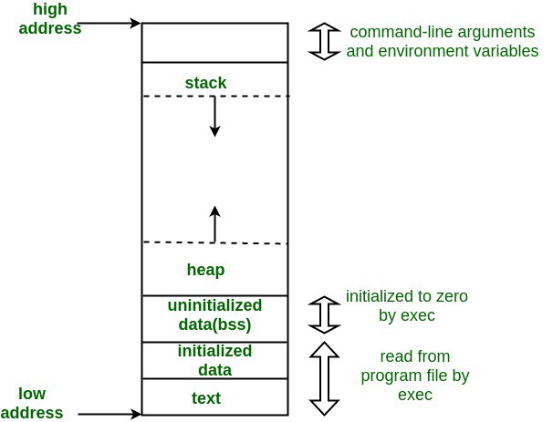

##  C/C++

### Static local variables
Variables declared at block scope with the specifier static or thread_local (since C++11) have static or thread (since C++11) storage duration but are initialized the first time control passes through their declaration (unless their initialization is zero- or constant-initialization, which can be performed before the block is first entered). On all further calls, the declaration is skipped.
If the initialization throws an exception, the variable is not considered to be initialized, and initialization will be attempted again the next time control passes through the declaration.
If the initialization recursively enters the block in which the variable is being initialized, the behavior is undefined.
If multiple threads attempt to initialize the same static local variable concurrently, the initialization occurs exactly once (similar behavior can be obtained for arbitrary functions with std::call_once).
Note: usual implementations of this feature use variants of the double-checked locking pattern, which reduces runtime overhead for already-initialized local statics to a single non-atomic boolean comparison.
(since C++11)
The destructor for a block-scope static variable is called at program exit, but only if the initialization took place successfully.
Function-local static objects in all definitions of the same `inline` function (which may be implicitly inline) all refer to the same object defined in one translation unit.

### Static member functions

Static member functions are not associated with any object. When called, they have no `this` pointer.
Static member functions cannot be `virtual`, `const`, or `volatile`.
The address of a static member function may be stored in a regular pointer to function, but not in a pointer to member function.

```c++
struct X
{
    inline static int n = 1;
};
```

Constant static members
If a static data member of integral or enumeration type is declared const (and not volatile), it can be initialized with an initializer in which every expression is a constant expression, right inside the class definition:

```c++
struct X
{
    const static int n = 1;
    const static int m{2}; // since C++11
    const static int k;
};
const int X::k = 3;
```


### Memory of layout of a c/c++ pramgram

* **Stack**:  The compiler automatically allocates and release, stores the parameter value of the function, local variable, function calls. The operation is similar to the stack in the data structure.

* **Heap**: Heap is a segment where dynamic memory allocation usually take place, it is usually released by the programmer, if the programmer doesn't release, it may be relaesed by the OS when the program exits.

* **Uninitialized data segment(BSS)**: Store global and static variables that are arithmetic 0 -- initialized by the kernel or uninitailized.   
e.g. `static int i;`

* **Initialized data segment(Data)**: usually called the Data Segment. A data segment is a portion of virtual address space of a program, which contains the **global**, **static**, **literal**, **external variables** that are initialized by programmer.
* **Text**: also know as a code segment or simply as text, is one of the sections of a program in an object file or in memory, which contains **executable instructions**. It is typically read-only.
  
```c
#include<stdio.h>
int a = 0;  //Initialized data segment 
char *p1;   //Uninitailized data segment, Zero initialized, nullptr
void main(){
    int b; //stack, undefined behavior, may be initialized to anything
    char s[] = "mj";   // stack
    char *p2;   // stack, can point to any address
    char *p3 = "mj520"; //mj520/0: Initialized data segment, p3 stack
    static int c  = 0;  // Initialized data segment
    p1 = (char *)malloc(10);    //10 bytes: Heap
    p2 = (char *)malloc(20);    //20 bytes: Heap
    strcpy(p1,"mjIloveu");      //mjIloveu/0 Initialized data segment, complier may optimize it to store it at the same location where p3 points to.

}

```


### Difference Between Malloc and New

> The basic differences between the two is that malloc exits in the C-language while new is a specific feauture of the C++ language. Malloc is also a function(which, for programmers, requires some time to execute) while new is an operator program (which cuts the execution time). This is a benefit from the operator new because programmers doing real-time programming have a need to choose the fastest method to use.

> Operator new is type-safe unlike the function malloc.

> The two also have different ways in dealing with failure and memory exhaustion.

> Function malloc doesn't construct an object(called constructor of object) but operator new does.

> Memory can also be re-sized or reallocated by using function malloc by using realloc. 

[Read more: Difference Between Malloc and New](http://www.differencebetween.net/technology/software-technology/difference-between-malloc-and-new/#ixzz6Cgc5Ovu6)

[What is the difference between new/delete and malloc/free?
](https://stackoverflow.com/questions/240212/what-is-the-difference-between-new-delete-and-malloc-free?r=SearchResults)


### When should static_cast, dynamic_cast, const_cast and reinterpret_cast be used?
> **static_cast** is the first cast you should attempt to use. It does things like implicit conversions between types (such as int to float, or pointer to void*), and it can also call explicit conversion functions (or implicit ones). 

> **const_cast** can be used to remove or add const to a variable; no other C++ cast is capable of removing it (not even reinterpret_cast)

> **dynamic_cast** is exclusively used for handling polymorphism. You can cast a pointer or reference to any polymorphic type to any other class type (a polymorphic type has at least one virtual function, declared or inherited). 

> **reinterpret_cast** is the most dangerous cast, and should be used very sparingly.

C-style casts also ignore access control when performing a static_cast, which means that they have the ability to perform an operation that no other cast can.

[Read more:](https://stackoverflow.com/questions/332030/when-should-static-cast-dynamic-cast-const-cast-and-reinterpret-cast-be-used)

### explicit specifier
1. Specifies that a constructor or conversion function (since C++11) or deduction guide (since C++17) is explicit, that is, it cannot be used for implicit conversions and copy-initialization.
2) The explicit specifier may be used with a constant expression. The function is explicit if and only if that constant expression evaluates to true.
[read more](https://en.cppreference.com/w/cpp/language/explicit)


### noncopyable
> If you inherit from noncopyable then it has two benefits:

* It prevents the class from being copied or assigned
* It makes the intention clear from looking at the class definition, ie self-documenting code  
[What are use cases for booster::noncopyable?
](https://stackoverflow.com/questions/3518853/what-are-use-cases-for-boosternoncopyable)

### Polymorphisms
These polymorphisms also go by diferent names in C++,
* Subtype polymorphisms is also known as **runtime polymorphisms**.
* Parametric polymorphisms is also known as **compile-time polymorphisms**.
* Ad-hoc polymorphisms is also known as **overlaoding**.
* Coercion is also known as (implict or explicit) **casting**.  
[Read more The Four Polymorphisms in C++](https://catonmat.net/cpp-polymorphism)

### C++ map having key as a user define data type
> C++ map stores keys in ordered form (Note that it internally use a self balancing binary search tree). Ordering is internally done using operator " < " So if we use our own data type as key, we must overload this operator for our data type.
[read more](https://www.geeksforgeeks.org/c-map-key-user-define-data-type/)


### Reference

#### What is move semantics?

> This referes to temporaries that are permitted to be modified after they are initialized, for the purpose of allowing "move sematics".

> rvalue references allow developers to provide perfect function forwarding.  
[Read more](https://en.wikipedia.org/wiki/C%2B%2B11#Rvalue_references_and_move_constructors)  
[What is move semantics?](https://stackoverflow.com/questions/3106110/what-is-move-semantics)


### Can we store unordered_map<T>::iterator?
> (To put this in context: §23.2.5 is the section on unordered associative containers, so it applies to std::unordered_set, std::unordered_map, std::unordered_multiset and std::unordered_multimap.) This means:
>1. If you want to insert n elements into an unordered_map called hash, you can check whether
`hash.size() + n < hash.max_load_factor() * hash.bucket_count()`
is true. If it is false, all iterators will be invalidated during the insert. If true, iterators will remain valid.
>2. Even if iterators are invalidated in this operation, references to the elements themselves will remain valid.
>3. If you erase elements, only iterators pointing to those will be invalidated; other iterators will remain valid.


## The Standard Template Library
Three categories: Sequence containers, Associative container, and Container apdaters.
* **Sequence Containers** are container classes that maintain the ordering of elements of containers. In C++11 there are 6 sequnce containers: std::vector, std::deque, std::array, std::list, std::forward_list and std::basic_string.

### Weak_ptr


### Implementing own memcpy (size in bytes?)
```c
void memcpy(void* dest, void* src, int size)
{
    uint8_t *pdest = (uint8_t*) dest;
    uint8_t *psrc = (uint8_t*) src;

    int loops = (size / sizeof(uint32_t));
    for(int index = 0; index < loops; ++index)
    {
        *((uint32_t*)pdest) = *((uint32_t*)psrc);
        pdest += sizeof(uint32_t);
        psrc += sizeof(uint32_t);
    }

    loops = (size % sizeof(uint32_t));
    for (int index = 0; index < loops; ++index)
    {
        *pdest = *psrc;
        ++pdest;
        ++psrc;
    }
}
```

## How do you solve a collision hash?

**Collision Handing**: Since a hash function gets us a small number of a big key, there is a possibility that two keys result in same value. The situation where a newly inserted key maps to an already occupied slot in hash table is called collision and must be handled using some collision handing techniques. 

- **Chaining**: The idea is to make to each cell of hash table point to a linked list of records that have same hash function value. Chaining is simple, but requires additional memory outside the table.

  

  **Advantages**:

  1. Simple to implement.
  2. Hash table never fills up, we can add more elements to the chain.
  3. Less sensitive the hash function or load functors.
  4. It is mostly used when it is unknown how man and how frequently keys may be inserted or deleted.

  **Disadvantages**:

  1. Cache performance of chaining is not good as keys are sorted using a linked list. Open addressing provides better cash performance as everything is sorted in the same table.
  2. Wastage of space(Some parts of hash table never used)
  3. if the chain becomes long, the search time can become O(n) in the worst case.
  4. Uses extra space for links.

  References:

  [Hashing I: Chaining, Hash Functions](http://courses.csail.mit.edu/6.006/fall09/lecture_notes/lecture05.pdf )

- **Open Addressing**: In open addressing, all elements are sorted in hash table itself. Each table entry contains either a record or NIL. when searching for an element, we one by one examine table slots util the desire element is found or it is clear that the element is not in the table. 

## Debug
### How to find memory leak in a C++ code/project?

[stackoverflow](https://stackoverflow.com/questions/6261201/how-to-find-memory-leak-in-a-c-code-project)

## Effective C++

Item 2: Prefer consts, enums, and inlines to #defines.  
Item 3: Use const whenever possible.  
Item 4: Make sure that objects are initialized before they're used.  
Item 5: Know what functions C++ sliently writes ans calls.  
Item 7: Declare destructions virtual in polymorphic base classes.  
Item 8: Prevent exceptions from leaving destructors.  
Item 9: Never call virtual funcitons during construction or destruction. (virtual functions never go down into derived classes.)  
Item10: Have assignment operators return a reference to *this.  
Item11: Handle assignment to self in operator=.  
Item12: Copy all parts of an object.


