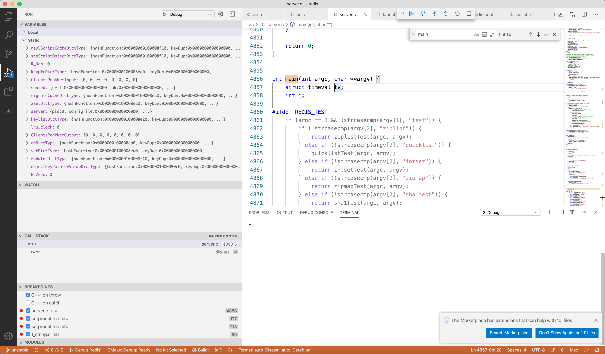
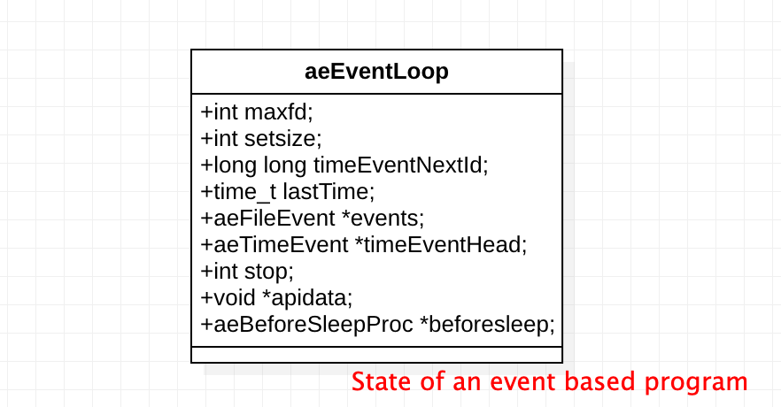
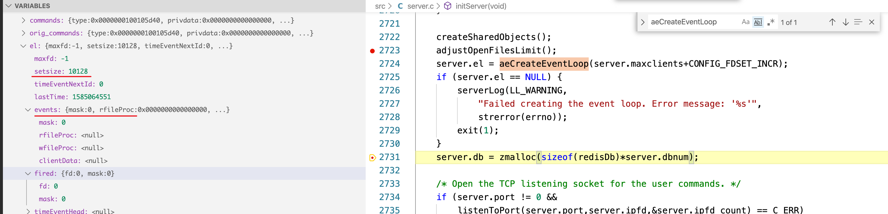
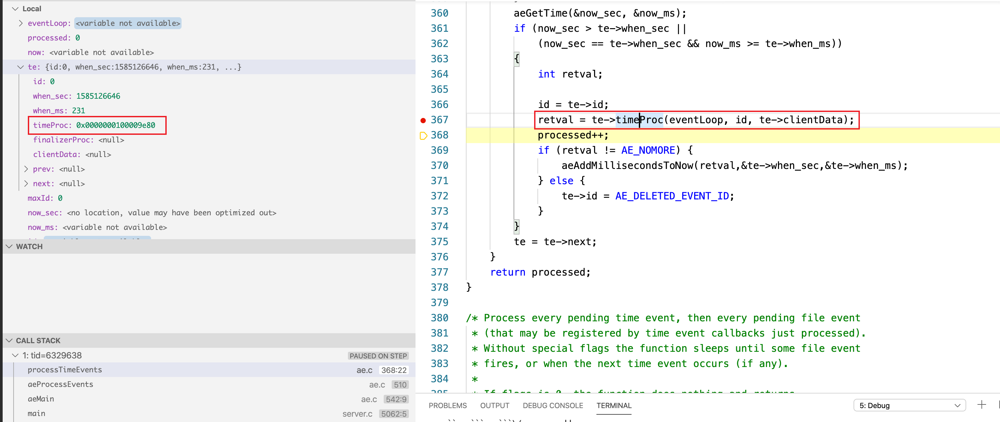
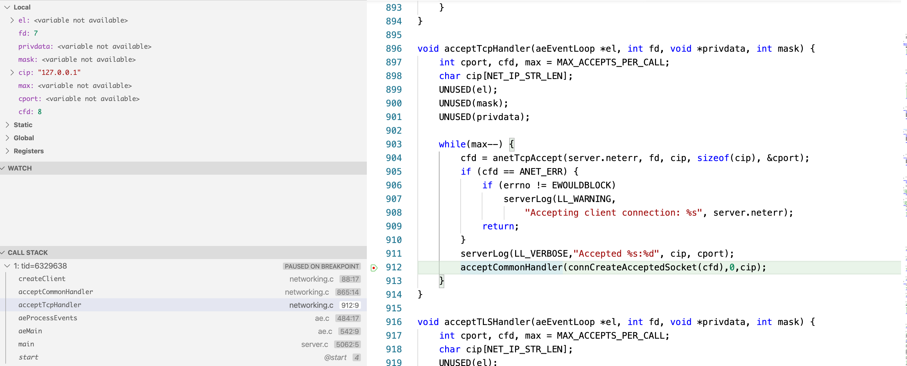

# Redis

[Documentation](https://redis.io/documentation) 

# What is Redis?

1. Redis is an **in-memory,** **key-value** **store**.

- **In-memory store**: Redis keeps the data in the cache and it does not write to the disk. This makes reading/writing data very fast. (However, Redis has an option to write data to the disk)
- **Key-value store**: Redis can store data as key-value pairs.

2. It is a [No-SQL](https://en.wikipedia.org/wiki/NoSQL) database.

3. Uses [data structures](https://redis.io/topics/data-types-intro) to store data.

4. Interaction with data is command-based.

> Redis is an open source (BSD licensed), in-memory data structure store, used as a database, cache and message broker. It supports data structures such as **strings, hashes, lists, sets, sorted sets** with range queries, bitmaps, hyperloglogs, geospatial indexes with radius queries and streams. Redis has built-in replication, Lua scripting, LRU eviction, transactions and different levels of on-disk persistence, and provides high availability via Redis Sentinel and automatic partitioning with Redis Cluster.

> You can run atomic operations on these types, like appending to a string; incrementing the value in a hash; pushing an element to a list; computing set intersection, union and difference; or getting the member with highest ranking in a sorted set.

> In order to achieve its outstanding performance, Redis works with an in-memory dataset. Depending on your use case, you can persist it either by dumping the dataset to disk every once in a while, or by appending each command to a log. Persistence can be optionally disabled, if you just need a feature-rich, networked, in-memory cache.

> Redis also supports trivial-to-setup master-slave asynchronous replication, with very fast non-blocking first synchronization, auto-reconnection with partial resynchronization on net split.

>Other features include:

    Transactions
    Pub/Sub
    Lua scripting
    Keys with a limited time-to-live
    LRU eviction of keys
    Automatic failover
    You can use Redis from most programming languages out there.

> Redis is written in ANSI C and works in most POSIX systems like Linux, *BSD, OS X without external dependencies. Linux and OS X are the two operating systems where Redis is developed and tested the most, and we recommend using Linux for deploying. Redis may work in Solaris-derived systems like SmartOS, but the support is best effort. There is no official support for Windows builds.


## Redis安装及配置

------

1. 用docker运行Redis

    > `docker pull redis`
    > `docker run -d --name redis -p 6379:6379 redis`  
    > `docker exec -it redis redis-cli`

2. Linux安装

    > 1. 确保Linux已经[安装gcc](https://blog.csdn.net/qq_33571814/article/details/82380215)
    > 2. 下载Redis
    >    `wget http://download.redis.io/releases/redis-4.0.1.tar.gz`
    > 3. 解压
    >    `tar -zxvf redis-4.0.1.tar.gz`
    > 4. 进入目录后编译
    >    `cd redis-4.0.1`
    >    `make MALLOC=libc`
    > 5. 安装
    >    `make PREFIX=/usr/local/redis install` #指定安装目录为/usr/local/redis
    > 6. 启动
    >    `/usr/local/redis/bin/redis-server`

3. Redis配置
    > 1. 进入解压的Redis目录，将redis.conf复制到安装文件的目录下
    >    `cp redis.conf /usr/local/redis`
    > 2. 启动自定义配置的Redis
    >    `/usr/local/redis/bin/redis-server /usr/local/redis/redis.conf`

4. 配置详解

    > - daemonize ： 默认为no，修改为yes启用守护线程
    > - port ：设定端口号，默认为6379
    > - bind ：绑定IP地址
    > - databases ：数据库数量，默认16
    > - save <second> <changes> ：指定多少时间、有多少次更新操作，就将数据同步到数据文件
    >   `#redis默认配置有三个条件，满足一个即进行持久化`
    >   `save 900 1` #900s有1个更改
    >   `save 300 10` #300s有10个更改
    >   `save 60 10000` #60s有10000更改
    > - dbfilename ：指定本地数据库的文件名，默认为dump.rdb
    > - dir ：指定本地数据库的存放目录，默认为./当前文件夹
    > - requirepass ：设置密码，默认关闭
    >   `redis -cli -h host -p port -a password`

5. Redis关闭

    > - 使用kill命令 (非正常关闭，数据易丢失)
    >   `ps -ef|grep -i redis`
    >   `kill -9 PID`
    > - 正常关闭
    >   `redis-cli shutdown`

## Redis常用命令

------

> Redis五种数据类型：string、hash、list、set、zset

### 公用命令

> - DEL key
> - DUMP key：序列化给定key，返回被序列化的值
> - EXISTS key：检查key是否存在
> - EXPIRE key second：为key设定过期时间
> - TTL key：返回key剩余时间
> - PERSIST key：移除key的过期时间，key将持久保存
> - KEY pattern：查询所有符号给定模式的key
> - RANDOM key：随机返回一个key
> - RANAME key newkey：修改key的名称
> - MOVE key db：移动key至指定数据库中
> - TYPE key：返回key所储存的值的类型

### EXPIRE key second的使用场景： 

1. 限时的优惠活动 

2. 网站数据缓存 

3. 手机验证码 

4. 限制网站访客频率

## key的命名规范

1. key不要太长，尽量不要超过1024字节。不仅消耗内存，也会降低查找的效率

2. key不要太短，太短可读性会降低

3. 在一个项目中，key最好使用统一的命名模式，如user:123:password

4. key区分大小写

## String 

Redis has commands for operating on some parts or the whole of the string data type. The string data type can also store integers and floating point numbers. Here is the [link](https://redis.io/commands#string) for the documentation on the commands used for operating on strings. We have previously seen an example of how to use the string data type.

### String 的常见命令

- **set** **key_name value**：命令不区分大小写，但是key_name区分大小写
- **SETNX key value**：当key不存在时设置key的值。（SET if Not eXists）
- **get key_name**
- GETRANGE key start end：获取key中字符串的子字符串，从start开始，end结束
- MGET key1 [key2 …]：获取多个key
- GETSET KEY_NAME VALUE：设定key的值，并返回key的旧值。当key不存在，返回nil
- STRLEN key：返回key所存储的字符串的长度
- **INCR KEY_NAME** ：INCR命令key中存储的值+1,如果不存在key，则key中的值话先被初始化为0再加1
- **INCRBY KEY_NAME** 增量
- **DECR KEY_NAME VALUE**：key中的值自减一
- **DECRBY KEY_NAME VALUE**
- append key_name value：字符串拼接，追加至末尾，如果不存在，为其赋值

### **String应用场景：**

1. String通常用于保存单个字符串或JSON字符串数据 
2. String是二进制安全的，所以可以把保密要求高的图片文件内容作为字符串来存储 
3. 计数器：常规Key-Value缓存应用，如微博数、粉丝数。INCR本身就具有原子性特性，所以不会有线程安全问题

## Hashes

Hashes, which are maps composed of fields associated with values. Both the field and the value are strings. This is very similar to Ruby or Python hashes.

### Hash commands

#### HGETALL key

Returns all fields and values of the hash stored at `key`. In the returned value, every field name is followed by its value, so the length of the reply is twice the size of the hash.                  

#### HSETNX key field value

Sets `field` in the hash stored at `key` to `value`, only if `field` does not yet exist. If `key` does not exist, a new key holding a hash is created. If `field` already exists, this operation has no effect.

#### HVALS key

> **Time complexity:** O(N) where N is the size of the hash.

Returns all values in the hash stored at `key`.

## List

### List commands

#### LPUSH key element [element ...]

Insert all the specified values at the head of the list stored at `key`. If `key` does not exist, it is created as empty list before performing the push operations. When `key` holds a value that is not a list, an error is returned.

It is possible to push multiple elements using a single command call just specifying multiple arguments at the end of the command. Elements are inserted one after the other to the head of the list, from the leftmost element to the rightmost element. So for instance the command `LPUSH mylist a b c` will result into a list containing `c` as first element, `b` as second element and `a` as third element.

```sql
127.0.0.1:6379> lpush mj1 "I love you"
(integer) 1
127.0.0.1:6379> lpop mj1
"I love you"
```

#### LRANGE key start stop

Returns the specified elements of the list stored at `key`. The offsets `start` and `stop` are zero-based indexes, with `0` being the first element of the list (the head of the list), `1` being the next element and so on.

These offsets can also be negative numbers indicating offsets starting at the end of the list. For example, `-1` is the last element of the list, `-2` the penultimate, and so on.

```sql
127.0.0.1:6379> rpush mj1 "I love you forver"
(integer) 1
127.0.0.1:6379> lrange mj1 0 -1
1) "I love you forver"
127.0.0.1:6379> lrange mj1 0 -1
1) "I love you forver"
127.0.0.1:6379> lrange mj1 0 -1
1) "I love you forver"
127.0.0.1:6379> lindex mj1 0
"I love you forver"
```

#### BLPOP key [key ...] timeout

[BLPOP](https://redis.io/commands/blpop) is a blocking list pop primitive. It is the blocking version of [LPOP](https://redis.io/commands/lpop) because it blocks the connection when there are no elements to pop from any of the given lists. An element is popped from the head of the first list that is non-empty, with the given keys being checked in the order that they are given.

```sql
blpop l1 200
1) "l1"
2) "3"
(11.28s)

lpush l1 3
(integer) 1
```

#### LTRIM key start stop

```
LPUSH mylist someelement
LTRIM mylist 0 99
```

This pair of commands will push a new element on the list, while making sure that the list will not grow larger than 100 elements. **This is very useful when using Redis to store logs** for example. It is important to note that when used in this way [LTRIM](https://redis.io/commands/ltrim) is an O(1) operation because in the average case just one element is removed from the tail of the list.

```sql
127.0.0.1:6379> RPUSH mylist "one"
(integer) 2
127.0.0.1:6379> rpush mylist "two"
(integer) 3
127.0.0.1:6379> RPUSH mylist "three"
(integer) 4
127.0.0.1:6379> LTRIM mylist 1 -1
OK
127.0.0.1:6379> LRANGE mylist 0 -1
1) "one"
2) "two"
3) "three"
127.0.0.1:6379> LRANGE mylist 0 -1
1) "one"
2) "two"
3) "three"
127.0.0.1:6379> LTRIM mylist 1 -1
OK
127.0.0.1:6379> LRANGE mylist 0 -1
1) "two"
2) "three"
```

#### LSET key index element

Sets the list element at `index` to `element`. For more information on the `index` argument, see [LINDEX](https://redis.io/commands/lindex).

An error is returned for out of range indexes.

```sql
127.0.0.1:6379> RPUSH mylist "one"
(integer) 3
127.0.0.1:6379> RPUSH mylist "two"
(integer) 4
127.0.0.1:6379> lset mylist -2 "five"
OK
127.0.0.1:6379> lrange mylist 0 -1
1) "two"
2) "three"
3) "five"
4) "two"
```

#### LINSERT key BEFORE|AFTER pivot element

Inserts `element` in the list stored at `key` either before or after the reference value `pivot`.

When `key` does not exist, it is considered an empty list and no operation is performed.

An error is returned when `key` exists but does not hold a list value.

```sql
linsert mylist BEFORE "two" "six"
(integer) 5
127.0.0.1:6379> lrange mylist 0 -1
1) "six"
2) "two"
3) "three"
4) "five"
5) "two"
```

#### RPOPLPUSH source destination

Atomically returns and removes the last element (tail) of the list stored at `source`, and pushes the element at the first element (head) of the list stored at `destination`.

For example: consider `source` holding the list `a,b,c`, and `destination` holding the list `x,y,z`. Executing [RPOPLPUSH](https://redis.io/commands/rpoplpush) results in `source` holding `a,b` and `destination` holding `c,x,y,z`.

If `source` does not exist, the value `nil` is returned and no operation is performed. If `source` and `destination` are the same, the operation is equivalent to removing the last element from the list and pushing it as first element of the list, so it can be considered as a list rotation command.

#####  Pattern: Reliable queue

Redis is often used as a messaging server to implement processing of background jobs or other kinds of messaging tasks. A simple form of queue is often obtained pushing values into a list in the producer side, and waiting for this values in the consumer side using [RPOP](https://redis.io/commands/rpop) (using polling), or [BRPOP](https://redis.io/commands/brpop) if the client is better served by a blocking operation.

#####  Pattern: Circular list

Using [RPOPLPUSH](https://redis.io/commands/rpoplpush) with the same source and destination key, a client can visit all the elements of an N-elements list, one after the other, in O(N) without transferring the full list from the server to the client using a single [LRANGE](https://redis.io/commands/lrange) operation.

The above pattern works even if the following two conditions:

- There are multiple clients rotating the list: they'll fetch different elements, until all the elements of the list are visited, and the process restarts.

- Even if other clients are actively pushing new items at the end of the list. 

  An example is a monitoring system that must check that a set of web sites are reachable, with the smallest delay possible, using a number of parallel workers.

```sql
127.0.0.1:6379> RPUSH mylist "one"
(integer) 6
127.0.0.1:6379> RPUSH mylist "two"
(integer) 7
127.0.0.1:6379> RPUSH mylist "three"
(integer) 8
127.0.0.1:6379> RPOPLPUSH mylist myotherlist
"three"
127.0.0.1:6379> LRANGE mylist 0 -1
1) "six"
2) "two"
3) "three"
4) "five"
5) "two"
6) "one"
7) "two"
127.0.0.1:6379> lrange myotherlist 0 -1
1) "three"
127.0.0.1:6379>
```

## Set 

#### SET key value [EX seconds|PX milliseconds] [NX|XX] [KEEPTTL]

```shell
127.0.0.1:6379> SET mykey "Hello"
OK
127.0.0.1:6379> get mykey
"Hello"
127.0.0.1:6379>  SET anotherkey "will expire in a minute" EX 60
OK
127.0.0.1:6379> keys *
```

#### SCARD key

Returns the set cardinality (number of elements) of the set stored at `key`.

```
127.0.0.1:6379> type myset
set
127.0.0.1:6379> scard myset
(integer) 2
127.0.0.1:6379> scard mj
(error) WRONGTYPE Operation against a key holding the wrong kind of value
```

#### SISMEMBER key member

```
sismember myset "one"
(integer) 1
127.0.0.1:6379> sismember myset "two"
(integer) 0
127.0.0.1:6379> SISMEMBER myset "one"
(integer) 1
```

#### SRANDMEMBER key [count]

```
127.0.0.1:6379> srandmember myset 2
1) "Hello"
2) "one"
127.0.0.1:6379>
```

#####  Distribution of returned elements

The distribution of the returned elements is far from perfect when the number of elements in the set is small, this is due to the fact that we used an approximated random element function that does not really guarantees good distribution.

The algorithm used, that is implemented inside dict.c, samples the hash table buckets to find a non-empty one. **Once a non empty bucket is found, since we use chaining in our hash table implementation, the number of elements inside the bucket is checked and a random element is selected.**

This means that if you have two non-empty buckets in the entire hash table, and one has three elements while one has just one, the element that is alone in its bucket will be returned with much higher probability.

#### SREM key member [member ...]

```shell
127.0.0.1:6379> SMEMBERS myset
1) "Hello"
2) "World"
3) "two"
4) "one"
5) "three"
127.0.0.1:6379> SREM myset one
(integer) 1
127.0.0.1:6379> SMEMBERS myset
1) "Hello"
2) "World"
3) "two"
4) "three"
```

#### SCAN cursor [MATCH pattern] [COUNT count] [TYPE type]	

Since these commands allow for incremental iteration, returning only a small number of elements per call, they can be used in production without the downside of commands like [KEYS](https://redis.io/commands/keys) or [SMEMBERS](https://redis.io/commands/smembers) that may block the server for a long time (even several seconds) when called against big collections of keys or elements.

However while blocking commands like [SMEMBERS](https://redis.io/commands/smembers) are able to provide all the elements that are part of a Set in a given moment, The SCAN family of commands only offer limited guarantees about the returned elements since the collection that we incrementally iterate can change during the iteration process.

```shell
127.0.0.1:6379> sadd myset 1 2 3 foo foobar feelsgood
(integer) 6
127.0.0.1:6379> sscan myset 0 match f*
1) "0"
2) 1) "foobar"
   2) "foo"
   3) "feelsgood"
127.0.0.1:6379> scan 0 MATCH *mj*
1) "9"
2) 1) "mj1"
   2) "list_mj"
   3) "mj"
   4) "mj520"
   5) "zset-mj"
   
127.0.0.1:6379> scan 0 MATCH *mj* count 4
1) "10"
2) 1) "mj1"
   2) "list_mj"
   3) "mj"
   4) "mj520"
```

#  [Redis debugging guide](https://redis.io/topics/debugging#attaching-gdb-to-a-running-process)

## Attaching GDB to a running process

```
$ redis-cli info | grep process_id
process_id:58414
```

In the above example the process ID is **58414**.

- Login into your Redis server.

- (Optional but recommended) Start **screen** or **tmux** or any other program that will make sure that your GDB session will not be closed if your ssh connection will timeout. If you don't know what screen is do yourself a favor and [Read this article](http://www.linuxjournal.com/article/6340)

- Attach GDB to the running Redis server typing:

  gdb `` ``

  For example: gdb /usr/local/bin/redis-server 58414

GDB will start and will attach to the running server printing something like the following:

## Obtaining the core file

The next step is to generate the core dump, that is the image of the memory of the running Redis process. This is performed using the `gcore` command:

```
(gdb) gcore
Saved corefile core.58414
```


## [VSCode, MacOS Catalina - doesn't stop on breakpoints on C/C++ debug](https://stackoverflow.com/questions/58329611/vscode-macos-catalina-doesnt-stop-on-breakpoints-on-c-c-debug)


# Src	

redis-server的main函数位于server.c 中，我们从main开始逐步分析代码的流程。整个redis-server的main函数位于[redis.c:4856](https://github.com/henrytien/redis/blob/unstable/src/server.c#L4856)中，我们从`main`开始逐步分析代码的流程。



## Config

### struct redisServer

[redisServer](https://github.com/henrytien/redis/blob/unstable/src/server.h#L1014) Server global state.

[initServerConfig](https://github.com/henrytien/redis/blob/unstable/src/server.c#L2272) 

`server.migrate_cached_sockets = dictCreate(&migrateCacheDictType,NULL);`

- [dict](https://github.com/henrytien/redis/blob/unstable/src/dict.h#L76) implement by hash table and when conflict deal with rehash.

```c
typedef struct dict {
    dictType *type;
    void *privdata;
    dictht ht[2];
    long rehashidx; /* rehashing not in progress if rehashidx == -1 */
    unsigned long iterators; /* number of iterators currently running */
} dict;
```

```c
/* Initialize the hash table */
int _dictInit(dict *d, dictType *type,
        void *privDataPtr)
{
    _dictReset(&d->ht[0]);
    _dictReset(&d->ht[1]);
    d->type = type;
    d->privdata = privDataPtr;
    d->rehashidx = -1;
    d->iterators = 0;
    return DICT_OK;
}
```

### Command table

```c
server.commands = dictCreate(&commandTableDictType,NULL);
server.orig_commands = dictCreate(&commandTableDictType,NULL);
```

```c
/* Command table. sds string -> command struct pointer. */
dictType commandTableDictType = {
    dictSdsCaseHash,            /* hash function */
    NULL,                       /* key dup */
    NULL,                       /* val dup */
    dictSdsKeyCaseCompare,      /* key compare */
    dictSdsDestructor,          /* key destructor */
    NULL                        /* val destructor */
};
```

 Populates the Redis Command Table starting from the hard coded list

[redisCommandTable](https://github.com/henrytien/redis/blob/unstable/src/server.c#L182) Here are struct array, implement by struct of  redisCommand,  numcommands are 202.

```c
struct redisCommand {
    char *name;
    redisCommandProc *proc;
    int arity;
    char *sflags;   /* Flags as string representation, one char per flag. */
    uint64_t flags; /* The actual flags, obtained from the 'sflags' field. */
    /* Use a function to determine keys arguments in a command line.
     * Used for Redis Cluster redirect. */
    redisGetKeysProc *getkeys_proc;
    /* What keys should be loaded in background when calling this command? */
    int firstkey; /* The first argument that's a key (0 = no keys) */
    int lastkey;  /* The last argument that's a key */
    int keystep;  /* The step between first and last key */
    long long microseconds, calls;
    int id;     /* Command ID. This is a progressive ID starting from 0 that
                   is assigned at runtime, and is used in order to check
                   ACLs. A connection is able to execute a given command if
                   the user associated to the connection has this command
                   bit set in the bitmap of allowed commands. */
};
```

### ACLInit

The Redis ACL, short for Access Control List, is the feature that allows certain connections to be limited in terms of the commands that can be executed and the keys that can be accessed.

[ACLSetUser](https://github.com/henrytien/redis/blob/unstable/src/acl.c#L703) Set user properties according to the string "op".

### moduleInitModulesSystem

Set up the keyspace notification susbscriber list and static client .

```c
 moduleKeyspaceSubscribers = listCreate();
 moduleFreeContextReusedClient = createClient(NULL);
```

[server.h/client](https://github.com/henrytien/redis/blob/unstable/src/server.h#L759)

Our thread-safe contexts GIL must start with already locked, it is just unlocked when it's safe.`pthread_mutex_lock(&moduleGIL);` in `moduleInitModulesSystem`.

## Check

### Sentinel mode

Parsing the configuration file, in sentinel mode will have the effect of populating the sentinel data structures with master nodes to monitor.

```c
if (server.sentinel_mode) {
  initSentinelConfig();
  initSentinel();
}
```


### Check redis-check-rdb/aof mode

```c
if (strstr(argv[0],"redis-check-rdb") != NULL)
  	redis_check_rdb_main(argc,argv,NULL);
else if (strstr(argv[0],"redis-check-aof") != NULL)
    redis_check_aof_main(argc,argv);
```


### Handle config file

All the other options are parsed and conceptually appended to the configuration file.

```c
 while(j != argc) {
   if (argv[j][0] == '-' && argv[j][1] == '-') {
     /* Option name */
     if (!strcmp(argv[j], "--check-rdb")) {
       /* Argument has no options, need to skip for parsing. */
       j++;
       continue;
     }
     if (sdslen(options)) options = sdscat(options,"\n");
     options = sdscat(options,argv[j]+2);
     options = sdscat(options," ");
   } else {
     /* Option argument */
     options = sdscatrepr(options,argv[j],strlen(argv[j]));
     options = sdscat(options," ");
   }
   j++;
 }
```


[loadServerConfigFromString](https://github.com/henrytien/redis/blob/unstable/src/config.c#L289)

Load the server configuration from the specified filename. This way loadServerConfig can be used to just load  a string.

```c
//...
/* Execute config directives */
if (!strcasecmp(argv[0],"bind") && argc >= 2) {
	int j, addresses = argc-1;

	if (addresses > CONFIG_BINDADDR_MAX) {
	err = "Too many bind addresses specified"; goto loaderr;
}
/* Free old bind addresses */
for (j = 0; j < server.bindaddr_count; j++) {
	zfree(server.bindaddr[j]);
}
for (j = 0; j < addresses; j++)
	server.bindaddr[j] = zstrdup(argv[j+1]);
	server.bindaddr_count = addresses;
}// ...
```

---

## InitServer

[initServer](https://github.com/henrytien/redis/blob/unstable/src/server.c#L2684), Initialization after setting defaults from the config system. Open the TCP listening socket for the user commands.

### Create aeEventLoop

[createSharedObjects](https://github.com/henrytien/redis/blob/unstable/src/server.c#L2157) Server initialization.

```c
typedef struct redisObject {
    unsigned type:4;
    unsigned encoding:4;
    unsigned lru:LRU_BITS; /* LRU time (relative to global lru_clock) or
                            * LFU data (least significant 8 bits frequency
                            * and most significant 16 bits access time). */
    int refcount;
    void *ptr;
} robj;
```


[aeEventLoop *aeCreateEventLoop(int setsize)](https://github.com/henrytien/redis/blob/unstable/src/ae.c#L66) State of an event based program, and all file event will be  registered.

```c
/* File event structure */
typedef struct aeFileEvent {
    int mask; /* one of AE_(READABLE|WRITABLE|BARRIER) */
    aeFileProc *rfileProc;
    // 写事件
    aeFileProc *wfileProc;
    void *clientData;
} aeFileEvent;

```

aeEventLoop assignment server.el

```c
//...
server.el = aeCreateEventLoop(server.maxclients+CONFIG_FDSET_INCR);
    if (server.el == NULL) {
        serverLog(LL_WARNING,
            "Failed creating the event loop. Error message: '%s'",
            strerror(errno));
        exit(1);
    }
//...
```

struct aeEventLoop 



Initionlization  aeEventLoop



### Server Listening 

TCP listening socket for the user commands, the listening file descriptors are stored in the integer array 'fds' and their number is set in '*count'.

```c
int listenToPort(int port, int *fds, int *count) {
    int j;

  /* Force binding of 0.0.0.0 if no bind address is specified, always
   * entering the loop if j == 0. */
	if (server.bindaddr_count == 0) server.bindaddr[0] = NULL;
	for (j = 0; j < server.bindaddr_count || j == 0; j++) {
        if (server.bindaddr[j] == NULL) {
            int unsupported = 0;
            /* Bind * for both IPv6 and IPv4, we enter here only if
             * server.bindaddr_count == 0. */
            fds[*count] = anetTcp6Server(server.neterr,port,NULL,
                server.tcp_backlog);
            if (fds[*count] != ANET_ERR) {
                anetNonBlock(NULL,fds[*count]);
                (*count)++;
            } else if (errno == EAFNOSUPPORT) {
                unsupported++;
                serverLog(LL_WARNING,"Not listening to IPv6: unsupported");
            }
         //...
        }//...
		}
  //...
}
        
```

### Socket 

[_anetTcpServer](https://github.com/henrytien/redis/blob/unstable/src/anet.c#L479) create socket, and set socket.

```c
//...
for (p = servinfo; p != NULL; p = p->ai_next) {
        // Create first socket.
        if ((s = socket(p->ai_family,p->ai_socktype,p->ai_protocol)) == -1)
            continue;

        if (af == AF_INET6 && anetV6Only(err,s) == ANET_ERR) goto error;
        if (anetSetReuseAddr(err,s) == ANET_ERR) goto error;
        if (anetListen(err,s,p->ai_addr,p->ai_addrlen,backlog) == ANET_ERR) s = ANET_ERR;
        goto end;
    }
    
   //...
```


### Redis databases

Create the Redis databases, and initialize other internal state.

typedef struct [redisDb](https://github.com/henrytien/redis/blob/unstable/src/server.h#L635)

```c
/* Redis database representation. There are multiple databases identified
 * by integers from 0 (the default database) up to the max configured
 * database. The database number is the 'id' field in the structure. */
typedef struct redisDb {
    dict *dict;                 /* The keyspace for this DB */
    dict *expires;              /* Timeout of keys with a timeout set */
    dict *blocking_keys;        /* Keys with clients waiting for data (BLPOP)*/
    dict *ready_keys;           /* Blocked keys that received a PUSH */
    dict *watched_keys;         /* WATCHED keys for MULTI/EXEC CAS */
    int id;                     /* Database ID */
    long long avg_ttl;          /* Average TTL, just for stats */
    unsigned long expires_cursor; /* Cursor of the active expire cycle. */
    list *defrag_later;         /* List of key names to attempt to defrag one by one, gradually. */
} redisDb;
```

### timer

Create the timer callback, this is our way to process many background operations incrementally, like clients timeout, eviction of unaccessed expired keys and so forth.

[aeCreateTimeEvent](https://github.com/henrytien/redis/blob/unstable/src/ae.c#L244)

```c
long long aeCreateTimeEvent(aeEventLoop *eventLoop, long long milliseconds,
        aeTimeProc *proc, void *clientData,
        aeEventFinalizerProc *finalizerProc)
{
    long long id = eventLoop->timeEventNextId++;
    aeTimeEvent *te;

    te = zmalloc(sizeof(*te));
    if (te == NULL) return AE_ERR;
    te->id = id;
    aeAddMillisecondsToNow(milliseconds,&te->when_sec,&te->when_ms);
    te->timeProc = proc;
    te->finalizerProc = finalizerProc;
    te->clientData = clientData;
    te->prev = NULL;
    te->next = eventLoop->timeEventHead;
    if (te->next)
        te->next->prev = te;
    eventLoop->timeEventHead = te;
    return id;
}
```

Here are some other things init. Like `clusterInit()`, `scriptingInit()`,

```c
if (server.cluster_enabled) clusterInit();
    replicationScriptCacheInit();
    scriptingInit(1);
    slowlogInit();
    latencyMonitorInit();
```

## Loading

Load the data when server init.

```c
 moduleLoadFromQueue(); // Load all the modules in the server
 ACLLoadUsersAtStartup(); // in order to load the ACLs
 InitServerLast();
 loadDataFromDisk();
```

[InitServerLast](https://github.com/henrytien/redis/blob/unstable/src/server.c#L2887) Specifically, creation of threads due to a race bug in ld.so, in which Thread Local Storage initialization collides with dlopen call.

```c
void InitServerLast() {
    /* Initialize the background system, spawning the thread.*/
    bioInit(); 
    /* Initialize the data structures needed for threaded I/O. */
    initThreadedIO();
    set_jemalloc_bg_thread(server.jemalloc_bg_thread);
    server.initial_memory_usage = zmalloc_used_memory();
}
```


## Process event

```c
aeSetBeforeSleepProc(server.el,beforeSleep);
aeSetAfterSleepProc(server.el,afterSleep);
aeMain(server.el);
aeDeleteEventLoop(server.el);
```

Here are aeMain will proccess event until stop.

```c
void aeMain(aeEventLoop *eventLoop) {
    eventLoop->stop = 0;
    while (!eventLoop->stop) {
        if (eventLoop->beforesleep != NULL)
            eventLoop->beforesleep(eventLoop);
        aeProcessEvents(eventLoop, AE_ALL_EVENTS|AE_CALL_AFTER_SLEEP);
    }
}
```

[aeProcessEvents](https://github.com/henrytien/redis/blob/unstable/src/ae.c#L394) Process every pending time event, then every pending file event (that may be registered by time event callbacks just processed). Without special flags the function sleeps until some file event fires, or when the next time event occurs (if any).

### Timer event

```c
int aeProcessEvents(aeEventLoop *eventLoop, int flags)
{
    int processed = 0, numevents;
  	//...
		/* Call the multiplexing API, will return only on timeout or when
 		* some event fires. */
 		numevents = aeApiPoll(eventLoop, tvp);
  	//...
}
  
```


Call the multiplexing API, will return only on timeout or when some event fires.

```c
static int aeApiPoll(aeEventLoop *eventLoop, struct timeval *tvp) {
    aeApiState *state = eventLoop->apidata;
    int retval, numevents = 0;

    if (tvp != NULL) {
        struct timespec timeout;
        timeout.tv_sec = tvp->tv_sec;
        timeout.tv_nsec = tvp->tv_usec * 1000;
        retval = kevent(state->kqfd, NULL, 0, state->events, eventLoop->setsize,
                        &timeout);
    } else {
        retval = kevent(state->kqfd, NULL, 0, state->events, eventLoop->setsize,
                        NULL);
    }
    //...
}
```


This is our timer interrupt, called server.hz times per second. Here is where we do a number of things that need to be done asynchronously. For instance: Triggering BGSAVE / AOF rewrite, and handling of terminated children. Stop the I/O threads if we don't have enough pending work.

[serverCron](https://github.com/henrytien/redis/blob/unstable/src/server.c#L1838) Everything directly called here will be called server.hz times per second.

```c
int serverCron(struct aeEventLoop *eventLoop, long long id, void *clientData) {
    int j;
    UNUSED(eventLoop);
    UNUSED(id);
    UNUSED(clientData);
    //...
		/* We need to do a few operations on clients asynchronously. */
    clientsCron();

    /* Handle background operations on Redis databases. */
    databasesCron();

    /* Start a scheduled AOF rewrite if this was requested by the user while
     * a BGSAVE was in progress. */
    if (!hasActiveChildProcess() &&
        server.aof_rewrite_scheduled)
    {
        rewriteAppendOnlyFileBackground();
    }
    //...
  	server.cronloops++;
    return 1000/server.hz;
}
```

The serverCron first time registered by aeCreateTimeEvent in [InitServer](https://github.com/henrytien/redis/blob/unstable/src/server.c#L2818).

```c
/* Create the timer callback, this is our way to process many background
     * operations incrementally, like clients timeout, eviction of unaccessed
     * expired keys and so forth. */
    if (aeCreateTimeEvent(server.el, 1, serverCron, NULL, NULL) == AE_ERR) {
        serverPanic("Can't create event loop timers.");
        exit(1);
    }
```


Handle in processTimeEvents.




## Connect server

### Accept

when you exec `./redis-cli` 

[acceptTcpHandler](https://github.com/henrytien/redis/blob/unstable/src/networking.c#L896) 



Handling by acceptCommonHandler function.

```c
static void acceptCommonHandler(connection *conn, int flags, char *ip) {
//...
/* Create connection and client */
    if ((c = createClient(conn)) == NULL) {
        char conninfo[100];
        serverLog(LL_WARNING,
            "Error registering fd event for the new client: %s (conn: %s)",
            connGetLastError(conn),
            connGetInfo(conn, conninfo, sizeof(conninfo)));
        connClose(conn); /* May be already closed, just ignore errors */
        return;
    }
	  //...
   }
```

### Create Client

Set conn no block, don't delay send to coalesce packets.

```c
client *createClient(connection *conn) {
    client *c = zmalloc(sizeof(client));

    /* passing NULL as conn it is possible to create a non connected client.
     * This is useful since all the commands needs to be executed
     * in the context of a client. When commands are executed in other
     * contexts (for instance a Lua script) we need a non connected client. */
    if (conn) {
        connNonBlock(conn);
        connEnableTcpNoDelay(conn);
        if (server.tcpkeepalive)
            connKeepAlive(conn,server.tcpkeepalive);
        connSetReadHandler(conn, readQueryFromClient);
        connSetPrivateData(conn, c);
    }
    // ...
}
```

Struct [connection](https://github.com/henrytien/redis/blob/unstable/src/connection.h#L70) 

```c
struct connection {
    ConnectionType *type;
    ConnectionState state;
    int flags;
    int last_errno;
    void *private_data;
    ConnectionCallbackFunc conn_handler;
    ConnectionCallbackFunc write_handler;
    ConnectionCallbackFunc read_handler;
    int fd;
};
```

Note that connAccept() is free to do two things here:

1. Call clientAcceptHandler() immediately;

2. Schedule a future call to clientAcceptHandler().

```c
if (connAccept(conn, clientAcceptHandler) == C_ERR) {
        char conninfo[100];
        serverLog(LL_WARNING,
                "Error accepting a client connection: %s (conn: %s)",
                connGetLastError(conn), connGetInfo(conn, conninfo, sizeof(conninfo)));
        freeClient(connGetPrivateData(conn));
        return;
    }
```

`connAccept()` aims to reduce the need to wait for the next event loop, if no additional handshake is required.

### Read query from client

This function is called every time, in the client structure 'c', there is more query buffer to process, because we read more data from the socket or because a client was blocked and later reactivated, so there could be pending query buffer, already representing a full command, to process.

```c
void processInputBuffer(client *c) {
    /* Keep processing while there is something in the input buffer */
    while(c->qb_pos < sdslen(c->querybuf)) {
        /* Return if clients are paused. */
        if (!(c->flags & CLIENT_SLAVE) && clientsArePaused()) break;
        
    //...
	
	 /* Multibulk processing could see a <= 0 length. */
        if (c->argc == 0) {
            resetClient(c);
        } else {
            /* If we are in the context of an I/O thread, we can't really
             * execute the command here. All we can do is to flag the client
             * as one that needs to process the command. */
            if (c->flags & CLIENT_PENDING_READ) {
                c->flags |= CLIENT_PENDING_COMMAND;
                break;
            }

            /* We are finally ready to execute the command. */
            if (processCommandAndResetClient(c) == C_ERR) {
                /* If the client is no longer valid, we avoid exiting this
                 * loop and trimming the client buffer later. So we return
                 * ASAP in that case. */
                return;
            }
        }
}
    
```


This function gets called we already read a whole command, arguments are in the client argv/argc fields. `processCommand()` execute the command or prepare the server for a bulk read from the client.

```c
int processCommand(client *c) {
    moduleCallCommandFilters(c);

    /* The QUIT command is handled separately. Normal command procs will
     * go through checking for replication and QUIT will cause trouble
     * when FORCE_REPLICATION is enabled and would be implemented in
     * a regular command proc. */
    if (!strcasecmp(c->argv[0]->ptr,"quit")) {
        addReply(c,shared.ok);
        c->flags |= CLIENT_CLOSE_AFTER_REPLY;
        return C_ERR;
    }

    /* Now lookup the command and check ASAP about trivial error conditions
     * such as wrong arity, bad command name and so forth. */
    c->cmd = c->lastcmd = lookupCommand(c->argv[0]->ptr);
    //...
    
}
```

### Process Command

`processCommand()` execute the command or prepare the server for a bulk read from the client.

[processCommand](https://github.com/henrytien/redis/blob/unstable/src/server.c#L3338)

```c
int processCommand(client *c) {
//...
/* Exec the command */
    if (c->flags & CLIENT_MULTI &&
        c->cmd->proc != execCommand && c->cmd->proc != discardCommand &&
        c->cmd->proc != multiCommand && c->cmd->proc != watchCommand)
    {
        queueMultiCommand(c);
        addReply(c,shared.queued);
    } else {
        call(c,CMD_CALL_FULL);
        c->woff = server.master_repl_offset;
        if (listLength(server.ready_keys))
            handleClientsBlockedOnKeys();
    }
    return C_OK;
}
```


### Write to client

This function is called every time we are going to transmit new data to the client.

```c
int prepareClientToWrite(client *c) {
    /* If it's the Lua client we always return ok without installing any
     * handler since there is no socket at all. */
    if (c->flags & (CLIENT_LUA|CLIENT_MODULE)) return C_OK;

    /* CLIENT REPLY OFF / SKIP handling: don't send replies. */
    if (c->flags & (CLIENT_REPLY_OFF|CLIENT_REPLY_SKIP)) return C_ERR;

    /* Masters don't receive replies, unless CLIENT_MASTER_FORCE_REPLY flag
     * is set. */
    if ((c->flags & CLIENT_MASTER) &&
        !(c->flags & CLIENT_MASTER_FORCE_REPLY)) return C_ERR;

    if (!c->conn) return C_ERR; /* Fake client for AOF loading. */

    /* Schedule the client to write the output buffers to the socket, unless
     * it should already be setup to do so (it has already pending data). */
    if (!clientHasPendingReplies(c)) clientInstallWriteHandler(c);

    /* Authorize the caller to queue in the output buffer of this client. */
    return C_OK;
}
```

[handleClientsWithPendingWrites](https://github.com/henrytien/redis/blob/unstable/src/networking.c#L1314) This function is called just before entering the event loop, in the hope we can just write the replies to the client output buffer without any need to use a syscall in order to install the writable event handler.

```c
int handleClientsWithPendingWrites(void) {
    listIter li;
    listNode *ln;
    int processed = listLength(server.clients_pending_write);

    listRewind(server.clients_pending_write,&li);
    while((ln = listNext(&li))) {
        client *c = listNodeValue(ln);
        c->flags &= ~CLIENT_PENDING_WRITE;
        listDelNode(server.clients_pending_write,ln);

        /* If a client is protected, don't do anything,
         * that may trigger write error or recreate handler. */
        if (c->flags & CLIENT_PROTECTED) continue;

        /* Try to write buffers to the client socket. */
        if (writeToClient(c,0) == C_ERR) continue;
        //...
}
```


Amount of bytes already sent in the current buffer or object being sent.

```c
/* If we fully sent the object on head go to the next one */
if (c->sentlen == objlen) {
    c->reply_bytes -= o->size;
    listDelNode(c->reply,listFirst(c->reply));
    c->sentlen = 0;
    /* If there are no longer objects in the list, we expect
    * the count of reply bytes to be exactly zero. */
    if (listLength(c->reply) == 0)
    serverAssert(c->reply_bytes == 0);
}
```


### Packet

```c
/* Protocol and I/O related defines */
#define PROTO_MAX_QUERYBUF_LEN  (1024*1024*1024) /* 1GB max query buffer. */
#define PROTO_IOBUF_LEN         (1024*16)  /* Generic I/O buffer size */
#define PROTO_REPLY_CHUNK_BYTES (16*1024) /* 16k output buffer */
#define PROTO_INLINE_MAX_SIZE   (1024*64) /* Max size of inline reads */
#define PROTO_MBULK_BIG_ARG     (1024*32)
#define LONG_STR_SIZE      21          /* Bytes needed for long -> str + '\0' */
#define REDIS_AUTOSYNC_BYTES (1024*1024*32) /* fdatasync every 32MB */
```


aof.c and rdb.c

---

As you can guess from the names these files implement the RDB and AOF

persistence for Redis. Redis uses a persistence model based on the `fork()`

system call in order to create a thread with the same (shared) memory

content of the main Redis thread. This secondary thread dumps the content

of the memory on disk. This is used by `rdb.c` to create the snapshots

on disk and by `aof.c` in order to perform the AOF rewrite when the

append only file gets too big.


The implementation inside `aof.c` has additional functions in order to

implement an API that allows commands to append new commands into the AOF

file as clients execute them.


The `call()` function defined inside `server.c` is responsible to call

the functions that in turn will write the commands into the AOF.


[rdbLoadRio](https://github.com/henrytien/redis/blob/unstable/src/rdb.c#L2023) Load an RDB file from the rio stream 'rdb'.

```c
int rdbLoadRio(rio *rdb, int rdbflags, rdbSaveInfo *rsi) {
    uint64_t dbid;
    int type, rdbver;
    redisDb *db = server.db+0;
    char buf[1024];

    rdb->update_cksum = rdbLoadProgressCallback;
    rdb->max_processing_chunk = server.loading_process_events_interval_bytes;
    if (rioRead(rdb,buf,9) == 0) goto eoferr;  // Here rio 
    buf[9] = '\0';
    
    //...
}
```

## DB

### Set operation	

High level Set operation. This function can be used in order to set a key, whatever it was existing or not, to a new object. [genericSetKey]

```c
void genericSetKey(redisDb *db, robj *key, robj *val, int keepttl) {
    if (lookupKeyWrite(db,key) == NULL) {
        dbAdd(db,key,val);
    } else {
        dbOverwrite(db,key,val);
    }
    incrRefCount(val);
    if (!keepttl) removeExpire(db,key);
    signalModifiedKey(db,key);
}
```

Create a new key in a Redis database. `dicAdd()`

```c
/* Add an element to the target hash table */
int dictAdd(dict *d, void *key, void *val)
{
    dictEntry *entry = dictAddRaw(d,key,NULL);

    if (!entry) return DICT_ERR;
    dictSetVal(d, entry, val);
    return DICT_OK;
}

```

HashTable 

```c
/* This is our hash table structure. Every dictionary has two of this as we
 * implement incremental rehashing, for the old to the new table. */
typedef struct dictht {
    dictEntry **table;
    unsigned long size;
    unsigned long sizemask;
    unsigned long used;
} dictht;
```


Random

```c
unsigned int dictGetSomeKeys(dict *d, dictEntry **des, unsigned int count) {
		unsigned long j; /* internal hash table id, 0 or 1. */
    unsigned long tables; /* 1 or 2 tables? */
    unsigned long stored = 0, maxsizemask;
    unsigned long maxsteps;

    if (dictSize(d) < count) count = dictSize(d);
    maxsteps = count*10;

    /* Try to do a rehashing work proportional to 'count'. */
    for (j = 0; j < count; j++) {
        if (dictIsRehashing(d))
            _dictRehashStep(d);
        else
            break;
    }

    tables = dictIsRehashing(d) ? 2 : 1;
    maxsizemask = d->ht[0].sizemask;
    if (tables > 1 && maxsizemask < d->ht[1].sizemask)
        maxsizemask = d->ht[1].sizemask;

    /* Pick a random point inside the larger table. */
    unsigned long i = random() & maxsizemask;
    unsigned long emptylen = 0; /* Continuous empty entries so far. */
    while(stored < count && maxsteps--) {
        for (j = 0; j < tables; j++) {
            if (tables == 2 && j == 0 && i < (unsigned long) d->rehashidx) {
                if (i >= d->ht[1].size)
                    i = d->rehashidx;
                else
                    continue;
            }
            if (i >= d->ht[j].size) continue; /* Out of range for this table. */
            dictEntry *he = d->ht[j].table[i];

            /* Count contiguous empty buckets, and jump to other
             * locations if they reach 'count' (with a minimum of 5). */
            if (he == NULL) {
                emptylen++;
                if (emptylen >= 5 && emptylen > count) {
                    i = random() & maxsizemask;
                    emptylen = 0;
                }
            } else {
                emptylen = 0;
                while (he) {
                    /* Collect all the elements of the buckets found non
                     * empty while iterating. */
                    *des = he;
                    des++;
                    he = he->next;
                    stored++;
                    if (stored == count) return stored;
                }
            }
        }
        i = (i+1) & maxsizemask;
    }
    return stored;
}
```


### Data Type 	

`redisObject`

```c
typedef struct redisObject {
    unsigned type:4;
    unsigned encoding:4;
    unsigned lru:LRU_BITS; /* LRU time (relative to global lru_clock) or
                            * LFU data (least significant 8 bits frequency
                            * and most significant 16 bits access time). */
    int refcount;
    void *ptr;
} robj;
```

Basically this structure can represent all the basic Redis data types like  strings, lists, sets, sorted sets and so forth. The interesting thing is that it has a `type` field, so that it is possible to know what type a given object has, and a `refcount`, so that the same object can be referenced in multiple places without allocating it multiple times. Finally the `ptr`  field points to the actual representation of the object, which might vary even for the same type, depending on the `encoding` used.


`sds.c` is the Redis string library, check http://github.com/antirez/sds for more information.

The string is always null-termined (all the sds strings are, always)

```c
struct __attribute__ ((__packed__)) sdshdr8 {
    uint8_t len; /* used */
    uint8_t alloc; /* excluding the header and null terminator */
    unsigned char flags; /* 3 lsb of type, 5 unused bits */
    char buf[];
};
```

[Sds](https://github.com/henrytien/redis/blob/unstable/src/sds.c#L81) Create a new sds string with the content specified by the 'init' pointer and initlen

```c
sds sdsnewlen(const void *init, size_t initlen) {
    void *sh;
    sds s;
    char type = sdsReqType(initlen);
    /* Empty strings are usually created in order to append. Use type 8
     * since type 5 is not good at this. */
    if (type == SDS_TYPE_5 && initlen == 0) type = SDS_TYPE_8;
    int hdrlen = sdsHdrSize(type);
    unsigned char *fp; /* flags pointer. */

    sh = s_malloc(hdrlen+initlen+1);
    if (sh == NULL) return NULL;
    if (!init)
        memset(sh, 0, hdrlen+initlen+1);
    s = (char*)sh+hdrlen;
    fp = ((unsigned char*)s)-1;
    switch(type) {
        case SDS_TYPE_5: {
            *fp = type | (initlen << SDS_TYPE_BITS);
            break;
        }
        case SDS_TYPE_8: {
            SDS_HDR_VAR(8,s);
            sh->len = initlen;
            sh->alloc = initlen;
            *fp = type;
            break;
        }
        //...
    }
    if (initlen && init)
        memcpy(s, init, initlen);
    s[initlen] = '\0';
    return s;
}

```

[Ziplist](https://github.com/henrytien/redis/blob/unstable/src/zplist.c#L1)

The ziplist is a specially encoded dually linked list that is designed  to be very memory efficient. It stores both strings and integer values, where integers are encoded as actual integers instead of a series of characters.

[Skiplist](https://github.com/henrytien/redis/blob/unstable/src/server.h#L877)

```c
/* ZSETs use a specialized version of Skiplists */
typedef struct zskiplistNode {
    sds ele;
    double score;
    struct zskiplistNode *backward;
    struct zskiplistLevel {
        struct zskiplistNode *forward;
        unsigned long span;
    } level[];
} zskiplistNode;

typedef struct zskiplist {
    struct zskiplistNode *header, *tail;
    unsigned long length;
    int level;
} zskiplist;

```

Zset 

```c
typedef struct zset {
    dict *dict;
    zskiplist *zsl;
} zset;
```


[zslCreate](https://github.com/henrytien/redis/blob/unstable/src/zset.c#L80) Create a new skiplist. Should be enough for 2^64 elements.

```c
zskiplist *zslCreate(void) {
    int j;
    zskiplist *zsl;

    zsl = zmalloc(sizeof(*zsl));
    zsl->level = 1;
    zsl->length = 0;
    zsl->header = zslCreateNode(ZSKIPLIST_MAXLEVEL,0,NULL);
    for (j = 0; j < ZSKIPLIST_MAXLEVEL; j++) {
        zsl->header->level[j].forward = NULL;
        zsl->header->level[j].span = 0;
    }
    zsl->header->backward = NULL;
    zsl->tail = NULL;
    return zsl;
}
```

## HyperLogLog

HyperLogLog is similar to a Bloom filter internally as it runs items through a non-cryptographic hash and sets bits in a form of a bitfield. Unlike a Bloom filter, HyperLogLog keeps a counter of items that is incremented when new items are added that have not been previously added. This provides a very low error rate when estimating the unique items (cardinality) of a set. HyperLogLog is built right into Redis.

HyperLogLog data structure.

```c
struct hllhdr {
    char magic[4];      /* "HYLL" */
    uint8_t encoding;   /* HLL_DENSE or HLL_SPARSE. */
    uint8_t notused[3]; /* Reserved for future use, must be zero. */
    uint8_t card[8];    /* Cached cardinality, little endian. */
    uint8_t registers[]; /* Data bytes. */
};
```

Create an HLL object. We always create the HLL using sparse encoding. [createHLLObject](https://github.com/henrytien/redis/blob/unstable/src/hyperloglog.c#L1114)

```c
robj *createHLLObject(void) {
    robj *o;
    struct hllhdr *hdr;
    sds s;
    uint8_t *p;
    int sparselen = HLL_HDR_SIZE +
                    (((HLL_REGISTERS+(HLL_SPARSE_XZERO_MAX_LEN-1)) /
                     HLL_SPARSE_XZERO_MAX_LEN)*2);
    int aux;

    /* Populate the sparse representation with as many XZERO opcodes as
     * needed to represent all the registers. */
    aux = HLL_REGISTERS;
    s = sdsnewlen(NULL,sparselen);
    p = (uint8_t*)s + HLL_HDR_SIZE;
    while(aux) {
        int xzero = HLL_SPARSE_XZERO_MAX_LEN;
        if (xzero > aux) xzero = aux;
        HLL_SPARSE_XZERO_SET(p,xzero);
        p += 2;
        aux -= xzero;
    }
    serverAssert((p-(uint8_t*)s) == sparselen);

    /* Create the actual object. */
    o = createObject(OBJ_STRING,s);
    hdr = o->ptr;
    memcpy(hdr->magic,"HYLL",4);
    hdr->encoding = HLL_SPARSE;
    return o;
}
```


This function is actually a wrapper for [hllSparseSet(),](https://github.com/henrytien/redis/blob/unstable/src/hyperloglog.c#L903) it only performs the hashshing of the elmenet to obtain the index and zeros run length. And know about more [Redis new data structure: the HyperLogLog](http://antirez.com/news/75)

```c
int hllSparseAdd(robj *o, unsigned char *ele, size_t elesize) {
    long index;
    uint8_t count = hllPatLen(ele,elesize,&index);
    /* Update the register if this element produced a longer run of zeroes. */
    return hllSparseSet(o,index,count);
}
```

```shell
127.0.0.1:6379> pfadd mjhyper math 520
(integer) 1
(480.20s)
127.0.0.1:6379>
127.0.0.1:6379> PFMERGE henrymj mjhyper henryhyper
OK
(5.61s)
127.0.0.1:6379> PFCOUNT henrymj
(integer) 2
(4.62s)
```

## Pub/Sub

Examples 

Subscribe mjmsg

```shell
127.0.0.1:6379> subscribe mjmsg
Reading messages... (press Ctrl-C to quit)
1) "subscribe"
2) "mjmsg"
3) (integer) 1
1) "message"
2) "mjmsg"
3) "I love you"
```

Publish mjmsg 

```shell
127.0.0.1:6379> publish mjmsg "I love you"
(integer) 1
127.0.0.1:6379>
```

[pubsubSubscribeChannel](https://github.com/henrytien/redis/blob/unstable/src/pubsub.c#L149) Subscribe a client to a channel. Returns 1 if the operation succeeded, or 0 if the client was already subscribed to that channel.

```c
int pubsubSubscribeChannel(client *c, robj *channel) {
    dictEntry *de;
    list *clients = NULL;
    int retval = 0;

    /* Add the channel to the client -> channels hash table */
    if (dictAdd(c->pubsub_channels,channel,NULL) == DICT_OK) {
        retval = 1;
        incrRefCount(channel);
        /* Add the client to the channel -> list of clients hash table */
        de = dictFind(server.pubsub_channels,channel);
        if (de == NULL) {
            clients = listCreate();
            dictAdd(server.pubsub_channels,channel,clients);
            incrRefCount(channel);
        } else {
            clients = dictGetVal(de);
        }
        listAddNodeTail(clients,c);
    }
    /* Notify the client */
    addReplyPubsubSubscribed(c,channel);
    return retval;
}
```

### Pattern-matching subscriptions

The Redis Pub/Sub implementation supports pattern matching. Clients may subscribe to glob-style patterns in order to receive all the messages sent to channel names matching a given pattern.

```shell
127.0.0.1:6379> psubscribe mjmsg.*
Reading messages... (press Ctrl-C to quit)
1) "psubscribe"
2) "mjmsg.*"
3) (integer) 1
1) "pmessage"
2) "mjmsg.*"
3) "mjmsg.love"
4) "I love you"
1) "pmessage"
2) "mjmsg.*"
3) "mjmsg.i"
4) "I love henry"
```


```shell
127.0.0.1:6379> PUBLISH mjmsg.love "I love you"
(integer) 1
127.0.0.1:6379> publish mjmsg.i "I love henry"
(integer) 1
127.0.0.1:6379>
```

[pubsubSubscribePattern](https://github.com/henrytien/redis/blob/unstable/src/pubsub.c#L208)

```c
int pubsubSubscribePattern(client *c, robj *pattern) {
    int retval = 0;

    if (listSearchKey(c->pubsub_patterns,pattern) == NULL) {
        retval = 1;
        pubsubPattern *pat;
        listAddNodeTail(c->pubsub_patterns,pattern);
        incrRefCount(pattern);
        pat = zmalloc(sizeof(*pat));
        pat->pattern = getDecodedObject(pattern);
        pat->client = c;
        listAddNodeTail(server.pubsub_patterns,pat);
    }
    /* Notify the client */
    addReplyPubsubPatSubscribed(c,pattern);
    return retval;
}
```


### Publish a message

Send to clients listening for that channel, Send to clients listening to matching channels.

```c
int pubsubPublishMessage(robj *channel, robj *message) {
    //...
    /* Send to clients listening for that channel */
    de = dictFind(server.pubsub_channels,channel);
    if (de) {
        list *list = dictGetVal(de);
        listNode *ln;
        listIter li;

        listRewind(list,&li);
        while ((ln = listNext(&li)) != NULL) {
            client *c = ln->value;
            addReplyPubsubMessage(c,channel,message);
            receivers++;
        }
    }
    /* Send to clients listening to matching channels */
    if (listLength(server.pubsub_patterns)) {
        listRewind(server.pubsub_patterns,&li);
        channel = getDecodedObject(channel);
        while ((ln = listNext(&li)) != NULL) {
            pubsubPattern *pat = ln->value;

            if (stringmatchlen((char*)pat->pattern->ptr,
                                sdslen(pat->pattern->ptr),
                                (char*)channel->ptr,
                                sdslen(channel->ptr),0))
            {
                addReplyPubsubPatMessage(pat->client,
                    pat->pattern,channel,message);
                receivers++;
            }
        }
        decrRefCount(channel);
    }
    return receivers;
}
```

##  Transactions

[MULTI](https://redis.io/commands/multi), [EXEC](https://redis.io/commands/exec), [DISCARD](https://redis.io/commands/discard) and [WATCH](https://redis.io/commands/watch) are the foundation of transactions in Redis.

- All the commands in a transaction are serialized and executed sequentially.
- Either all of the commands or none are processed, so a Redis transaction is also atomic.

```c
/* Exec the command */
    if (c->flags & CLIENT_MULTI &&
        c->cmd->proc != execCommand && c->cmd->proc != discardCommand &&
        c->cmd->proc != multiCommand && c->cmd->proc != watchCommand)
    {
        queueMultiCommand(c);
        addReply(c,shared.queued);
    }
```

Multi command

```shell
127.0.0.1:6379> MULTI
OK
127.0.0.1:6379> set mj "I love you 520"
QUEUED
(67.10s)
127.0.0.1:6379> set henry "I love you 520"
QUEUED
(22.00s)
127.0.0.1:6379> exec
1) OK
2) OK
(353.96s)
```


### Exec 

- Check 

  ```c
  if (c->flags & (CLIENT_DIRTY_CAS|CLIENT_DIRTY_EXEC)) {
          addReply(c, c->flags & CLIENT_DIRTY_EXEC ? shared.execaborterr :
                                                     shared.nullarray[c->resp]);
          discardTransaction(c);
          goto handle_monitor;
      }
  ```

  

###  Optimistic locking using check-and-set

`WATCH`ed keys are monitored in order to detect changes against them. If at least one watched key is modified before the [EXEC](https://redis.io/commands/exec) command, the whole transaction aborts, and [EXEC](https://redis.io/commands/exec) returns a [Null reply](https://redis.io/topics/protocol#nil-reply) to notify that the transaction failed.


```c
typedef struct redisDb {
    dict *dict;                 /* The keyspace for this DB */
    dict *expires;              /* Timeout of keys with a timeout set */
    dict *blocking_keys;        /* Keys with clients waiting for data (BLPOP)*/
    dict *ready_keys;           /* Blocked keys that received a PUSH */
    dict *watched_keys;         /* WATCHED keys for MULTI/EXEC CAS */
    int id;                     /* Database ID */
    long long avg_ttl;          /* Average TTL, just for stats */
    unsigned long expires_cursor; /* Cursor of the active expire cycle. */
    list *defrag_later;         /* List of key names to attempt to defrag one by one, gradually. */
} redisDb;
```

Watch for the specified key. watchForKey

```c
void watchForKey(client *c, robj *key) {
    list *clients = NULL;
    listIter li;
    listNode *ln;
    watchedKey *wk;

    /* Check if we are already watching for this key */
    listRewind(c->watched_keys,&li);
    while((ln = listNext(&li))) {
        wk = listNodeValue(ln);
        if (wk->db == c->db && equalStringObjects(key,wk->key))
            return; /* Key already watched */
    }
    /* This key is not already watched in this DB. Let's add it */
    clients = dictFetchValue(c->db->watched_keys,key);
    if (!clients) {
        clients = listCreate();
        dictAdd(c->db->watched_keys,key,clients);
        incrRefCount(key);
    }
    //...
    }
```

