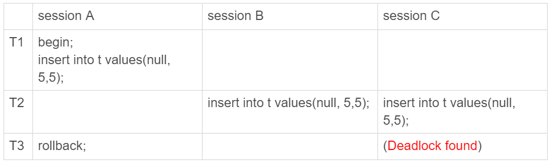

# MySQL实战45讲


## 01 | 基础架构：一条SQL查询语句是如何执行的？


### 连接器
如果长连接累积下来，可能导致内存占用太大，被系统强行杀掉（OOM），从现象看就是 MySQL 异常重启了。
怎么解决这个问题呢？你可以考虑以下两种方案。

定期断开长连接。使用一段时间，或者程序里面判断执行过一个占用内存的大查询后，断开连接，之后要查询再重连。

如果你用的是 MySQL 5.7 或更新版本，可以在每次执行一个比较大的操作后，通过执行 mysql_reset_connection 来重新初始化连接资源。这个过程不需要重连和重新做权限验证，但是会将连接恢复到刚刚创建完时的状态。


### 分析器

分析器先会做“词法分析”。你输入的是由多个字符串和空格组成的一条 SQL 语句，MySQL 需要识别出里面的字符串分别是什么，代表什么。

### 优化器

经过了分析器，MySQL 就知道你要做什么了。在开始执行之前，还要先经过优化器的处理。

### 执行器

```mysql
mysql> select * from T where ID=10;
 
ERROR 1142 (42000): SELECT command denied to user 'b'@'localhost' for table 'T'
```

1. 调用 InnoDB 引擎接口取这个表的第一行，判断 ID 值是不是 10，如果不是则跳过，如果是则将这行存在结果集中；
2. 调用引擎接口取“下一行”，重复相同的判断逻辑，直到取到这个表的最后一行。
3. 执行器将上述遍历过程中所有满足条件的行组成的记录集作为结果集返回给客户端。


## 02 | 日志系统：一条SQL更新语句是如何执行的？

### 重要的日志模块：redo log

MySQL 里经常说到的 WAL 技术，WAL 的全称是 Write-Ahead Logging，它的关键点就是先写日志，再写磁盘。

有了 redo log，InnoDB 就可以保证即使数据库发生异常重启，之前提交的记录都不会丢失，这个能力称为**crash-safe**。

### 重要的日志模块：binlog

1. redo log 是 InnoDB 引擎特有的；binlog 是 MySQL 的 Server 层实现的，所有引擎都可以使用。
2. redo log 是物理日志，记录的是“在某个数据页上做了什么修改”；binlog 是逻辑日志，记录的是这个语句的原始逻辑，比如“给 ID=2 这一行的 c 字段加 1 ”。
3. redo log 是循环写的，空间固定会用完；binlog 是可以追加写入的。“追加写”是指 binlog 文件写到一定大小后会切换到下一个，并不会覆盖以前的日志。


### 两阶段提交

简单说，redo log 和 binlog 都可以用于表示事务的提交状态，而两阶段提交就是让这两个状态保持逻辑上的一致。

### 小结

redo log 用于保证 crash-safe 能力。innodb_flush_log_at_trx_commit 这个参数设置成 1 的时候，表示每次事务的 redo log 都直接持久化到磁盘。这个参数我建议你设置成 1，这样可以保证 MySQL 异常重启之后数据不丢失。

sync_binlog 这个参数设置成 1 的时候，表示每次事务的 binlog 都持久化到磁盘。这个参数我也建议你设置成 1，这样可以保证 MySQL 异常重启之后 binlog 不丢失。

## 03 | 事务隔离：为什么你改了我还看不见？

简单来说，事务就是要保证一组数据库操作，要么全部成功，要么全部失败。

### 隔离性与隔离级别

提到事务，你肯定会想到 ACID（Atomicity、Consistency、Isolation、Durability，即原子性、一致性、隔离性、持久性），今天我们就来说说其中 I，也就是“隔离性”。

```mysql
mysql> create table T(c int) engine=InnoDB;
insert into T(c) values(1);
```


在“读提交”隔离级别下，这个视图是在每个 SQL 语句开始执行的时候创建的。这里需要注意的是，“读未提交”隔离级别下直接返回记录上的最新值，没有视图概念；而“串行化”隔离级别下直接用加锁的方式来避免并行访问。

```mysql
mysql> show variables like 'transaction_isolation';
 
+-----------------------+----------------+
 
| Variable_name | Value |
 
+-----------------------+----------------+
 
| transaction_isolation | READ-COMMITTED |
 
+-----------------------+----------------+
```

### 事务隔离的实现

在 MySQL 中，实际上每条记录在更新的时候都会同时记录一条回滚操作。记录上的最新值，通过回滚操作，都可以得到前一个状态的值。除了对回滚段的影响，长事务还占用锁资源，也可能拖垮整个库，这个我们会在后面讲锁的时候展开。

### 事务的启动方式

1. 显式启动事务语句， begin 或 start transaction。配套的提交语句是 commit，回滚语句是 rollback。
2. set autocommit=0，这个命令会将这个线程的自动提交关掉。意味着如果你只执行一个 select 语句，这个事务就启动了，而且并不会自动提交。这个事务持续存在直到你主动执行 commit 或 rollback 语句，或者断开连接。

在 autocommit 为 1 的情况下，用 begin 显式启动的事务，如果执行 commit 则提交事务。如果执行 commit work and chain，则是提交事务并自动启动下一个事务，这样也省去了再次执行 begin 语句的开销。

`select * from information_schema.innodb_trx where TIME_TO_SEC(timediff(now(),trx_started))>60`

## 04 | 深入浅出索引（上）

一句话简单来说，索引的出现其实就是为了提高数据查询的效率，就像书的目录一样。

**哈希表这种结构适用于只有等值查询的场景**，比如 Memcached 及其他一些 NoSQL 引擎。

你可以想象一下一棵 100 万节点的平衡二叉树，树高 20。一次查询可能需要访问 20 个数据块。在机械硬盘时代，从磁盘随机读一个数据块需要 10 ms 左右的寻址时间。也就是说，对于一个 100 万行的表，如果使用二叉树来存储，单独访问一个行可能需要 20 个 10 ms 的时间，这个查询可真够慢的。

### InnoDB 的索引模型

```mysql
mysql> create table T(
id int primary key, 
k int not null, 
name varchar(16),
index (k))engine=InnoDB;
```


根据上面的索引结构说明，我们来讨论一个问题：**基于主键索引和普通索引的查询有什么区别？**

- 如果语句是 select * from T where ID=500，即主键查询方式，则只需要搜索 ID 这棵 B+ 树；
- 如果语句是 select * from T where k=5，即普通索引查询方式，则需要先搜索 k 索引树，得到 ID 的值为 500，再到 ID 索引树搜索一次。这个过程称为回表。

### 索引维护

基于上面的索引维护过程说明，我们来讨论一个案例：

> 你可能在一些建表规范里面见到过类似的描述，要求建表语句里一定要有自增主键。当然事无绝对，我们来分析一下哪些场景下应该使用自增主键，而哪些场景下不应该。

自增主键是指自增列上定义的主键，在建表语句中一般是这么定义的： NOT NULL PRIMARY KEY AUTO_INCREMENT。

**显然，主键长度越小，普通索引的叶子节点就越小，普通索引占用的空间也就越小。**

所以，从性能和存储空间方面考量，自增主键往往是更合理的选择。

### 小结

B+ 树能够很好地配合磁盘的读写特性，减少单次查询的磁盘访问次数。

```mysql
alter table T drop index k;
alter table T add index(k);
```

如果你要重建主键索引，也可以这么写：

```mysql
alter table T drop primary key;
alter table T add primary key(id);
```

### 如何避免长事务对业务的影响？

**首先，从应用开发端来看：**

1. 确认是否使用了 set autocommit=0。这个确认工作可以在测试环境中开展，把 MySQL 的 general_log 开起来，然后随便跑一个业务逻辑，通过 general_log 的日志来确认。一般框架如果会设置这个值，也就会提供参数来控制行为，你的目标就是把它改成 1。
2. 确认是否有不必要的只读事务。有些框架会习惯不管什么语句先用 begin/commit 框起来。我见过有些是业务并没有这个需要，但是也把好几个 select 语句放到了事务中。这种只读事务可以去掉。
3. 业务连接数据库的时候，根据业务本身的预估，通过 SET MAX_EXECUTION_TIME 命令，来控制每个语句执行的最长时间，避免单个语句意外执行太长时间。（为什么会意外？在后续的文章中会提到这类案例）

**其次，从数据库端来看：**

1. 监控 information_schema.Innodb_trx 表，设置长事务阈值，超过就报警 / 或者 kill；
2. Percona 的 pt-kill 这个工具不错，推荐使用；
3. 在业务功能测试阶段要求输出所有的 general_log，分析日志行为提前发现问题；
4. 如果使用的是 MySQL 5.6 或者更新版本，把 innodb_undo_tablespaces 设置成 2（或更大的值）。如果真的出现大事务导致回滚段过大，这样设置后清理起来更方便。

## 05 | 深入浅出索引（下）

在下面这个表 T 中，如果我执行 select * from T where k between 3 and 5，需要执行几次树的搜索操作，会扫描多少行？

```mysql
mysql> create table T (
ID int primary key,
k int NOT NULL DEFAULT 0, 
s varchar(16) NOT NULL DEFAULT '',
index k(k))
engine=InnoDB;
 
insert into T values(100,1, 'aa'),(200,2,'bb'),(300,3,'cc'),(500,5,'ee'),(600,6,'ff'),(700,7,'gg');

```


我们一起来看看这条 SQL 查询语句的执行流程：

1. 在 k 索引树上找到 k=3 的记录，取得 ID = 300；
2. 再到 ID 索引树查到 ID=300 对应的 R3；
3. 在 k 索引树取下一个值 k=5，取得 ID=500；
4. 再回到 ID 索引树查到 ID=500 对应的 R4；
5. 在 k 索引树取下一个值 k=6，不满足条件，循环结束。

在这个过程中，**回到主键索引树搜索的过程，我们称为回表**。

有没有可能经过索引优化，避免回表过程呢？

### 覆盖索引

**由于覆盖索引可以减少树的搜索次数，显著提升查询性能，所以使用覆盖索引是一个常用的性能优化手段。**

```mysql
CREATE TABLE `tuser` (
  `id` int(11) NOT NULL,
  `id_card` varchar(32) DEFAULT NULL,
  `name` varchar(32) DEFAULT NULL,
  `age` int(11) DEFAULT NULL,
  `ismale` tinyint(1) DEFAULT NULL,
  PRIMARY KEY (`id`),
  KEY `id_card` (`id_card`),
  KEY `name_age` (`name`,`age`)
) ENGINE=InnoDB
```

如果现在有一个高频请求，要根据市民的身份证号查询他的姓名，这个联合索引就有意义了。它可以在这个高频请求上用到覆盖索引，不再需要回表查整行记录，减少语句的执行时间。

### 最左前缀原则

**B+ 树这种索引结构，可以利用索引的“最左前缀”，来定位记录。**


 如果你要查的是所有名字第一个字是“张”的人，你的 SQL 语句的条件是"where name like ‘张 %’"。

**在建立联合索引的时候，如何安排索引内的字段顺序。**

所以当已经有了 (a,b) 这个联合索引后，一般就不需要单独在 a 上建立索引了。因此，**第一原则是，如果通过调整顺序，可以少维护一个索引，那么这个顺序往往就是需要优先考虑采用的。**

### 索引下推

`mysql> select * from tuser where name like '张 %' and age=10 and ismale=1;`

MySQL 5.6 引入的索引下推优化（index condition pushdown)， 可以在索引遍历过程中，对索引中包含的字段先做判断，直接过滤掉不满足条件的记录，减少回表次数。


InnoDB 在 (name,age) 索引内部就判断了 age 是否等于 10，对于不等于 10 的记录，直接判断并跳过。在我们的这个例子中，只需要对 ID4、ID5 这两条记录回表取数据判断，就只需要回表 2 次。

```mysql
CREATE TABLE `geek` (
  `a` int(11) NOT NULL,
  `b` int(11) NOT NULL,
  `c` int(11) NOT NULL,
  `d` int(11) NOT NULL,
  PRIMARY KEY (`a`,`b`),
  KEY `c` (`c`),
  KEY `ca` (`c`,`a`),
  KEY `cb` (`c`,`b`)
) ENGINE=InnoDB;
```

为了这两个查询模式，这两个索引是否都是必须的？为什么呢？

```mysql
select * from geek where c=N order by a limit 1;
select * from geek where c=N order by b limit 1;
```

通过两个 alter 语句重建索引 k，以及通过两个 alter 语句重建主键索引是否合理？

是，重建索引的过程会创建一个新的索引，把数据按顺序插入，这样页面的利用率最高，也就是索引更紧凑、更省空间。

不论是删除主键还是创建主键，都会将整个表重建。所以连着执行这两个语句的话，第一个语句就白做了。这两个语句，你可以用这个语句代替 ： alter table T engine=InnoDB。

> InnoDB 这种引擎,虽然删除了表的部分记录,但是它的索引还在, 并未释放空间，所以记得删除表之后删除索引。

## 06 | 全局锁和表锁 ：给表加个字段怎么有这么多阻碍？

### 全局锁

顾名思义，全局锁就是对整个数据库实例加锁。MySQL 提供了一个加全局读锁的方法，命令是 Flush tables with read lock (FTWRL)。当你需要让整个库处于只读状态的时候，可以使用这个命令，之后其他线程的以下语句会被阻塞：数据更新语句（数据的增删改）、数据定义语句（包括建表、修改表结构等）和更新类事务的提交语句。

**全局锁的典型使用场景是，做全库逻辑备份。**

也就是说，不加锁的话，备份系统备份的得到的库不是一个逻辑时间点，这个视图是逻辑不一致的。

**single-transaction** 方法只适用于所有的表使用事务引擎的库。如果有的表使用了不支持事务的引擎，那么备份就只能通过 FTWRL 方法。

**为什么不使用 set global readonly=true 的方式呢**？

- 一是，在有些系统中，readonly 的值会被用来做其他逻辑，比如用来判断一个库是主库还是备库。因此，修改 global 变量的方式影响面更大，我不建议你使用。
- 二是，在异常处理机制上有差异。如果执行 FTWRL 命令之后由于客户端发生异常断开，那么 MySQL 会自动释放这个全局锁，整个库回到可以正常更新的状态。而将整个库设置为 readonly 之后，如果客户端发生异常，则数据库就会一直保持 readonly 状态，这样会导致整个库长时间处于不可写状态，风险较高。

### 表级锁

MySQL 里面表级别的锁有两种：一种是表锁，一种是元数据锁（meta data lock，MDL)。

**另一类表级的锁是 MDL（metadata lock)。**

当对一个表做增删改查操作的时候，加 MDL 读锁；当要对表做结构变更操作的时候，加 MDL 写锁。

- 读锁之间不互斥，因此你可以有多个线程同时对一张表增删改查。
- 读写锁之间、写锁之间是互斥的，用来保证变更表结构操作的安全性。因此，如果有两个线程要同时给一个表加字段，其中一个要等另一个执行完才能开始执行。

如果某个表上的查询语句频繁，而且客户端有重试机制，也就是说超时后会再起一个新 session 再请求的话，这个库的线程很快就会爆满。

你现在应该知道了，事务中的 MDL 锁，在语句执行开始时申请，但是语句结束后并不会马上释放，而会等到整个事务提交后再释放。

### **如何安全地给小表加字段？**

比较理想的机制是，在 alter table 语句里面设定等待时间，如果在这个指定的等待时间里面能够拿到 MDL 写锁最好，拿不到也不要阻塞后面的业务语句，先放弃。

### 小结

如果你发现你的应用程序里有 lock tables 这样的语句，你需要追查一下，比较可能的情况是：

- 要么是你的系统现在还在用 MyISAM 这类不支持事务的引擎，那要安排升级换引擎；
- 要么是你的引擎升级了，但是代码还没升级。我见过这样的情况，最后业务开发就是把 lock tables 和 unlock tables 改成 begin 和 commit，问题就解决了。

你在用–single-transaction 方法做逻辑备份的过程中，如果主库上的一个小表做了一个 DDL，比如给一个表上加了一列。这时候，从备库上会看到什么现象呢？

## 07 | 行锁功过：怎么减少行锁对性能的影响？

行锁就是针对数据表中行记录的锁。这很好理解，比如事务 A 更新了一行，而这时候事务 B 也要更新同一行，则必须等事务 A 的操作完成后才能进行更新。

### 从两阶段锁说起

**在 InnoDB 事务中，行锁是在需要的时候才加上的，但并不是不需要了就立刻释放，而是要等到事务结束时才释放。这个就是两阶段锁协议。**

### 死锁和死锁检测


当出现死锁以后，有两种策略：

- 一种策略是，直接进入等待，直到超时。这个超时时间可以通过参数 innodb_lock_wait_timeout 来设置。
- 另一种策略是，发起死锁检测，发现死锁后，主动回滚死锁链条中的某一个事务，让其他事务得以继续执行。将参数 innodb_deadlock_detect 设置为 on，表示开启这个逻辑。

在 InnoDB 中，innodb_lock_wait_timeout 的默认值是 50s，意味着如果采用第一个策略，当出现死锁以后，第一个被锁住的线程要过 50s 才会超时退出，然后其他线程才有可能继续执行。

**怎么解决由这种热点行更新导致的性能问题呢？**

问题的症结在于，死锁检测要耗费大量的 CPU 资源。

**如果你能确保这个业务一定不会出现死锁，可以临时把死锁检测关掉。**

基本思路就是，对于相同行的更新，在进入引擎之前排队。这样在 InnoDB 内部就不会有大量的死锁检测工作了。

### 小结

我给你的建议是：如果你的事务中需要锁多个行，要把最可能造成锁冲突、最可能影响并发度的锁的申请时机尽量往后放。

**如果你要删除一个表里面的前 10000 行数据，有以下三种方法可以做到**：

- 第一种，直接执行 delete from T limit 10000;
- 第二种，在一个连接中循环执行 20 次 delete from T limit 500;
- 第三种，在 20 个连接中同时执行 delete from T limit 500。

你会选择哪一种方法呢？为什么呢？

在一个连接中循环执行 20 次 delete from T limit 500。

确实是这样的，第二种方式是相对较好的。

第一种方式（即：直接执行 delete from T limit 10000）里面，单个语句占用时间长，锁的时间也比较长；而且大事务还会导致主从延迟。

第三种方式（即：在 20 个连接中同时执行 delete from T limit 500），会人为造成锁冲突。

## 08 | 事务到底是隔离的还是不隔离的？

在 MySQL 里，有两个“视图”的概念：

- 一个是 view。它是一个用查询语句定义的虚拟表，在调用的时候执行查询语句并生成结果。创建视图的语法是 create view … ，而它的查询方法与表一样。
- 另一个是 InnoDB 在实现 MVCC 时用到的一致性读视图，即 consistent read view，用于支持 RC（Read Committed，读提交）和 RR（Repeatable Read，可重复读）隔离级别的实现。

### “快照”在 MVCC 里是怎么工作的？

我们先来看看这个快照是怎么实现的。

InnoDB 里面每个事务有一个唯一的事务 ID，叫作 transaction id。它是在事务开始的时候向 InnoDB 的事务系统申请的，是按申请顺序严格递增的。


图中虚线框里是同一行数据的 4 个版本，当前最新版本是 V4，k 的值是 22，它是被 transaction id 为 25 的事务更新的，因此它的 row trx_id 也是 25。


1. 如果落在绿色部分，表示这个版本是已提交的事务或者是当前事务自己生成的，这个数据是可见的；
2. 如果落在红色部分，表示这个版本是由将来启动的事务生成的，是肯定不可见的；
3. 如果落在黄色部分，那就包括两种情况
   a. 若 row trx_id 在数组中，表示这个版本是由还没提交的事务生成的，不可见；
   b. 若 row trx_id 不在数组中，表示这个版本是已经提交了的事务生成的，可见。

**InnoDB 利用了“所有数据都有多个版本”的这个特性，实现了“秒级创建快照”的能力。**

### 更新逻辑

**更新数据都是先读后写的，而这个读，只能读当前的值，称为“当前读”（current read）。**

下面这两个 select 语句，就是分别加了读锁（S 锁，共享锁）和写锁（X 锁，排他锁）。

```mysql
mysql> select k from t where id=1 lock in share mode;
mysql> select k from t where id=1 for update;
```

**事务的可重复读的能力是怎么实现的？**

可重复读的核心就是一致性读（consistent read）；而事务更新数据的时候，只能用当前读。如果当前的记录的行锁被其他事务占用的话，就需要进入锁等待。

### 小结

InnoDB 的行数据有多个版本，每个数据版本有自己的 row trx_id，每个事务或者语句有自己的一致性视图。普通查询语句是一致性读，一致性读会根据 row trx_id 和一致性视图确定数据版本的可见性。

- 对于可重复读，查询只承认在事务启动前就已经提交完成的数据；
- 对于读提交，查询只承认在语句启动前就已经提交完成的数据；

思考题

```mysql
mysql> CREATE TABLE `t` (
  `id` int(11) NOT NULL,
  `c` int(11) DEFAULT NULL,
  PRIMARY KEY (`id`)
) ENGINE=InnoDB;
insert into t(id, c) values(1,1),(2,2),(3,3),(4,4);
```

## 09 | 普通索引和唯一索引，应该怎么选择？

`select name from CUser where id_card = 'xxxxxxxyyyyyyzzzzz';`

从性能的角度考虑，你选择唯一索引还是普通索引呢？选择的依据是什么呢？

### 查询过程

- 对于普通索引来说，查找到满足条件的第一个记录 (5,500) 后，需要查找下一个记录，直到碰到第一个不满足 k=5 条件的记录。
- 对于唯一索引来说，由于索引定义了唯一性，查找到第一个满足条件的记录后，就会停止继续检索。

### 更新过程

**如果要在这张表中插入一个新记录 (4,400) 的话，InnoDB 的处理流程是怎样的。**

change buffer 因为减少了随机磁盘访问，所以对更新性能的提升是会很明显的。

### change buffer 的使用场景

change buffer 的大小，可以通过参数 innodb_change_buffer_max_size 来动态设置。这个参数设置为 50 的时候，表示 change buffer 的大小最多只能占用 buffer pool 的 50%。

通过上面的分析，你已经清楚了使用 change buffer 对更新过程的加速作用，也清楚了 change buffer 只限于用在普通索引的场景下，而不适用于唯一索引。那么，现在有一个问题就是：普通索引的所有场景，使用 change buffer 都可以起到加速作用吗？

因此，对于写多读少的业务来说，页面在写完以后马上被访问到的概率比较小，此时 change buffer 的使用效果最好。这种业务模型常见的就是账单类、日志类的系统。

### 索引选择和实践


普通索引和 change buffer 的配合使用，对于数据量大的表的更新优化还是很明显的。

### change buffer 和 redo log

`mysql> insert into t(id,k) values(id1,k1),(id2,k2);`

**redo log 主要节省的是随机写磁盘的 IO 消耗（转成顺序写），而 change buffer 主要节省的则是随机读磁盘的 IO 消耗。**

**思考**

change buffer 一开始是写内存的，那么如果这个时候机器掉电重启，会不会导致 change buffer 丢失呢？change buffer 丢失可不是小事儿，再从磁盘读入数据可就没有了 merge 过程，就等于是数据丢失了。会不会出现这种情况呢？

1.change buffer有一部分在内存有一部分在ibdata.
做purge操作,应该就会把change buffer里相应的数据持久化到ibdata
2.redo log里记录了数据页的修改以及change buffer新写入的信息
如果掉电,持久化的change buffer数据已经purge,不用恢复

如果某次写入使用了 change buffer 机制，之后主机异常重启，是否会丢失 change buffer 和数据。

这个问题的答案是不会丢失，虽然是只更新内存，但是在事务提交的时候，我们把 change buffer 的操作也记录到 redo log 里了，所以崩溃恢复的时候，change buffer 也能找回来。

## 10 | MySQL为什么有时候会选错索引？

```mysql
CREATE TABLE `t` (
  `id` int(11) NOT NULL,
  `a` int(11) DEFAULT NULL,
  `b` int(11) DEFAULT NULL,
  PRIMARY KEY (`id`),
  KEY `a` (`a`),
  KEY `b` (`b`)
) ENGINE=InnoDB；
```

相应的存储过程

```mysql
delimiter ;;
create procedure idata()
begin
  declare i int;
  set i=1;
  while(i<=100000)do
    insert into t values(i, i, i);
    set i=i+1;
  end while;
end;;
delimiter ;
call idata();
```

分析一下这条语句`mysql> explain select * from t where a between 10000 and 20000;`

```mysql
set long_query_time=0;
select * from t where a between 10000 and 20000; /*Q1*/
select * from t force index(a) where a between 10000 and 20000;/*Q2*/
```

- 第一句，是将慢查询日志的阈值设置为 0，表示这个线程接下来的语句都会被记录入慢查询日志中；
- 第二句，Q1 是 session B 原来的查询；
- 第三句，Q2 是加了 force index(a) 来和 session B 原来的查询语句执行情况对比。

结果你会发现，Q2执行为21毫秒，而Q1是40毫秒。

### 优化器的逻辑

选择索引是优化器的工作。

**扫描行数是怎么判断的？**

只能根据统计信息来估算记录数。

**MySQL 是怎样得到索引的基数的呢?** 这里，我给你简单介绍一下 MySQL 采样统计的方法。

analyze table t 命令，可以用来重新统计索引信息。


如果只是索引统计不准确，通过 analyze 命令可以解决很多问题，但是前面我们说了，优化器可不止是看扫描行数。

### 索引选择异常和处理

原本可以执行得很快的 SQL 语句，执行速度却比你预期的慢很多，你应该怎么办呢？

**一种方法是，像我们第一个例子一样，采用 force index 强行选择一个索引。**

**第二种方法就是，我们可以考虑修改语句，引导 MySQL 使用我们期望的索引**

`select * from t where (a between 1 and 1000) and (b between 50000 and 100000) order by b limit 1;`

改为`select * from t where (a between 1 and 1000) and (b between 50000 and 100000) order by b,a limit 1;`

### **小结**

对于由于索引统计信息不准确导致的问题，你可以用 analyze table 来解决。

而对于其他优化器误判的情况，你可以在应用端用 force index 来强行指定索引，也可以通过修改语句来引导优化器，还可以通过增加或者删除索引来绕过这个问题。

**思考题**

通过 session A 的配合，让 session B 删除数据后又重新插入了一遍数据，然后就发现 explain 结果中，rows 字段从 10001 变成 37000 多。而如果没有 session A 的配合，只是单独执行 delete from t 、call idata()、explain 这三句话，会看到 rows 字段其实还是 10000 左右。你可以自己验证一下这个结果。

这是什么原因呢？

1.为什么没有session A,session B扫描的行数是1W
由于mysql是使用标记删除来删除记录的,并不从索引和数据文件中真正的删除。如果delete和insert中间的间隔相对较小,purge线程还没有来得及清理该记录。如果主键相同的情况下,新插入的insert会沿用之前删除的delete的记录的空间。session A 开启了事务并没有提交，所以之前插入的 10 万行数据是不能删除的。这样，之前的数据每一行数据都有两个版本，旧版本是 delete 之前的数据，新版本是标记为 deleted 的数据。

## 11 | 怎么给字符串字段加索引？

```mysql
mysql> create table SUser(
ID bigint unsigned primary key,
email varchar(64), 
... 
)engine=innodb; 
```

使用邮箱登录

`mysql> select f1, f2 from SUser where email='xxx';`

```mysql
mysql> alter table SUser add index index1(email);
或
mysql> alter table SUser add index index2(email(6));
```

第一个语句创建的 index1 索引里面，包含了每个记录的整个字符串；而第二个语句创建的 index2 索引里面，对于每个记录都是只取前 6 个字节。

### 前缀索引

**使用前缀索引，定义好长度，就可以做到既节省空间，又不用额外增加太多的查询成本。**

那么问题来了，有什么方法能够确定我应该使用多长的前缀呢？

首先，你可以使用下面这个语句，算出这个列上有多少个不同的值：

```mysql
mysql> select count(distinct email) as L from SUser;
```

然后，依次选取不同长度的前缀来看这个值，比如我们要看一下 4~7 个字节的前缀索引，可以用这个语句：

```mysql
mysql> select 
  count(distinct left(email,4)）as L4,
  count(distinct left(email,5)）as L5,
  count(distinct left(email,6)）as L6,
  count(distinct left(email,7)）as L7,
from SUser;
```

### 前缀索引对覆盖索引的影响

1. 使用前缀索引可能会增加扫描行数，这会影响到性能。
2. 使用前缀索引就用不上覆盖索引对查询性能的优化了，这也是你在选择是否使用前缀索引时需要考虑的一个因素。

### 其他方式

**第一种方式是使用倒序存储** 如果你存储身份证号的时候把它倒过来存，每次查询的时候，你可以这么写：

```mysql
mysql> select field_list from t where id_card = reverse('input_id_card_string');
```

实践中你不要忘记使用 count(distinct) 方法去做个验证。

**第二种方式是使用 hash 字段** 你可以在表上再创建一个整数字段，来保存身份证的校验码，同时在这个字段上创建索引。

```mysql
mysql> alter table t add id_card_crc int unsigned, add index(id_card_crc);
```

由于校验码可能存在冲突，也就是说两个不同的身份证号通过 crc32() 函数得到的结果可能是相同的，所以你的查询语句 where 部分要判断 id_card 的值是否精确相同。

```mysql
mysql> select field_list from t where id_card_crc=crc32('input_id_card_string') and id_card='input_id_card_string'
```

**使用倒序存储和使用 hash 字段这两种方法的异同点**

相同点是，都不支持范围查询。

区别，主要体现在以下三个方面：

1. 从占用的额外空间来看，倒序存储方式在主键索引上，不会消耗额外的存储空间，而 hash 字段方法需要增加一个字段。当然，倒序存储方式使用 4 个字节的前缀长度应该是不够的，如果再长一点，这个消耗跟额外这个 hash 字段也差不多抵消了。
2. 在 CPU 消耗方面，倒序方式每次写和读的时候，都需要额外调用一次 reverse 函数，而 hash 字段的方式需要额外调用一次 crc32() 函数。如果只从这两个函数的计算复杂度来看的话，reverse 函数额外消耗的 CPU 资源会更小些。
3. 从查询效率上看，使用 hash 字段方式的查询性能相对更稳定一些。因为 crc32 算出来的值虽然有冲突的概率，但是概率非常小，可以认为每次查询的平均扫描行数接近 1。而倒序存储方式毕竟还是用的前缀索引的方式，也就是说还是会增加扫描行数。

### 小结

1. 直接创建完整索引，这样可能比较占用空间；
2. 创建前缀索引，节省空间，但会增加查询扫描次数，并且不能使用覆盖索引；
3. 倒序存储，再创建前缀索引，用于绕过字符串本身前缀的区分度不够的问题；
4. 创建 hash 字段索引，查询性能稳定，有额外的存储和计算消耗，跟第三种方式一样，都不支持范围扫描。

**问题**

如果你在维护一个学校的学生信息数据库，学生登录名的统一格式是”学号 @gmail.com", 而学号的规则是：十五位的数字，其中前三位是所在城市编号、第四到第六位是学校编号、第七位到第十位是入学年份、最后五位是顺序编号。

系统登录的时候都需要学生输入登录名和密码，验证正确后才能继续使用系统。就只考虑登录验证这个行为的话，你会怎么设计这个登录名的索引呢？

## 12 | 为什么我的MySQL会“抖”一下？

**当内存数据页跟磁盘数据页内容不一致的时候，我们称这个内存页为“脏页”。内存数据写入到磁盘后，内存和磁盘上的数据页的内容就一致了，称为“干净页”**。

其实就是在写内存和日志，而 MySQL 偶尔“抖”一下的那个瞬间，可能就是在刷脏页（flush。

- 第一种场景

  对应的就是 InnoDB 的 redo log 写满了。这时候系统会停止所有更新操作，把 checkpoint 往前推进，redo log 留出空间可以继续写。

- 第二种场景

  对应的就是系统内存不足。当需要新的内存页，而内存不够用的时候，就要淘汰一些数据页，空出内存给别的数据页使用。如果淘汰的是“脏页”，就要先将脏页写到磁盘。

### InnoDB 刷脏页的控制策略

innodb_io_capacity 这个参数了，它会告诉 InnoDB 你的磁盘能力。这个值我建议你设置成磁盘的 IOPS。磁盘的 IOPS 可以通过 fio 这个工具来测试，下面的语句是我用来测试磁盘随机读写的命令：

`fio -filename=$filename -direct=1 -iodepth 1 -thread -rw=randrw -ioengine=psync -bs=16k -size=500M -numjobs=10 -runtime=10 -group_reporting -name=mytest `

**如果你来设计策略控制刷脏页的速度，会参考哪些因素呢？**

InnoDB 的刷盘速度就是要参考这两个因素：一个是脏页比例，一个是 redo log 写盘速度。

```mysql
F1(M)
{
  if M>=innodb_max_dirty_pages_pct then
      return 100;
  return 100*M/innodb_max_dirty_pages_pct;
}
```

无论是你的查询语句在需要内存的时候可能要求淘汰一个脏页，还是由于刷脏页的逻辑会占用 IO 资源并可能影响到了你的更新语句，都可能是造成你从业务端感知到 MySQL“抖”了一下的原因。

```mysql
mysql> select VARIABLE_VALUE into @a from global_status where VARIABLE_NAME = 'Innodb_buffer_pool_pages_dirty';
select VARIABLE_VALUE into @b from global_status where VARIABLE_NAME = 'Innodb_buffer_pool_pages_total';
select @a/@b;
```

### **小结**

利用 WAL 技术，数据库将随机写转换成了顺序写，大大提升了数据库的性能。

**思考题**：

一个内存配置为 128GB、innodb_io_capacity 设置为 20000 的大规格实例，正常会建议你将 redo log 设置成 4 个 1GB 的文件。

但如果你在配置的时候不慎将 redo log 设置成了 1 个 100M 的文件，会发生什么情况呢？又为什么会出现这样的情况呢？

redo log是关系型数据库的核心啊,保证了ACID里的D。所以redo log是牵一发而动全身的操作，按照老师说的当内存数据页跟磁盘数据页不一致的时候,把内存页称为'脏页'。如果redo log设置得太小,redo log写满.那么会涉及到哪些操作呢,我认为是以下几点:

1. 把相对应的数据页中的脏页持久化到磁盘,checkpoint往前推
2. 由于redo log还记录了undo的变化,undo log buffer也要持久化进undo log

## 13 | 为什么表数据删掉一半，表文件大小不变？

### 数据删除流程

如果我们删掉了一个数据页上的所有记录，会怎么样？

答案是，整个数据页就可以被复用了。但是，**数据页的复用跟记录的复用是不同的。**

delete 命令其实只是把记录的位置，或者数据页标记为了“可复用”，但磁盘文件的大小是不会变的。**不止是删除数据会造成空洞，插入数据也会。**也就是说，经过大量增删改的表，都是可能是存在空洞的。所以，如果能够把这些空洞去掉，就能达到收缩表空间的目的。

而重建表，就可以达到这样的目的。

### 重建表

对于一个大表来说，Online DDL 最耗时的过程就是拷贝数据到临时表的过程，这个步骤的执行期间可以接受增删改操作。所以，相对于整个 DDL 过程来说，锁的时间非常短。对业务来说，就可以认为是 Online 的。

### Online 和 inplace

我们重建表的这个语句 alter table t engine=InnoDB，其实隐含的意思是：

```mysql
alter table t engine=innodb,ALGORITHM=inplace;
```

同学问到使用 optimize table、analyze table 和 alter table 这三种方式重建表的区别。这里，我顺便再简单和你解释一下。

- 从 MySQL 5.6 版本开始，alter table t engine = InnoDB（也就是 recreate)；
- analyze table t 其实不是重建表，只是对表的索引信息做重新统计，没有修改数据，这个过程中加了 MDL 读锁；
- optimize table t 等于 recreate+analyze。

### 小结

如果要收缩一个表，只是 delete 掉表里面不用的数据的话，表文件的大小是不会变的，你还要通过 alter table 命令重建表，才能达到表文件变小的目的。

**思考**

假设现在有人碰到了一个“想要收缩表空间，结果适得其反”的情况，看上去是这样的：

1. 一个表 t 文件大小为 1TB；
2. 对这个表执行 alter table t engine=InnoDB；
3. 发现执行完成后，空间不仅没变小，还稍微大了一点儿，比如变成了 1.01TB。

你觉得可能是什么原因呢 ？

1. 将表 t 重建一次；
2. 插入一部分数据，但是插入的这些数据，用掉了一部分的预留空间；
3. 这种情况下，再重建一次表 t，就可能会出现问题中的现象。

## 14 | count(*)这么慢，我该怎么办？

### count(*) 的实现方式

- MyISAM 引擎把一个表的总行数存在了磁盘上，因此执行 count(*) 的时候会直接返回这个数，效率很高；
- 而 InnoDB 引擎就麻烦了，它执行 count(*) 的时候，需要把数据一行一行地从引擎里面读出来，然后累积计数。

InnoDB 是索引组织表，主键索引树的叶子节点是数据，而普通索引树的叶子节点是主键值。所以，普通索引树比主键索引树小很多。对于 count(*) 这样的操作，遍历哪个索引树得到的结果逻辑上都是一样的。

如果你现在有一个页面经常要显示交易系统的操作记录总数，到底应该怎么办呢？答案是，我们只能自己计数。

### 用缓存系统保存计数

**将计数保存在缓存系统中的方式，还不只是丢失更新的问题。即使 Redis 正常工作，这个值还是逻辑上不精确的。**

### 在数据库保存计数


虽然会话 B 的读操作仍然是在 T3 执行的，但是因为这时候更新事务还没有提交，所以计数值加 1 这个操作对会话 B 还不可见。

### 不同的 count 用法

**对于 count(主键 id) 来说**，InnoDB 引擎会遍历整张表，把每一行的 id 值都取出来，返回给 server 层。server 层拿到 id 后，判断是不可能为空的，就按行累加。

**对于 count(1) 来说**，InnoDB 引擎遍历整张表，但不取值。server 层对于返回的每一行，放一个数字“1”进去，判断是不可能为空的，按行累加。

单看这两个用法的差别的话，你能对比出来，count(1) 执行得要比 count(主键 id) 快。因为从引擎返回 id 会涉及到解析数据行，以及拷贝字段值的操作。**但是 count(\*) 是例外**，并不会把全部字段取出来，而是专门做了优化，不取值。count(*) 肯定不是 null，按行累加。

按照效率排序的话，count(字段)<count(主键 id)<count(1)≈count(*)，所以我建议你，尽量使用 count(\*）

### 小结

其实，把计数放在 Redis 里面，不能够保证计数和 MySQL 表里的数据精确一致的原因，是**这两个不同的存储构成的系统，不支持分布式事务，无法拿到精确一致的视图。**而把计数值也放在 MySQL 中，就解决了一致性视图的问题。

**思考**

由于事务可以保证中间结果不被别的事务读到，因此修改计数值和插入新记录的顺序是不影响逻辑结果的。但是，从并发系统性能的角度考虑，你觉得在这个事务序列里，应该先插入操作记录，还是应该先更新计数表呢？

从并发系统性能的角度考虑，应该先插入操作记录，再更新计数表。

知识点在《行锁功过：怎么减少行锁对性能的影响？》
因为更新计数表涉及到行锁的竞争，先插入再更新能最大程度地减少了事务之间的锁等待，提升了并发度。


## 15 | 答疑文章（一）：日志和索引相关问题

### 日志相关问题

在两阶段提交的不同瞬间，MySQL 如果发生异常重启，是怎么保证数据完整性的？

崩溃恢复时的判断规则。

1. 如果 redo log 里面的事务是完整的，也就是已经有了 commit 标识，则直接提交；
2. 如果 redo log 里面的事务只有完整的 prepare，则判断对应的事务 binlog 是否存在并完整：
   a. 如果是，则提交事务；
   b. 否则，回滚事务。

### 追问 1：MySQL 怎么知道 binlog 是完整的?

回答：一个事务的 binlog 是有完整格式的：

- statement 格式的 binlog，最后会有 COMMIT；
- row 格式的 binlog，最后会有一个 XID event。

MySQL 可以通过校验 checksum 的结果来发现。所以，MySQL 还是有办法验证事务 binlog 的完整性的。

### 追问 2：redo log 和 binlog 是怎么关联起来的?

回答：它们有一个共同的数据字段，叫 XID。崩溃恢复的时候，会按顺序扫描 redo log：

- 如果碰到既有 prepare、又有 commit 的 redo log，就直接提交；
- 如果碰到只有 parepare、而没有 commit 的 redo log，就拿着 XID 去 binlog 找对应的事务。

### 追问 3：处于 prepare 阶段的 redo log 加上完整 binlog，重启就能恢复，MySQL 为什么要这么设计?

也就是 binlog 写完以后 MySQL 发生崩溃，这时候 binlog 已经写入了，之后就会被从库（或者用这个 binlog 恢复出来的库）使用。

所以，在主库上也要提交这个事务。采用这个策略，主库和备库的数据就保证了一致性。

### 追问 4：如果这样的话，为什么还要两阶段提交呢？干脆先 redo log 写完，再写 binlog。崩溃恢复的时候，必须得两个日志都完整才可以。是不是一样的逻辑？

回答：其实，两阶段提交是经典的分布式系统问题，并不是 MySQL 独有的。

如果必须要举一个场景，来说明这么做的必要性的话，那就是事务的持久性问题。

对于 InnoDB 引擎来说，如果 redo log 提交完成了，事务就不能回滚（如果这还允许回滚，就可能覆盖掉别的事务的更新）。而如果 redo log 直接提交，然后 binlog 写入的时候失败，InnoDB 又回滚不了，数据和 binlog 日志又不一致了。

两阶段提交就是为了给所有人一个机会，当每个人都说“我 ok”的时候，再一起提交。

### 追问 6：那能不能反过来，只用 redo log，不要 binlog？

回答：如果只从崩溃恢复的角度来讲是可以的。你可以把 binlog 关掉，这样就没有两阶段提交了，但系统依然是 crash-safe 的。

因为 binlog 有着 redo log 无法替代的功能。

一个是归档。redo log 是循环写，写到末尾是要回到开头继续写的。这样历史日志没法保留，redo log 也就起不到归档的作用。

一个就是 MySQL 系统依赖于 binlog。binlog 作为 MySQL 一开始就有的功能，被用在了很多地方。其中，MySQL 系统高可用的基础，就是 binlog 复制。

### 追问 7：redo log 一般设置多大？

回答：redo log 太小的话，会导致很快就被写满，然后不得不强行刷 redo log，这样 WAL 机制的能力就发挥不出来了。

所以，如果是现在常见的几个 TB 的磁盘的话，就不要太小气了，直接将 redo log 设置为 4 个文件、每个文件 1GB 吧。

### 追问 8：正常运行中的实例，数据写入后的最终落盘，是从 redo log 更新过来的还是从 buffer pool 更新过来的呢？

回答：这个问题其实问得非常好。这里涉及到了，“redo log 里面到底是什么”的问题。

实际上，redo log 并没有记录数据页的完整数据，所以它并没有能力自己去更新磁盘数据页，也就不存在“数据最终落盘，是由 redo log 更新过去”的情况。

1. 如果是正常运行的实例的话，数据页被修改以后，跟磁盘的数据页不一致，称为脏页。最终数据落盘，就是把内存中的数据页写盘。这个过程，甚至与 redo log 毫无关系。
2. 在崩溃恢复场景中，InnoDB 如果判断到一个数据页可能在崩溃恢复的时候丢失了更新，就会将它读到内存，然后让 redo log 更新内存内容。更新完成后，内存页变成脏页，就回到了第一种情况的状态。

### 业务设计问题

> 业务上有这样的需求，A、B 两个用户，如果互相关注，则成为好友。设计上是有两张表，一个是 like 表，一个是 friend 表，like 表有 user_id、liker_id 两个字段，我设置为复合唯一索引即 uk_user_id_liker_id。语句执行逻辑是这样的：

> 以 A 关注 B 为例：
> 第一步，先查询对方有没有关注自己（B 有没有关注 A）
> select * from like where user_id = B and liker_id = A;

> 如果有，则成为好友
> insert into friend;

> 没有，则只是单向关注关系
> insert into like;

> 但是如果 A、B 同时关注对方，会出现不会成为好友的情况。因为上面第 1 步，双方都没关注对方。第 1 步即使使用了排他锁也不行，因为记录不存在，行锁无法生效。请问这种情况，在 MySQL 锁层面有没有办法处理？

```mysql
CREATE TABLE `like` (
  `id` int(11) NOT NULL AUTO_INCREMENT,
  `user_id` int(11) NOT NULL,
  `liker_id` int(11) NOT NULL,
  PRIMARY KEY (`id`),
  UNIQUE KEY `uk_user_id_liker_id` (`user_id`,`liker_id`)
) ENGINE=InnoDB;
 
CREATE TABLE `friend` (
  id` int(11) NOT NULL AUTO_INCREMENT,
  `friend_1_id` int(11) NOT NULL,
  `firned_2_id` int(11) NOT NULL,
  UNIQUE KEY `uk_friend` (`friend_1_id`,`firned_2_id`)
  PRIMARY KEY (`id`)
) ENGINE=InnoDB;
```

首先，要给“like”表增加一个字段，比如叫作 relation_ship，并设为整型，取值 1、2、3。

> 值是 1 的时候，表示 user_id 关注 liker_id;
> 值是 2 的时候，表示 liker_id 关注 user_id;
> 值是 3 的时候，表示互相关注。

然后，当 A 关注 B 的时候，逻辑改成如下所示的样子：

应用代码里面，比较 A 和 B 的大小，如果 A<B，就执行下面的逻辑

```mysql
mysql> begin; /* 启动事务 */
insert into `like`(user_id, liker_id, relation_ship) values(A, B, 1) on duplicate key update relation_ship=relation_ship | 1;
select relation_ship from `like` where user_id=A and liker_id=B;
/* 代码中判断返回的 relation_ship，
  如果是 1，事务结束，执行 commit
  如果是 3，则执行下面这两个语句：
  */
insert ignore into friend(friend_1_id, friend_2_id) values(A,B);
commit;
```

这个设计里，让“like”表里的数据保证 user_id < liker_id，这样不论是 A 关注 B，还是 B 关注 A，在操作“like”表的时候，如果反向的关系已经存在，就会出现行锁冲突。

然后，insert … on duplicate 语句，确保了在事务内部，执行了这个 SQL 语句后，就强行占住了这个行锁，之后的 select 判断 relation_ship 这个逻辑时就确保了是在行锁保护下的读操作。

操作符 “|” 是按位或，连同最后一句 insert 语句里的 ignore，是为了保证重复调用时的幂等性。

这样，即使在双方“同时”执行关注操作，最终数据库里的结果，也是 like 表里面有一条关于 A 和 B 的记录，而且 relation_ship 的值是 3， 并且 friend 表里面也有了 A 和 B 的这条记录。

不知道你会不会吐槽：之前明明还说尽量不要使用唯一索引，结果这个例子一上来我就创建了两个。这里我要再和你说明一下，之前文章我们讨论的，是在“业务开发保证不会插入重复记录”的情况下，着重要解决性能问题的时候，才建议尽量使用普通索引。

**思考**

```mysql
mysql> CREATE TABLE `t` (
`id` int(11) NOT NULL primary key auto_increment,
`a` int(11) DEFAULT NULL
) ENGINE=InnoDB;
insert into t values(1,2);
```

这时候，表 t 里有唯一的一行数据 (1,2)。假设，我现在要执行：

```mysql
mysql> update t set a=2 where id=1;
```

结果显示，匹配 (rows matched) 了一行，修改 (Changed) 了 0 行。

仅从现象上看，MySQL 内部在处理这个命令的时候，可以有以下三种选择：

1. 更新都是先读后写的，MySQL 读出数据，发现 a 的值本来就是 2，不更新，直接返回，执行结束；
2. MySQL 调用了 InnoDB 引擎提供的“修改为 (1,2)”这个接口，但是引擎发现值与原来相同，不更新，直接返回；
3. InnoDB 认真执行了“把这个值修改成 (1,2)"这个操作，该加锁的加锁，该更新的更新。

你觉得实际情况会是以上哪种呢？你可否用构造实验的方式，来证明你的结论？进一步地，可以思考一下，MySQL 为什么要选择这种策略呢？

然后你会说，MySQL 怎么这么笨，就不会更新前判断一下值是不是相同吗？如果判断一下，不就不用浪费 InnoDB 操作，多去更新一次了？

其实 MySQL 是确认了的。只是在这个语句里面，MySQL 认为读出来的值，只有一个确定的 (id=1), 而要写的是 (a=3)，只从这两个信息是看不出来“不需要修改”的。

**思考**

有时会反问自己 底层原理有那么重要吗？ 会用不就行了吗？ 自己不知道该怎么推翻这些想法 加上自己有个不好的习惯 就是容易放弃 希望自己能够坚持到最后。


> 说下我自己的理解。
>
> 我在带新人的时候，要求大家在写SQL语句的时候，心里是有数的，知道每个语句执行的结果，以及这些代码会消耗什么资源、如果慢了会慢在哪里、每个语句执行会占用哪些锁等等。
>
> 有的新人会问“为什么需要这么麻烦，我执行一下，看看结果对不对，对了就行，不对就改，是不是也可以？”
>
> 我说不可以。因为如果这样，我们就会受到很多局限，即使我们定位自己是业务开发人员。
>
> 这里我说一个限制：
>
> 这会限制基于数据库的业务架构能力。一个语句可以试，一个五个语句的事务分析就要试很多次，一个复杂业务系统的数据库设计，是试不出来的。
>
> 原理可以帮我们剪枝，排除掉那些理论上明显错误的方案，这样才有精力真的去试那些有限的、可能正确的方案。
>
> 
> 我们不需要100%精通MySQL(我自己离这个目标也相去甚远），但是只要多知道一些原理，就能多剪一些枝，架构设计就能少一些错误选项的干扰，设计出来的项目架构正确的可能性更高。
>
> 我自己特别喜欢这个剪枝的过程和感觉，他表示我用以前学习的时间，来节省了现在工作的时间。
>
> 
> 当然，“原理”是一个很大的概念，有的原理更接近实战，有的远一些。这个专栏我挑的是跟平时使用相关的原理，以便大家可以有机会边学边用。
>
> 一起加油吧🤝

## 16 | “order by”是怎么工作的？

```mysql
CREATE TABLE `t` (
  `id` int(11) NOT NULL,
  `city` varchar(16) NOT NULL,
  `name` varchar(16) NOT NULL,
  `age` int(11) NOT NULL,
  `addr` varchar(128) DEFAULT NULL,
  PRIMARY KEY (`id`),
  KEY `city` (`city`)
) ENGINE=InnoDB;
```

``select city,name,age from t where city='杭州' order by name limit 1000  ;``

这个语句看上去逻辑很清晰，但是你了解它的执行流程吗？

### 全字段排序

前面我们介绍过索引，所以你现在就很清楚了，为避免全表扫描，我们需要在 city 字段加上索引。

在 city 字段上创建索引之后，我们用 explain 命令来看看这个语句的执行情况。


<center><span class="reference">图 1 使用 explain 命令查看语句的执行情况</span></center>

你可以用下面介绍的方法，来确定一个排序语句是否使用了临时文件。

```mysql
/* 打开 optimizer_trace，只对本线程有效 */
SET optimizer_trace='enabled=on'; 
 
/* @a 保存 Innodb_rows_read 的初始值 */
select VARIABLE_VALUE into @a from  performance_schema.session_status where variable_name = 'Innodb_rows_read';
 
/* 执行语句 */
select city, name,age from t where city='杭州' order by name limit 1000; 
 
/* 查看 OPTIMIZER_TRACE 输出 */
SELECT * FROM `information_schema`.`OPTIMIZER_TRACE`\G
 
/* @b 保存 Innodb_rows_read 的当前值 */
select VARIABLE_VALUE into @b from performance_schema.session_status where variable_name = 'Innodb_rows_read';
 
/* 计算 Innodb_rows_read 差值 */
select @b-@a;
```

### rowid 排序

**如果 MySQL 认为排序的单行长度太大会怎么做呢？**

接下来，我来修改一个参数，让 MySQL 采用另外一种算法。

```mysql
SET max_length_for_sort_data = 16;
```

max_length_for_sort_data，是 MySQL 中专门控制用于排序的行数据的长度的一个参数。

### 全字段排序 VS rowid 排序

MySQL 的一个设计思想：**如果内存够，就要多利用内存，尽量减少磁盘访问。**

并不是所有的 order by 语句，都需要排序操作的。从上面分析的执行过程，我们可以看到，MySQL 之所以需要生成临时表，并且在临时表上做排序操作，**其原因是原来的数据都是无序的。**

所以，我们可以在这个市民表上创建一个 city 和 name 的联合索引，对应的 SQL 语句是：

`alter table t add index city_user(city, name);`

**覆盖索引是指，索引上的信息足够满足查询请求，不需要再回到主键索引上去取数据。**

### 小结

今天这篇文章，我和你介绍了 MySQL 里面 order by 语句的几种算法流程。

在开发系统的时候，你总是不可避免地会使用到 order by 语句。你心里要清楚每个语句的排序逻辑是怎么实现的，还要能够分析出在最坏情况下，每个语句的执行对系统资源的消耗，这样才能做到下笔如有神，不犯低级错误。

**思考**

假设你的表里面已经有了 city_name(city, name) 这个联合索引，然后你要查杭州和苏州两个城市中所有的市民的姓名，并且按名字排序，显示前 100 条记录。如果 SQL 查询语句是这么写的 ：

```mysql
mysql> select * from t where city in ('杭州'," 苏州 ") order by name limit 100;
```

那么，这个语句执行的时候会有排序过程吗，为什么？

如果业务端代码由你来开发，需要实现一个在数据库端不需要排序的方案，你会怎么实现呢？

进一步地，如果有分页需求，要显示第 101 页，也就是说语句最后要改成 “limit 10000,100”， 你的实现方法又会是什么呢？

这里，我们要用到 (city,name) 联合索引的特性，把这一条语句拆成两条语句，执行流程如下：

1. 执行 select * from t where city=“杭州” order by name limit 100; 这个语句是不需要排序的，客户端用一个长度为 100 的内存数组 A 保存结果。
2. 执行 select * from t where city=“苏州” order by name limit 100; 用相同的方法，假设结果被存进了内存数组 B。
3. 现在 A 和 B 是两个有序数组，然后你可以用归并排序的思想，得到 name 最小的前 100 值，就是我们需要的结果了。

## 17 | 如何正确地显示随机消息？

```mysql
mysql> CREATE TABLE `words` (
  `id` int(11) NOT NULL AUTO_INCREMENT,
  `word` varchar(64) DEFAULT NULL,
  PRIMARY KEY (`id`)
) ENGINE=InnoDB;
 
delimiter ;;
create procedure idata()
begin
  declare i int;
  set i=0;
  while i<10000 do
    insert into words(word) values(concat(char(97+(i div 1000)), char(97+(i % 1000 div 100)), char(97+(i % 100 div 10)), char(97+(i % 10))));
    set i=i+1;
  end while;
end;;
delimiter ;
 
call idata();
```

### 内存临时表

**对于 InnoDB 表来说**，执行全字段排序会减少磁盘访问，因此会被优先选择。

**对于内存表，回表过程只是简单地根据数据行的位置，直接访问内存得到数据，根本不会导致多访问磁盘**。优化器没有了这一层顾虑，那么它会优先考虑的，就是用于排序的行越小越好了，所以，MySQL 这时就会选择 rowid 排序。

**MySQL 的表是用什么方法来定位“一行数据”的**

- 对于有主键的 InnoDB 表来说，这个 rowid 就是主键 ID；
- 对于没有主键的 InnoDB 表来说，这个 rowid 就是由系统生成的；
- MEMORY 引擎不是索引组织表。在这个例子里面，你可以认为它就是一个数组。因此，这个 rowid 其实就是数组的下标。

到这里，我来稍微小结一下：**order by rand() 使用了内存临时表，内存临时表排序的时候使用了 rowid 排序方法。**

### 磁盘临时表

tmp_table_size 这个配置限制了内存临时表的大小，默认值是 16M。如果临时表大小超过了 tmp_table_size，那么内存临时表就会转成磁盘临时表。

### 随机排序方法

如果你直接使用 order by rand()，这个语句需要 Using temporary 和 Using filesort，查询的执行代价往往是比较大的。所以，在设计的时候你要量避开这种写法。

## 18 | 为什么这些SQL语句逻辑相同，性能却差异巨大？

### 案例一：条件字段函数操作

假设你现在维护了一个交易系统，其中交易记录表 tradelog 包含交易流水号（tradeid）、交易员 id（operator）、交易时间（t_modified）等字段。为了便于描述，我们先忽略其他字段。这个表的建表语句如下：

```mysql
mysql> CREATE TABLE `tradelog` (
  `id` int(11) NOT NULL,
  `tradeid` varchar(32) DEFAULT NULL,
  `operator` int(11) DEFAULT NULL,
  `t_modified` datetime DEFAULT NULL,
  PRIMARY KEY (`id`),
  KEY `tradeid` (`tradeid`),
  KEY `t_modified` (`t_modified`)
) ENGINE=InnoDB DEFAULT CHARSET=utf8mb4;
```

`mysql> select count(*) from tradelog where month(t_modified)=7;`

可以再追问一句为什么？为什么条件是 where t_modified='2018-7-1’的时候可以用上索引，而改成 where month(t_modified)=7 的时候就不行了？

也就是说，**对索引字段做函数操作，可能会破坏索引值的有序性，因此优化器就决定放弃走树搜索功能。**

不过优化器在个问题上确实有“偷懒”行为，即使是对于不改变有序性的函数，也不会考虑使用索引。比如，对于 select * from tradelog where id + 1 = 10000 这个 SQL 语句，这个加 1 操作并不会改变有序性，但是 MySQL 优化器还是不能用 id 索引快速定位到 9999 这一行。所以，需要你在写 SQL 语句的时候，手动改写成 where id = 10000 -1 才可以。

### 案例二：隐式类型转换

select “10” > 9 返回的是 1，所以你就能确认 MySQL 里的转换规则了：在 MySQL 中，字符串和数字做比较的话，是将字符串转换成数字。

### 案例三：隐式字符编码转换

`select * from trade_detail  where CONVERT(traideid USING utf8mb4)=$L2.tradeid.value; `

字符集不同只是条件之一，**连接过程中要求在被驱动表的索引字段上加函数操作**，是直接导致对被驱动表做全表扫描的原因。

`mysql> select d.* from tradelog l , trade_detail d where d.tradeid=CONVERT(l.tradeid USING utf8) and l.id=2; `

### 小结

今天我给你举了三个例子，其实是在说同一件事儿，即：**对索引字段做函数操作，可能会破坏索引值的有序性，因此优化器就决定放弃走树搜索功能。**

**思考**

你遇到过别的、类似上面提到的性能问题吗？你认为原因是什么，又是怎么解决的呢？

## 19 | 为什么我只查一行的语句，也执行这么慢？

```mysql
mysql> CREATE TABLE `t` (
  `id` int(11) NOT NULL,
  `c` int(11) DEFAULT NULL,
  PRIMARY KEY (`id`)
) ENGINE=InnoDB;
 
delimiter ;;
create procedure idata()
begin
  declare i int;
  set i=1;
  while(i<=100000)do
    insert into t values(i,i);
    set i=i+1;
  end while;
end;;
delimiter ;
 
call idata();
```

### 第一类：查询长时间不返回

大概率是表 t 被锁住了。接下来分析原因的时候，一般都是首先执行一下 show processlist 命令，看看当前语句处于什么状态。

### 等 MDL 锁

通过查询 sys.schema_table_lock_waits 这张表，我们就可以直接找出造成阻塞的 process id，把这个连接用 kill 命令断开即可。

### 等 flush

出现 Waiting for table flush 状态的可能情况是：有一个 flush tables 命令被别的语句堵住了，然后它又堵住了我们的 select 语句。

### 等行锁

查询方法是：

```mysql
mysql> select * from t sys.innodb_lock_waits where locked_table=`'test'.'t'`\G
```

### 第二类：查询慢

 set long_query_time=0，将慢查询日志的时间阈值设置为 0

带 lock in share mode 的 SQL 语句，是当前读，因此会直接读到 1000001 这个结果，所以速度很快；而 select * from t where id=1 这个语句，是一致性读，因此需要从 1000001 开始，依次执行 undo log，执行了 100 万次以后，才将 1 这个结果返回。

### 小结

今天我给你举了在一个简单的表上，执行“查一行”，可能会出现的被锁住和执行慢的例子。这其中涉及到了表锁、行锁和一致性读的概念。

**思考**

```mysql
begin;
select * from t where c=5 for update;
commit;
```

这个语句序列是怎么加锁的呢？加的锁又是什么时候释放呢？

select语句一直处于killed状态的情况？

## 20 | 幻读是什么，幻读有什么问题？

```mysql
begin;
select * from t where d=5 for update;
commit;
```

比较好理解的是，这个语句会命中 d=5 的这一行，对应的主键 id=5，因此在 select 语句执行完成后，id=5 这一行会加一个写锁，而且由于两阶段锁协议，这个写锁会在执行 commit 语句的时候释放。

幻读指的是一个事务在前后两次查询同一个范围的时候，后一次查询看到了前一次查询没有看到的行。

这里，我需要对“幻读”做一个说明：

1. 在可重复读隔离级别下，普通的查询是快照读，是不会看到别的事务插入的数据的。因此，幻读在“当前读”下才会出现。
2. 上面 session B 的修改结果，被 session A 之后的 select 语句用“当前读”看到，不能称为幻读。幻读仅专指“新插入的行”。

### 幻读有什么问题？

**首先是语义上的。**session A 在 T1 时刻就声明了，“我要把所有 d=5 的行锁住，不准别的事务进行读写操作”。而实际上，这个语义被破坏了。

**其次，是数据一致性的问题。**

**这个数据不一致到底是怎么引入的？**

我们分析一下可以知道，这是我们假设“select * from t where d=5 for update 这条语句只给 d=5 这一行，也就是 id=5 的这一行加锁”导致的。

**也就是说，即使把所有的记录都加上锁，还是阻止不了新插入的记录，**这也是为什么“幻读”会被单独拿出来解决的原因。

### 如何解决幻读？

产生幻读的原因是，行锁只能锁住行，但是新插入记录这个动作，要更新的是记录之间的“间隙”。因此，为了解决幻读问题，InnoDB 只好引入新的锁，也就是间隙锁 (Gap Lock)。

但是间隙锁不一样，**跟间隙锁存在冲突关系的，是“往这个间隙中插入一个记录”这个操作。**间隙锁之间都不存在冲突关系。

间隙锁和行锁合称 next-key lock，每个 next-key lock 是前开后闭区间。也就是说，我们的表 t 初始化以后，如果用 select * from t for update 要把整个表所有记录锁起来，就形成了 7 个 next-key lock，分别是 (-∞,0]、(0,5]、(5,10]、(10,15]、(15,20]、(20, 25]、(25, +supremum]。

**间隙锁和 next-key lock 的引入，帮我们解决了幻读的问题，但同时也带来了一些“困扰”。**

业务逻辑这样的：任意锁住一行，如果这一行不存在的话就插入，如果存在这一行就更新它的数据，代码如下：

```mysql
begin;
select * from t where id=N for update;
 
/* 如果行不存在 */
insert into t values(N,N,N);
/* 如果行存在 */
update t set d=N set id=N;
 
commit;
```

这个同学碰到的现象是，这个逻辑一旦有并发，就会碰到死锁。你一定也觉得奇怪，这个逻辑每次操作前用 for update 锁起来，已经是最严格的模式了，怎么还会有死锁呢？

**间隙锁的引入，可能会导致同样的语句锁住更大的范围，这其实是影响了并发度的**。

**思考**

大家都用读提交，可是逻辑备份的时候，mysqldump 为什么要把备份线程设置成可重复读呢？

在备份期间，备份线程用的是可重复读，而业务线程用的是读提交。同时存在两种事务隔离级别，会不会有问题？

你也可以说说，你的线上 MySQL 配置的是什么隔离级别，为什么会这么配置？你有没有碰到什么场景，是必须使用可重复读隔离级别的呢？

如果真的要去掉gap lock，可以考虑改用RC隔离级别+binlog_format=row如果真的要去掉gap lock，可以考虑改用RC隔离级别+binlog_format=row

通过打印锁日志帮助理解问题

## 21 | 为什么我只改一行的语句，锁这么多？

**我总结的加锁规则里面，包含了两个“原则”、两个“优化”和一个“bug”。**

1. 原则 1：加锁的基本单位是 next-key lock。希望你还记得，next-key lock 是前开后闭区间。
2. 原则 2：查找过程中访问到的对象才会加锁。
3. 优化 1：索引上的等值查询，给唯一索引加锁的时候，next-key lock 退化为行锁。
4. 优化 2：索引上的等值查询，向右遍历时且最后一个值不满足等值条件的时候，next-key lock 退化为间隙锁。
5. 一个 bug：唯一索引上的范围查询会访问到不满足条件的第一个值为止。

### 案例一：等值查询间隙锁

### 案例二：非唯一索引等值锁

lock in share mode 只锁覆盖索引，但是如果是 for update 就不一样了。 执行 for update 时，系统会认为你接下来要更新数据，因此会顺便给主键索引上满足条件的行加上行锁。

### 案例三：主键索引范围锁

```mysql
mysql> select * from t where id=10 for update;
mysql> select * from t where id>=10 and id<11 for update;
```

你可能会想，id 定义为 int 类型，这两个语句就是等价的吧？其实，它们并不完全等价。

### 案例四：非唯一索引范围锁

### 案例五：唯一索引范围锁 bug

### 案例六：非唯一索引上存在"等值"的例子

### 案例七：limit 语句加锁

**在删除数据的时候尽量加 limit**。这样不仅可以控制删除数据的条数，让操作更安全，还可以减小加锁的范围。

### 案例八：一个死锁的例子

我们在分析加锁规则的时候可以用 next-key lock 来分析。但是要知道，具体执行的时候，是要分成间隙锁和行锁两段来执行的。

### 小结

我们上面的所有案例都是在可重复读隔离级别 (repeatable-read) 下验证的。同时，可重复读隔离级别遵守两阶段锁协议，所有加锁的资源，都是在事务提交或者回滚的时候才释放的。

读提交隔离级别下，锁的范围更小，锁的时间更短，这也是不少业务都默认使用读提交隔离级别的原因。

**思考**

MySQL的那些语句执行会触发加锁操作？都是些什么样的锁？什么时候释放这些锁的？

锁就是加在索引上的，这是 InnoDB 的一个基础设定，需要你在分析问题的时候要一直记得。

## 22 | MySQL有哪些“饮鸩止渴”提高性能的方法？

### 短连接风暴

碰到这种情况时，一个比较自然的想法，就是调高 max_connections 的值。但这样做是有风险的。因为设计 max_connections 这个参数的目的是想保护 MySQL，如果我们把它改得太大，让更多的连接都可以进来，那么系统的负载可能会进一步加大。

**第一种方法：先处理掉那些占着连接但是不工作的线程。**

从服务端断开连接使用的是 kill connection + id 的命令， 一个客户端处于 sleep 状态时，它的连接被服务端主动断开后，这个客户端并不会马上知道。

**第二种方法：减少连接过程的消耗。**

跳过权限验证的方法是：重启数据库，并使用–skip-grant-tables 参数启动。这样，整个 MySQL 会跳过所有的权限验证阶段，包括连接过程和语句执行过程在内。尤其你的库外网可访问的话，就更不能这么做了。

### 慢查询性能问题

在 MySQL 中，会引发性能问题的慢查询，大体有以下三种可能：

1. 索引没有设计好；
2. SQL 语句没写好；
3. MySQL 选错了索引

**导致慢查询的第一种可能是，索引没有设计好。**

比较理想的是能够在备库先执行。

1. 在备库 B 上执行 set sql_log_bin=off，也就是不写 binlog，然后执行 alter table 语句加上索引；
2. 执行主备切换；
3. 这时候主库是 B，备库是 A。在 A 上执行 set sql_log_bin=off，然后执行 alter table 语句加上索引。

**导致慢查询的第二种可能是，语句没写好。**

```mysql
mysql> insert into query_rewrite.rewrite_rules(pattern, replacement, pattern_database) values ("select * from t where id + 1 = ?", "select * from t where id = ? - 1", "db1");
 
call query_rewrite.flush_rewrite_rules();
```

这里，call query_rewrite.flush_rewrite_rules() 这个存储过程，是让插入的新规则生效，也就是我们说的“查询重写”。

**MySQL 选错了索引**

应急方案就是给这个语句加上 force index。

通过下面这个过程，我们就可以预先发现问题。

1. 上线前，在测试环境，把慢查询日志（slow log）打开，并且把 long_query_time 设置成 0，确保每个语句都会被记录入慢查询日志；
2. 在测试表里插入模拟线上的数据，做一遍回归测试；
3. 观察慢查询日志里每类语句的输出，特别留意 Rows_examined 字段是否与预期一致。

不要吝啬这段花在上线前的“额外”时间，因为这会帮你省下很多故障复盘的时间。

如果是新项目的话，或者是修改了原有项目的 表结构设计，全量回归测试都是必要的。这时候，你需要工具帮你检查所有的 SQL 语句的返回结果。比如，你可以使用开源工具 [pt-query-digest](https://www.percona.com/doc/percona-toolkit/3.0/pt-query-digest.html)。

### QPS 突增问题

我这里再和你展开说明一下。

1. 一种是由全新业务的 bug 导致的。假设你的 DB 运维是比较规范的，也就是说白名单是一个个加的。这种情况下，如果你能够确定业务方会下掉这个功能，只是时间上没那么快，那么就可以从数据库端直接把白名单去掉。
2. 如果这个新功能使用的是单独的数据库用户，可以用管理员账号把这个用户删掉，然后断开现有连接。这样，这个新功能的连接不成功，由它引发的 QPS 就会变成 0。
3. 如果这个新增的功能跟主体功能是部署在一起的，那么我们只能通过处理语句来限制。这时，我们可以使用上面提到的查询重写功能，把压力最大的 SQL 语句直接重写成"select 1"返回。

当然，这个操作的风险很高，需要你特别细致。它可能存在两个副作用：

1. 如果别的功能里面也用到了这个 SQL 语句模板，会有误伤；
2. 很多业务并不是靠这一个语句就能完成逻辑的，所以如果单独把这一个语句以 select 1 的结果返回的话，可能会导致后面的业务逻辑一起失败。

所以，方案 3 是用于止血的，跟前面提到的去掉权限验证一样，应该是你所有选项里优先级最低的一个方案。

**思考**

你是否碰到过，在业务高峰期需要临时救火的场景？你又是怎么处理的呢？

- “如果一个数据库是被客户端的压力打满导致无法响应的，重启数据库是没用的。”，说明他很好地思考了。
  这个问题是因为重启之后，业务请求还会再发。而且由于是重启，buffer pool 被清空，可能会导致语句执行得更慢。
- 他提到的第 4 个问题也很典型。有时候一个表上会出现多个单字段索引（而且往往这是因为运维工程师对索引原理不够清晰做的设计），这样就可能出现优化器选择索引合并算法的现象。但实际上，索引合并算法的效率并不好。而通过将其中的一个索引改成联合索引的方法，是一个很好的应对方案。
- 如果你的数据库请求模式直接对应于客户请求，这往往是一个危险的设计。因为客户行为不可控，可能突然因为你们公司的一个运营推广，压力暴增，这样很容易把数据库打挂。
  在设计模型里面设计一层，专门负责管理请求和数据库服务资源，对于比较重要和大流量的业务，是一个好的设计方向。

## 23 | MySQL是怎么保证数据不丢的？

得到的结论是：只要 redo log 和 binlog 保证持久化到磁盘，就能确保 MySQL 异常重启后，数据可以恢复。

redo log 的写入流程是怎么样的，如何保证 redo log 真实地写入了磁盘。那么今天，我们就再一起看看 MySQL 写入 binlog 和 redo log 的流程。

### binlog 的写入机制

binlog 的写入逻辑比较简单：事务执行过程中，先把日志写到 binlog cache，事务提交的时候，再把 binlog cache 写到 binlog 文件中。

write 和 fsync 的时机，是由参数 sync_binlog 控制的：

1. sync_binlog=0 的时候，表示每次提交事务都只 write，不 fsync；
2. sync_binlog=1 的时候，表示每次提交事务都会执行 fsync；
3. sync_binlog=N(N>1) 的时候，表示每次提交事务都 write，但累积 N 个事务后才 fsync。

因此，在出现 IO 瓶颈的场景里，将 sync_binlog 设置成一个比较大的值，可以提升性能。在实际的业务场景中，考虑到丢失日志量的可控性，一般不建议将这个参数设成 0，比较常见的是将其设置为 100~1000 中的某个数值。

但是，将 sync_binlog 设置为 N，对应的风险是：如果主机发生异常重启，会丢失最近 N 个事务的 binlog 日志。

### redo log 的写入机制

如果事务执行期间 MySQL 发生异常重启，那这部分日志就丢了。由于事务并没有提交，所以这时日志丢了也不会有损失。

通常我们说 MySQL 的“双 1”配置，指的就是 sync_binlog 和 innodb_flush_log_at_trx_commit 都设置成 1。也就是说，一个事务完整提交前，需要等待两次刷盘，一次是 redo log（prepare 阶段），一次是 binlog。


现在你就能理解了，WAL 机制主要得益于两个方面：

1. redo log 和 binlog 都是顺序写，磁盘的顺序写比随机写速度要快；
2. 组提交机制，可以大幅度降低磁盘的 IOPS 消耗。

### 小结

在专栏的[第 2 篇]和[第 15 篇]文章中，我和你分析了，如果 redo log 和 binlog 是完整的，MySQL 是如何保证 crash-safe 的。今天这篇文章，我着重和你介绍的是 MySQL 是“怎么保证 redo log 和 binlog 是完整的”。

**问题1:** 执行一个 update 语句以后，我再去执行 hexdump 命令直接查看 ibd 文件内容，为什么没有看到数据有改变呢？

回答：这可能是因为 WAL 机制的原因。update 语句执行完成后，InnoDB 只保证写完了 redo log、内存，可能还没来得及将数据写到磁盘。

**问题2:** 为什么 binlog cache 是每个线程自己维护的，而 redo log buffer 是全局共用的？

回答：MySQL 这么设计的主要原因是，binlog 是不能“被打断的”。一个事务的 binlog 必须连续写，因此要整个事务完成后，再一起写到文件里。

而 redo log 并没有这个要求，中间有生成的日志可以写到 redo log buffer 中。redo log buffer 中的内容还能“搭便车”，其他事务提交的时候可以被一起写到磁盘中。

**问题3:** 事务执行期间，还没到提交阶段，如果发生 crash 的话，redo log 肯定丢了，这会不会导致主备不一致呢？

回答：不会。因为这时候 binlog 也还在 binlog cache 里，没发给备库。crash 以后 redo log 和 binlog 都没有了，从业务角度看这个事务也没有提交，所以数据是一致的。

**问题4:** 如果 binlog 写完盘以后发生 crash，这时候还没给客户端答复就重启了。等客户端再重连进来，发现事务已经提交成功了，这是不是 bug？

回答：不是。

你可以设想一下更极端的情况，整个事务都提交成功了，redo log commit 完成了，备库也收到 binlog 并执行了。但是主库和客户端网络断开了，导致事务成功的包返回不回去，这时候客户端也会收到“网络断开”的异常。这种也只能算是事务成功的，不能认为是 bug。

实际上数据库的 crash-safe 保证的是：

1. 如果客户端收到事务成功的消息，事务就一定持久化了；
2. 如果客户端收到事务失败（比如主键冲突、回滚等）的消息，事务就一定失败了；
3. 如果客户端收到“执行异常”的消息，应用需要重连后通过查询当前状态来继续后续的逻辑。此时数据库只需要保证内部（数据和日志之间，主库和备库之间）一致就可以了。

**思考题**是：你的生产库设置的是“双 1”吗？ 如果平时是的话，你有在什么场景下改成过“非双 1”吗？你的这个操作又是基于什么决定的？

1. 业务高峰期。一般如果有预知的高峰期，DBA 会有预案，把主库设置成“非双 1”。
2. 备库延迟，为了让备库尽快赶上主库。@永恒记忆和 @Second Sight 提到了这个场景。
3. 用备份恢复主库的副本，应用 binlog 的过程，这个跟上一种场景类似。
4. 批量导入数据的时候。

一般情况下，把生产库改成“非双 1”配置，是设置 innodb_flush_logs_at_trx_commit=2、sync_binlog=1000。

## 24 | MySQL是怎么保证主备一致的？

大家知道 binlog 可以用来归档，也可以用来做主备同步，但它的内容是什么样的呢？为什么备库执行了 binlog 就可以跟主库保持一致了呢？

### MySQL 主备的基本原理


建议你把节点 B（也就是备库）设置成只读（readonly）模式。这样做，有以下几个考虑：

1. 有时候一些运营类的查询语句会被放到备库上去查，设置为只读可以防止误操作；
2. 防止切换逻辑有 bug，比如切换过程中出现双写，造成主备不一致；
3. 可以用 readonly 状态，来判断节点的角色。

因为 readonly 设置对超级 (super) 权限用户是无效的，而用于同步更新的线程，就拥有超级权限。

**节点 A 到 B 这条线的内部流程是什么样的**


一个事务日志同步的完整过程是这样的：

1. 在备库 B 上通过 change master 命令，设置主库 A 的 IP、端口、用户名、密码，以及要从哪个位置开始请求 binlog，这个位置包含文件名和日志偏移量。
2. 在备库 B 上执行 start slave 命令，这时候备库会启动两个线程，就是图中的 io_thread 和 sql_thread。其中 io_thread 负责与主库建立连接。
3. 主库 A 校验完用户名、密码后，开始按照备库 B 传过来的位置，从本地读取 binlog，发给 B。
4. 备库 B 拿到 binlog 后，写到本地文件，称为中转日志（relay log）。
5. sql_thread 读取中转日志，解析出日志里的命令，并执行。

sql_thread 演化成为了多个线程

### binlog 的三种格式对比

```mysql
mysql> CREATE TABLE `t` (
  `id` int(11) NOT NULL,
  `a` int(11) DEFAULT NULL,
  `t_modified` timestamp NOT NULL DEFAULT CURRENT_TIMESTAMP,
  PRIMARY KEY (`id`),
  KEY `a` (`a`),
  KEY `t_modified`(`t_modified`)
) ENGINE=InnoDB;
 
insert into t values(1,1,'2018-11-13');
insert into t values(2,2,'2018-11-12');
insert into t values(3,3,'2018-11-11');
insert into t values(4,4,'2018-11-10');
insert into t values(5,5,'2018-11-09');
```

如果你用 MySQL 客户端来做这个实验的话，要记得加 -c 参数，否则客户端会自动去掉注释。

```mysql
mysql> delete from t /*comment*/  where a>=4 and t_modified<='2018-11-10' limit 1;
```

当 binlog_format=statement 时，binlog 里面记录的就是 SQL 语句的原文。你可以用

```mysql
mysql> show binlog events in 'master.000001';
```

命令看 binlog 中的内容。

由于 statement 格式下，记录到 binlog 里的是语句原文，因此可能会出现这样一种情况：在主库执行这条 SQL 语句的时候，用的是索引 a；而在备库执行这条 SQL 语句的时候，却使用了索引 t_modified。因此，MySQL 认为这样写是有风险的。

如果我把 binlog 的格式改为 binlog_format=‘row’， 是不是就没有这个问题了呢？

这个事务的 binlog 是从 8900 这个位置开始的，所以可以用 start-position 参数来指定从这个位置的日志开始解析。

```mysql
mysqlbinlog  -vv data/master.000001 --start-position=8900;
```

当 binlog_format 使用 row 格式的时候，binlog 里面记录了真实删除行的主键 id，这样 binlog 传到备库去的时候，就肯定会删除 id=4 的行，不会有主备删除不同行的问题。

### 为什么会有 mixed 格式的 binlog？

- 因为有些 statement 格式的 binlog 可能会导致主备不一致，所以要使用 row 格式。
- 但 row 格式的缺点是，很占空间。比如你用一个 delete 语句删掉 10 万行数据，用 statement 的话就是一个 SQL 语句被记录到 binlog 中，占用几十个字节的空间。但如果用 row 格式的 binlog，就要把这 10 万条记录都写到 binlog 中。这样做，不仅会占用更大的空间，同时写 binlog 也要耗费 IO 资源，影响执行速度。
- 所以，MySQL 就取了个折中方案，也就是有了 mixed 格式的 binlog。mixed 格式的意思是，MySQL 自己会判断这条 SQL 语句是否可能引起主备不一致，如果有可能，就用 row 格式，否则就用 statement 格式。

也就是说，mixed 格式可以利用 statment 格式的优点，同时又避免了数据不一致的风险。

现在越来越多的场景要求把 MySQL 的 binlog 格式设置成 row。这么做的理由有很多，我来给你举一个可以直接看出来的好处：**恢复数据**。

```mysql
mysql> insert into t values(10,10, now());
```

如果我们把 binlog 格式设置为 mixed，你觉得 MySQL 会把它记录为 row 格式还是 statement 格式呢？

### 循环复制问题

我们可以用下面的逻辑，来解决两个节点间的循环复制的问题：

1. 规定两个库的 server id 必须不同，如果相同，则它们之间不能设定为主备关系；
2. 一个备库接到 binlog 并在重放的过程中，生成与原 binlog 的 server id 相同的新的 binlog；
3. 每个库在收到从自己的主库发过来的日志后，先判断 server id，如果跟自己的相同，表示这个日志是自己生成的，就直接丢弃这个日志。

**思考题**

说到循环复制问题的时候，我们说 MySQL 通过判断 server id 的方式，断掉死循环。但是，这个机制其实并不完备，在某些场景下，还是有可能出现死循环。

你能构造出一个这样的场景吗？又应该怎么解决呢？

这种三节点复制的场景，做数据库迁移的时候会出现。

如果出现了循环复制，可以在 A 或者 A’上，执行如下命令：

```mysql
stop slave；
CHANGE MASTER TO IGNORE_SERVER_IDS=(server_id_of_B);
start slave;
```

这样这个节点收到日志后就不会再执行。过一段时间后，再执行下面的命令把这个值改回来。

```mysql
stop slave；
CHANGE MASTER TO IGNORE_SERVER_IDS=();
start slave;
```

## 25 | MySQL是怎么保证高可用的？

### 主备延迟

你可以在备库上执行 show slave status 命令，它的返回结果里面会显示 seconds_behind_master，用于表示当前备库延迟了多少秒。

### 主备延迟的来源

**首先，有些部署条件下，备库所在机器的性能要比主库所在的机器性能差。**

追问 1：但是，做了对称部署以后，还可能会有延迟。这是为什么呢？

这就是**第二种常见的可能了，即备库的压力大**。

追问 2：采用了一主多从，保证备库的压力不会超过主库，还有什么情况可能导致主备延迟吗？

**这就是第三种可能了，即大事务。**

不要**一次性地用 delete 语句删除太多数据**。其实，这就是一个典型的大事务场景。

DBA 团队就要求你后续再删除数据的时候，要控制每个事务删除的数据量，分成多次删除。

**另一种典型的大事务场景，就是大表 DDL。**

追问 3：如果主库上也不做大事务了，还有什么原因会导致主备延迟吗？

造成主备延迟还有一个大方向的原因，就是**备库的并行复制能力**。

### 可靠性优先策略

从状态 1 到状态 2 切换的详细过程是这样的：

1. 判断备库 B 现在的 seconds_behind_master，如果小于某个值（比如 5 秒）继续下一步，否则持续重试这一步；
2. 把主库 A 改成只读状态，即把 readonly 设置为 true；
3. 判断备库 B 的 seconds_behind_master 的值，直到这个值变成 0 为止；
4. 把备库 B 改成可读写状态，也就是把 readonly 设置为 false；
5. 把业务请求切到备库 B。

### 可用性优先策略

我们把这个切换流程，暂时称作可用性优先流程。这个切换流程的代价，就是可能出现数据不一致的情况。

如果我还是用**可用性优先策略，但设置 binlog_format=row**，情况又会怎样呢？

你可能会问，那能不能直接切换到备库 B，但是保持 B 只读呢？

这样也不行。

因为，这段时间内，中转日志还没有应用完成，如果直接发起主备切换，客户端查询看不到之前执行完成的事务，会认为有“数据丢失”。

虽然随着中转日志的继续应用，这些数据会恢复回来，但是对于一些业务来说，查询到“暂时丢失数据的状态”也是不能被接受的。

**思考**

假设，现在你看到你维护的一个备库，它的延迟监控的图像类似图 6，是一个 45°斜向上的线段，你觉得可能是什么原因导致呢？你又会怎么去确认这个原因呢？

主备同步延迟，工作中常遇到几种情况：
1.主库做大量的dml操作，引起延迟
2.主库有个大事务在处理，引起延迟
3.对myisam存储引擎的表做dml操作，从库会有延迟。
4.利用pt工具对主库的大表做字段新增、修改和添加索引等操作，从库会有延迟。

现在一般采用读写分离，读的是从库，那么主从如果出现延迟的话，读库就读的不是最新数据，对这种问题有什么好建议吗？

备库的同步在这段时间完全被堵住了。

产生这种现象典型的场景主要包括两种：

- 一种是大事务（包括大表 DDL、一个事务操作很多行）；
- 还有一种情况比较隐蔽，就是备库起了一个长事务，比如

```mysql
begin; 
select * from t limit 1;
```

## 26 | 备库为什么会延迟好几个小时？

如果备库执行日志的速度持续低于主库生成日志的速度，那这个延迟就有可能成了小时级别。


在主库上，影响并发度的原因就是各种锁了。由于 InnoDB 引擎支持行锁，除了所有并发事务都在更新同一行（热点行）这种极端场景外，它对业务并发度的支持还是很友好的。

原来的 sql_thread, 不过现在它不再直接更新数据了，只负责读取中转日志和分发事务。真正更新日志的，变成了 worker 线程。而 work 线程的个数，就是由参数 slave_parallel_workers 决定的。根据我的经验，把这个值设置为 8~16 之间最好（32 核物理机的情况），毕竟备库还有可能要提供读查询，不能把 CPU 都吃光了。

接下来，你需要先思考一个问题：事务能不能按照轮询的方式分发给各个 worker，也就是第一个事务分给 worker_1，第二个事务发给 worker_2 呢？

其实是不行的。因为，事务被分发给 worker 以后，不同的 worker 就独立执行了。但是，由于 CPU 的调度策略，很可能第二个事务最终比第一个事务先执行。而如果这时候刚好这两个事务更新的是同一行，也就意味着，同一行上的两个事务，在主库和备库上的执行顺序相反，会导致主备不一致的问题。

接下来，请你再设想一下另外一个问题：同一个事务的多个更新语句，能不能分给不同的 worker 来执行呢？

答案是，也不行。举个例子，一个事务更新了表 t1 和表 t2 中的各一行，如果这两条更新语句被分到不同 worker 的话，虽然最终的结果是主备一致的，但如果表 t1 执行完成的瞬间，备库上有一个查询，就会看到这个事务“更新了一半的结果”，破坏了事务逻辑的隔离性。

所以，coordinator 在分发的时候，需要满足以下这两个基本要求：

1. 不能造成更新覆盖。这就要求更新同一行的两个事务，必须被分发到同一个 worker 中。
2. 同一个事务不能被拆开，必须放到同一个 worker 中。

### 按表分发策略

按表分发事务的基本思路是，如果两个事务更新不同的表，它们就可以并行。

也就是说，每个事务在分发的时候，跟所有 worker 的冲突关系包括以下三种情况：

1. 如果跟所有 worker 都不冲突，coordinator 线程就会把这个事务分配给最空闲的 woker;
2. 如果跟多于一个 worker 冲突，coordinator 线程就进入等待状态，直到和这个事务存在冲突关系的 worker 只剩下 1 个；
3. 如果只跟一个 worker 冲突，coordinator 线程就会把这个事务分配给这个存在冲突关系的 worker。

这个按表分发的方案，在多个表负载均匀的场景里应用效果很好。但是，如果碰到热点表，比如所有的更新事务都会涉及到某一个表的时候，所有事务都会被分配到同一个 worker 中，就变成单线程复制了。

### 按行分发策略

要解决热点表的并行复制问题，就需要一个按行并行复制的方案。按行复制的核心思路是：如果两个事务没有更新相同的行，它们在备库上可以并行执行。显然，这个模式要求 binlog 格式必须是 row。

只是要实现按行分发，这时候的 key，就必须是“库名 + 表名 + 唯一键的值”。

但是，这个“唯一键”只有主键 id 还是不够的，我们还需要考虑下面这种场景，表 t1 中除了主键，还有唯一索引 a：

基于行的策略，事务 hash 表中还需要考虑唯一键，即 key 应该是“库名 + 表名 + 索引 a 的名字 +a 的值”。

**相比于按表并行分发策略，按行并行策略在决定线程分发的时候，需要消耗更多的计算资源。**你可能也发现了，这两个方案其实都有一些约束条件：

1. 要能够从 binlog 里面解析出表名、主键值和唯一索引的值。也就是说，主库的 binlog 格式必须是 row；
2. 表必须有主键；
3. 不能有外键。表上如果有外键，级联更新的行不会记录在 binlog 中，这样冲突检测就不准确

### MySQL 5.7 的并行复制策略

你可以先考虑这样一个问题：同时处于“执行状态”的所有事务，是不是可以并行？

答案是，不能。


其实，不用等到 commit 阶段，只要能够到达 redo log prepare 阶段，就表示事务已经通过锁冲突的检验了。

因此，MySQL 5.7 并行复制策略的思想是：

1. 同时处于 prepare 状态的事务，在备库执行时是可以并行的；
2. 处于 prepare 状态的事务，与处于 commit 状态的事务之间，在备库执行时也是可以并行的。

**小结**

在今天这篇文章中，我和你介绍了 MySQL 的各种多线程复制策略。

为什么要有多线程复制呢？这是因为单线程复制的能力全面低于多线程复制，对于更新压力较大的主库，备库是可能一直追不上主库的。从现象上看就是，备库上 seconds_behind_master 的值越来越大。

**思考**

假设一个 MySQL 5.7.22 版本的主库，单线程插入了很多数据，过了 3 个小时后，我们要给这个主库搭建一个相同版本的备库。

这时候，你为了更快地让备库追上主库，要开并行复制。在 binlog-transaction-dependency-tracking 参数的 COMMIT_ORDER、WRITESET 和 WRITE_SESSION 这三个取值中，你会选择哪一个呢？

你选择的原因是什么？如果设置另外两个参数，你认为会出现什么现象呢？

> 关键点在于主库单线程，针对三种不同的策略，COMMIT_ORDER：没有同时到达redo log的prepare 状态的事务，备库退化为单线程；WRITESET：通过对比更新的事务是否存在冲突的行，可以并发执行；WRITE_SESSION：在WRITESET的基础上增加了线程的约束，则退化为单线程。综上，应选择WRITESET策略。

如果主库都是单线程压力模式，在从库追主库的过程中，binlog-transaction-dependency-tracking 应该选用什么参数？

这个问题的答案是，应该将这个参数设置为 WRITESET。


## 27 | 主库出问题了，从库怎么办？

先聊聊一主多从的切换正确性。然后，我们在下一篇文章中再聊聊解决一主多从的查询逻辑正确性的方法。


### 基于位点的主备切换

把节点 B 设置成节点 A’的从库的时候，需要执行一条 change master 命令：

```mysql
CHANGE MASTER TO 
MASTER_HOST=$host_name 
MASTER_PORT=$port 
MASTER_USER=$user_name 
MASTER_PASSWORD=$password 
MASTER_LOG_FILE=$master_log_name 
MASTER_LOG_POS=$master_log_pos  
```

所以，**通常情况下，我们在切换任务的时候，要先主动跳过这些错误，有两种常用的方法。**

**一种做法是**，主动跳过一个事务。跳过命令的写法是：

```mysql
set global sql_slave_skip_counter=1;
start slave;
```

**另外一种方式是，** 通过设置 slave_skip_errors 参数，直接设置跳过指定的错误。

我们可以把 slave_skip_errors 设置为 “1032,1062”，这样中间碰到这两个错误时就直接跳过。

### GTID

GTID 的全称是 Global Transaction Identifier，也就是全局事务 ID，是一个事务在提交的时候生成的，是这个事务的唯一标识。

`GTID=server_uuid:gno`

- server_uuid 是一个实例第一次启动时自动生成的，是一个全局唯一的值；
- gno 是一个整数，初始值是 1，每次提交事务的时候分配给这个事务，并加 1。

GTID 模式的启动也很简单，我们只需要在启动一个 MySQL 实例的时候，加上参数 gtid_mode=on 和 enforce_gtid_consistency=on 就可以了。

### 基于 GTID 的主备切换

我们在实例 B 上执行 start slave 命令，取 binlog 的逻辑是这样的：

1. 实例 B 指定主库 A’，基于主备协议建立连接。
2. 实例 B 把 set_b 发给主库 A’。
3. 实例 A’算出 set_a 与 set_b 的差集，也就是所有存在于 set_a，但是不存在于 set_b 的 GTID 的集合，判断 A’本地是否包含了这个差集需要的所有 binlog 事务。
   a. 如果不包含，表示 A’已经把实例 B 需要的 binlog 给删掉了，直接返回错误；
   b. 如果确认全部包含，A’从自己的 binlog 文件里面，找出第一个不在 set_b 的事务，发给 B；
4. 之后就从这个事务开始，往后读文件，按顺序取 binlog 发给 B 去执行。

### GTID 和在线 DDL

- 在实例 X 上执行 stop slave。
- 在实例 Y 上执行 DDL 语句。注意，这里并不需要关闭 binlog。
- 执行完成后，查出这个 DDL 语句对应的 GTID，并记为 server_uuid_of_Y:gno。
- 到实例 X 上执行以下语句序列：

```mysql
set GTID_NEXT="server_uuid_of_Y:gno";
begin;
commit;
set gtid_next=automatic;
start slave;
```

**小结**

如果你使用的 MySQL 版本支持 GTID 的话，我都建议你尽量使用 GTID 模式来做一主多从的切换。

**思考**

你在 GTID 模式下设置主从关系的时候，从库执行 start slave 命令后，主库发现需要的 binlog 已经被删除掉了，导致主备创建不成功。这种情况下，你觉得可以怎么处理呢？

GTID主从同步设置时，主库A发现需同步的GTID日志有删掉的，那么A就会报错。
解决办法：
从库B在启动同步前需要设置 gtid_purged，指定GTID同步的起点，使用备份搭建从库时需要这样设置。

1. 如果业务允许主从不一致的情况，那么可以在主库上先执行 show global variables like ‘gtid_purged’，得到主库已经删除的 GTID 集合，假设是 gtid_purged1；然后先在从库上执行 reset master，再执行 set global gtid_purged =‘gtid_purged1’；最后执行 start slave，就会从主库现存的 binlog 开始同步。binlog 缺失的那一部分，数据在从库上就可能会有丢失，造成主从不一致。
2. 如果需要主从数据一致的话，最好还是通过重新搭建从库来做。
3. 如果有其他的从库保留有全量的 binlog 的话，可以把新的从库先接到这个保留了全量 binlog 的从库，追上日志以后，如果有需要，再接回主库。
4. 如果 binlog 有备份的情况，可以先在从库上应用缺失的 binlog，然后再执行 start slave。

## 28 | 读写分离有哪些坑？

读写分离，以及怎么处理主备延迟导致的读写分离问题。

这种模式下一般会把数据库的连接信息放在客户端的连接层。也就是说，由客户端来选择后端数据库进行查询。

还有一种架构是，在 MySQL 和客户端之间有一个中间代理层 proxy，客户端只连接 proxy， 由 proxy 根据请求类型和上下文决定请求的分发路由。

1. 客户端直连方案，因为少了一层 proxy 转发，所以查询性能稍微好一点儿，并且整体架构简单，排查问题更方便。但是这种方案，由于要了解后端部署细节，所以在出现主备切换、库迁移等操作的时候，客户端都会感知到，并且需要调整数据库连接信息。
   你可能会觉得这样客户端也太麻烦了，信息大量冗余，架构很丑。其实也未必，一般采用这样的架构，一定会伴随一个负责管理后端的组件，比如 Zookeeper，尽量让业务端只专注于业务逻辑开发。
2. 带 proxy 的架构，对客户端比较友好。客户端不需要关注后端细节，连接维护、后端信息维护等工作，都是由 proxy 完成的。但这样的话，对后端维护团队的要求会更高。而且，proxy 也需要有高可用架构。因此，带 proxy 架构的整体就相对比较复杂。

由于主从可能存在延迟，客户端执行完一个更新事务后马上发起查询，如果查询选择的是从库的话，就有可能读到刚刚的事务更新之前的状态。

我们就来讨论怎么处理过期读问题。

这里，我先把文章中涉及到的处理过期读的方案汇总在这里，以帮助你更好地理解和掌握全文的知识脉络。这些方案包括：

- 强制走主库方案；
- sleep 方案；
- 判断主备无延迟方案；
- 配合 semi-sync 方案；
- 等主库位点方案；
- 等 GTID 方案。

### 强制走主库方案

1. 对于必须要拿到最新结果的请求，强制将其发到主库上。比如，在一个交易平台上，卖家发布商品以后，马上要返回主页面，看商品是否发布成功。那么，这个请求需要拿到最新的结果，就必须走主库。
2. 对于可以读到旧数据的请求，才将其发到从库上。在这个交易平台上，买家来逛商铺页面，就算晚几秒看到最新发布的商品，也是可以接受的。那么，这类请求就可以走从库。

当然，这个方案最大的问题在于，有时候你会碰到“所有查询都不能是过期读”的需求，比如一些金融类的业务。这样的话，你就要放弃读写分离，所有读写压力都在主库，等同于放弃了扩展性。

### Sleep 方案

以卖家发布商品为例，商品发布后，用 Ajax（Asynchronous JavaScript + XML，异步 JavaScript 和 XML）直接把客户端输入的内容作为“新的商品”显示在页面上，而不是真正地去数据库做查询。

1. 如果这个查询请求本来 0.5 秒就可以在从库上拿到正确结果，也会等 1 秒；
2. 如果延迟超过 1 秒，还是会出现过期读。

### 判断主备无延迟方案

我们知道 show slave status 结果里的 seconds_behind_master 参数的值，可以用来衡量主备延迟时间的长短。

所以**第一种确保主备无延迟的方法是，**每次从库执行查询请求前，先判断 seconds_behind_master 是否已经等于 0。

**第二种方法，**对比位点确保主备无延迟：

- Master_Log_File 和 Read_Master_Log_Pos，表示的是读到的主库的最新位点；
- Relay_Master_Log_File 和 Exec_Master_Log_Pos，表示的是备库执行的最新位点。

一个事务的 binlog 在主备库之间的状态：

1. 主库执行完成，写入 binlog，并反馈给客户端；
2. binlog 被从主库发送给备库，备库收到；
3. 在备库执行 binlog 完成。

这时，主库上执行完成了三个事务 trx1、trx2 和 trx3，其中：

1. trx1 和 trx2 已经传到从库，并且已经执行完成了；
2. trx3 在主库执行完成，并且已经回复给客户端，但是还没有传到从库中。

如果这时候你在从库 B 上执行查询请求，按照我们上面的逻辑，从库认为已经没有同步延迟，但还是查不到 trx3 的。严格地说，就是出现了过期读。

那么，这个问题有没有办法解决呢？

### 配合 semi-sync

要解决这个问题，就要引入半同步复制，也就是 semi-sync replication。

semi-sync 做了这样的设计：

1. 事务提交的时候，主库把 binlog 发给从库；
2. 从库收到 binlog 以后，发回给主库一个 ack，表示收到了；
3. 主库收到这个 ack 以后，才能给客户端返回“事务完成”的确认。

也就是说，如果启用了 semi-sync，就表示所有给客户端发送过确认的事务，都确保了备库已经收到了这个日志。

但是，semi-sync+ 位点判断的方案，只对一主一备的场景是成立的。在一主多从场景中，主库只要等到一个从库的 ack，就开始给客户端返回确认。这时，在从库上执行查询请求，就有两种情况：

1. 如果查询是落在这个响应了 ack 的从库上，是能够确保读到最新数据；
2. 但如果是查询落到其他从库上，它们可能还没有收到最新的日志，就会产生过期读的问题。

实际上，回到我们最初的业务逻辑里，当发起一个查询请求以后，我们要得到准确的结果，其实并不需要等到“主备完全同步”。

为什么这么说呢？

到这里，我们小结一下，semi-sync 配合判断主备无延迟的方案，存在两个问题：

1. 一主多从的时候，在某些从库执行查询请求会存在过期读的现象；
2. 在持续延迟的情况下，可能出现过度等待的问题。

### 等主库位点方案

要理解等主库位点方案，我需要先和你介绍一条命令：

```mysql
select master_pos_wait(file, pos[, timeout]);
```

这条命令的逻辑如下：

1. 它是在从库执行的；
2. 参数 file 和 pos 指的是主库上的文件名和位置；
3. timeout 可选，设置为正整数 N 表示这个函数最多等待 N 秒。

对于图 5 中先执行 trx1，再执行一个查询请求的逻辑，要保证能够查到正确的数据，我们可以使用这个逻辑：

1. trx1 事务更新完成后，马上执行 show master status 得到当前主库执行到的 File 和 Position；
2. 选定一个从库执行查询语句；
3. 在从库上执行 select master_pos_wait(File, Position, 1)；
4. 如果返回值是 >=0 的正整数，则在这个从库执行查询语句；
5. 否则，到主库执行查询语句。

### GTID 方案

如果你的数据库开启了 GTID 模式，对应的也有等待 GTID 的方案。

MySQL 中同样提供了一个类似的命令：

```
 select wait_for_executed_gtid_set(gtid_set, 1);
```

这条命令的逻辑是：

1. 等待，直到这个库执行的事务中包含传入的 gtid_set，返回 0；
2. 超时返回 1。

MySQL 5.7.6 版本开始，允许在执行完更新类事务后，把这个事务的 GTID 返回给客户端，这样等 GTID 的方案就可以减少一次查询。

问题是，怎么能够让 MySQL 在执行事务后，返回包中带上 GTID 呢？

你只需要将参数 session_track_gtids 设置为 OWN_GTID，然后通过 API 接口 mysql_session_track_get_first 从返回包解析出 GTID 的值即可。

**问题**

假设你的系统采用了我们文中介绍的最后一个方案，也就是等 GTID 的方案，现在你要对主库的一张大表做 DDL，可能会出现什么情况呢？为了避免这种情况，你会怎么做呢？

这种预期内的操作，应该在业务低峰期的时候，确保主库能够支持所有业务查询，然后把读请求都切到主库，再在主库上做 DDL。等备库延迟追上以后，再把读请求切回备库。

通过这个思考题，我主要想让关注的是，大事务对等位点方案的影响。

## 29 | 如何判断一个数据库是不是出问题了？

怎么判断一个主库出问题了？

你一定会说，这很简单啊，连上 MySQL，执行个 select 1 就好了。但是 select 1 成功返回了，就表示主库没问题吗？

### select 1 判断

实际上，select 1 成功返回，只能说明这个库的进程还在，并不能说明主库没问题。现在，我们来看一下这个场景。

并发连接和并发查询，并不是同一个概念。你在 show processlist 的结果里，看到的几千个连接，指的就是并发连接。而“当前正在执行”的语句，才是我们所说的并发查询。

### 查表判断

为了能够检测 InnoDB 并发线程数过多导致的系统不可用情况，我们需要找一个访问 InnoDB 的场景。一般的做法是，在系统库（mysql 库）里创建一个表，比如命名为 health_check，里面只放一行数据，然后定期执行：

```mysql
mysql> select * from mysql.health_check; 
```

但是，我们马上还会碰到下一个问题，即：空间满了以后，这种方法又会变得不好使。

我们知道，更新事务要写 binlog，而一旦 binlog 所在磁盘的空间占用率达到 100%，那么所有的更新语句和事务提交的 commit 语句就都会被堵住。但是，系统这时候还是可以正常读数据的。

### 更新判断

```mysql
mysql> CREATE TABLE `health_check` (
  `id` int(11) NOT NULL,
  `t_modified` timestamp NOT NULL DEFAULT CURRENT_TIMESTAMP,
  PRIMARY KEY (`id`)
) ENGINE=InnoDB;
 
/* 检测命令 */
insert into mysql.health_check(id, t_modified) values (@@server_id, now()) on duplicate key update t_modified=now();
```

由于 MySQL 规定了主库和备库的 server_id 必须不同（否则创建主备关系的时候就会报错），这样就可以保证主、备库各自的检测命令不会发生冲突。

更新判断是一个相对比较常用的方案了，不过依然存在一些问题。其中，“判定慢”一直是让 DBA 头疼的问题。

你一定会疑惑，**更新语句，如果失败或者超时，就可以发起主备切换了，为什么还会有判定慢的问题呢？**

之所以会出现这个现象，根本原因是我们上面说的所有方法，都是基于外部检测的。外部检测天然有一个问题，就是随机性。

因为，外部检测都需要定时轮询，所以系统可能已经出问题了，但是却需要等到下一个检测发起执行语句的时候，我们才有可能发现问题。而且，如果你的运气不够好的话，可能第一次轮询还不能发现，这就会导致切换慢的问题。

### 内部统计

其实，MySQL 5.6 版本以后提供的 performance_schema 库，就在 file_summary_by_event_name 表里统计了每次 IO 请求的时间。

file_summary_by_event_name 表里有很多行数据，我们先来看看 event_name='wait/io/file/innodb/innodb_log_file’这一行。

### 小结

今天，我想问你的是：业务系统一般也有高可用的需求，在你开发和维护过的服务中，你是怎么判断服务有没有出问题的呢？

主要思路就是关于服务状态和服务质量的监控。其中，服务状态的监控，一般都可以用外部系统来实现；而服务的质量的监控，就要通过接口的响应时间来统计。

## 30 | 答疑文章（二）：用动态的观点看加锁

**我们再一起复习一下加锁规则。这个规则中，包含了两个“原则”、两个“优化”和一个“bug”：**

- 原则 1：加锁的基本单位是 next-key lock。希望你还记得，next-key lock 是前开后闭区间。
- 原则 2：查找过程中访问到的对象才会加锁。
- 优化 1：索引上的等值查询，给唯一索引加锁的时候，next-key lock 退化为行锁。
- 优化 2：索引上的等值查询，向右遍历时且最后一个值不满足等值条件的时候，next-key lock 退化为间隙锁。
- 一个 bug：唯一索引上的范围查询会访问到不满足条件的第一个值为止。

### 不等号条件里的等值查询

有同学对“等值查询”提出了疑问：等值查询和“遍历”有什么区别？为什么我们文章的例子里面，where 条件是不等号，这个过程里也有等值查询？

```mysql
begin;
select * from t where id>9 and id<12 order by id desc for update;
```

1. 首先这个查询语句的语义是 order by id desc，要拿到满足条件的所有行，优化器必须先找到“第一个 id<12 的值”。
2. 这个过程是通过索引树的搜索过程得到的，在引擎内部，其实是要找到 id=12 的这个值，只是最终没找到，但找到了 (10,15) 这个间隙。
3. 然后向左遍历，在遍历过程中，就不是等值查询了，会扫描到 id=5 这一行，所以会加一个 next-key lock (0,5]。

也就是说，在执行过程中，通过树搜索的方式定位记录的时候，用的是“等值查询”的方法。

### 等值查询的过程

因为我要跟你强调这个过程：这些锁是“在执行过程中一个一个加的”，而不是一次性加上去的。

理解了这个加锁过程之后，我们就可以来分析下面例子中的死锁问题了。

### 怎么看死锁？

在出现死锁后，执行 show engine innodb status 命令得到的部分输出。这个命令会输出很多信息，有一节 LATESTDETECTED DEADLOCK，就是记录的最后一次死锁信息。

1. 由于锁是一个个加的，要避免死锁，对同一组资源，要按照尽量相同的顺序访问；
2. 在发生死锁的时刻，for update 这条语句占有的资源更多，回滚成本更大，所以 InnoDB 选择了回滚成本更小的 lock in share mode 语句，来回滚。

### 小结

每个想认真了解 MySQL 原理的同学，应该都要能够做到：通过 explain 的结果，就能够脑补出一个 SQL 语句的执行流程。达到这样的程度，才算是对索引组织表、索引、锁的概念有了比较清晰的认识。你同样也可以用这个方法，来验证自己对这些知识点的掌握程度。

**问题**

一个空表有间隙吗？这个间隙是由谁定义的？你怎么验证这个结论呢？

## 31 | 误删数据后除了跑路，还能怎么办？

为了找到解决误删数据的更高效的方法，我们需要先对和 MySQL 相关的误删数据，做下分类：

1. 使用 delete 语句误删数据行；
2. 使用 drop table 或者 truncate table 语句误删数据表；
3. 使用 drop database 语句误删数据库；
4. 使用 rm 命令误删整个 MySQL 实例。

### 误删行

Flashback 恢复数据的原理，是修改 binlog 的内容，拿回原库重放。而能够使用这个方案的前提是，需要确保 binlog_format=row 和 binlog_row_image=FULL。

**需要说明的是，我不建议你直接在主库上执行这些操作。**

恢复数据比较安全的做法，是恢复出一个备份，或者找一个从库作为临时库，在这个临时库上执行这些操作，然后再将确认过的临时库的数据，恢复回主库。

**我们不止要说误删数据的事后处理办法，更重要是要做到事前预防**。我有以下两个建议：

1. 把 sql_safe_updates 参数设置为 on。这样一来，如果我们忘记在 delete 或者 update 语句中写 where 条件，或者 where 条件里面没有包含索引字段的话，这条语句的执行就会报错。
2. 代码上线前，必须经过 SQL 审计。

你可能会说，设置了 sql_safe_updates=on，如果我真的要把一个小表的数据全部删掉，应该怎么办呢？

如果你确定这个删除操作没问题的话，可以在 delete 语句中加上 where 条件，比如 where id>=0。

但是，delete 全表是很慢的，需要生成回滚日志、写 redo、写 binlog。所以，从性能角度考虑，你应该优先考虑使用 truncate table 或者 drop table 命令。

### 误删库 / 表

**一种加速的方法是，** 在用备份恢复出临时实例之后，将这个临时实例设置成线上备库的从库，这样：

1. 在 start slave 之前，先通过执行
   change replication filter replicate_do_table = (tbl_name) 命令，就可以让临时库只同步误操作的表；
2. 这样做也可以用上并行复制技术，来加速整个数据恢复过程。

把之前删掉的 binlog 放回备库的操作步骤，是这样的：

1. 从备份系统下载 master.000005 和 master.000006 这两个文件，放到备库的日志目录下；
2. 打开日志目录下的 master.index 文件，在文件开头加入两行，内容分别是 “./master.000005”和“./master.000006”;
3. 重启备库，目的是要让备库重新识别这两个日志文件；
4. 现在这个备库上就有了临时库需要的所有 binlog 了，建立主备关系，就可以正常同步了。

我建议你不论使用上述哪种方式，都要把这个数据恢复功能做成自动化工具，并且经常拿出来演练。为什么这么说呢？

这里的原因，主要包括两个方面：

1. 虽然“发生这种事，大家都不想的”，但是万一出现了误删事件，能够快速恢复数据，将损失降到最小，也应该不用跑路了。
2. 而如果临时再手忙脚乱地手动操作，最后又误操作了，对业务造成了二次伤害，那就说不过去了。

### 延迟复制备库

如果有非常核心的业务，不允许太长的恢复时间，我们可以考虑**搭建延迟复制的备库。**

延迟复制的备库是一种特殊的备库，通过 CHANGE MASTER TO MASTER_DELAY = N 命令，可以指定这个备库持续保持跟主库有 N 秒的延迟。

比如你把 N 设置为 3600，这就代表了如果主库上有数据被误删了，并且在 1 小时内发现了这个误操作命令，这个命令就还没有在这个延迟复制的备库执行。这时候到这个备库上执行 stop slave，再通过之前介绍的方法，跳过误操作命令，就可以恢复出需要的数据。

### 预防误删库 / 表的方法

第一条建议是，账号分离。这样做的目的是，避免写错命令。

第二条建议是，制定操作规范。这样做的目的，是避免写错要删除的表名。

**小结**

如果你是业务开发同学，你可以用 show grants 命令查看账户的权限，如果权限过大，可以建议 DBA 同学给你分配权限低一些的账号；你也可以评估业务的重要性，和 DBA 商量备份的周期、是否有必要创建延迟复制的备库等等。

**问题**

回忆下你亲身经历过的误删数据事件吧，你用了什么方法来恢复数据呢？你在这个过程中得到的经验又是什么呢？

> 一般这种操作，如果脚本的开发和执行不是同一个人，需要开发同学把脚本放到 git 上，然后把 git 地址，以及文件的 md5 发给运维同学。

> 这四个脚本分别是：备份脚本、执行脚本、验证脚本和回滚脚本。如果能够坚持做到，即使出现问题，也是可以很快恢复的，一定能降低出现故障的概率。

不过，这个方案最大的敌人是这样的思想：这是个小操作，不需要这么严格。

## 32 | 为什么还有kill不掉的语句？

在 MySQL 中有两个 kill 命令：一个是 kill query + 线程 id，表示终止这个线程中正在执行的语句；一个是 kill connection + 线程 id，这里 connection 可缺省，表示断开这个线程的连接，当然如果这个线程有语句正在执行，也是要先停止正在执行的语句的。

### 收到 kill 以后，线程做什么？

当对一个表做增删改查操作时，会在表上加 MDL 读锁。所以，session B 虽然处于 blocked 状态，但还是拿着一个 MDL 读锁的。如果线程被 kill 的时候，就直接终止，那之后这个 MDL 读锁就没机会被释放了。

**实现上，当用户执行 kill query thread_id_B 时，MySQL 里处理 kill 命令的线程做了两件事：**

1. 把 session B 的运行状态改成 THD::KILL_QUERY(将变量 killed 赋值为 THD::KILL_QUERY)；
2. 给 session B 的执行线程发一个信号。

```
如果一个线程的状态是 KILL_CONNECTION，就把 Command 列显示成 Killed。
```

所以其实，即使是客户端退出了，这个线程的状态仍然是在等待中。那这个线程什么时候会退出呢？

答案是，只有等到满足进入 InnoDB 的条件后，session C 的查询语句继续执行，然后才有可能判断到线程状态已经变成了 KILL_QUERY 或者 KILL_CONNECTION，再进入终止逻辑阶段。

**这个例子是 kill 无效的第一类情况，即：线程没有执行到判断线程状态的逻辑。**跟这种情况相同的，还有由于 IO 压力过大，读写 IO 的函数一直无法返回，导致不能及时判断线程的状态。

**另一类情况是，终止逻辑耗时较长。**这时候，从 show processlist 结果上看也是 Command=Killed，需要等到终止逻辑完成，语句才算真正完成。这类情况，比较常见的场景有以下几种：

1. 超大事务执行期间被 kill。这时候，回滚操作需要对事务执行期间生成的所有新数据版本做回收操作，耗时很长。
2. 大查询回滚。如果查询过程中生成了比较大的临时文件，加上此时文件系统压力大，删除临时文件可能需要等待 IO 资源，导致耗时较长。
3. DDL 命令执行到最后阶段，如果被 kill，需要删除中间过程的临时文件，也可能受 IO 资源影响耗时较久。

之前有人问过我，如果直接在客户端通过 Ctrl+C 命令，是不是就可以直接终止线程呢？

答案是，不可以。

而由于 MySQL 是停等协议，所以这个线程执行的语句还没有返回的时候，再往这个连接里面继续发命令也是没有用的。实际上，执行 Ctrl+C 的时候，是 MySQL 客户端另外启动一个连接，然后发送一个 kill query 命令。

### 另外两个关于客户端的误解

**第一个误解是：如果库里面的表特别多，连接就会很慢。**

也就是说，**我们感知到的连接过程慢，其实并不是连接慢，也不是服务端慢，而是客户端慢。**

实际使用中，如果你自动补全功能用得并不多，我建议你每次使用的时候都默认加 -A。

其实提示里面没有说，除了加 -A 以外，加–quick(或者简写为 -q) 参数，也可以跳过这个阶段。但是，这个**–quick 是一个更容易引起误会的参数，也是关于客户端常见的一个误解。**

MySQL 客户端发送请求后，接收服务端返回结果的方式有两种：

1. 一种是本地缓存，也就是在本地开一片内存，先把结果存起来。如果你用 API 开发，对应的就是 mysql_store_result 方法。
2. 另一种是不缓存，读一个处理一个。如果你用 API 开发，对应的就是 mysql_use_result 方法。

MySQL 客户端默认采用第一种方式，而如果加上–quick 参数，就会使用第二种不缓存的方式。

### **小结**

比如，如果是第一个例子里 InnoDB 并发度的问题，你就可以临时调大 innodb_thread_concurrency 的值，或者停掉别的线程，让出位子给这个线程执行。

而如果是回滚逻辑由于受到 IO 资源限制执行得比较慢，就通过减少系统压力让它加速。

做完这些操作后，其实你已经没有办法再对它做什么了，只能等待流程自己完成。

**思考题**

如果你碰到一个被 killed 的事务一直处于回滚状态，你认为是应该直接把 MySQL 进程强行重启，还是应该让它自己执行完成呢？为什么呢？

因为重启之后该做的回滚动作还是不能少的，所以从恢复速度的角度来说，应该让它自己结束。

当然，如果这个语句可能会占用别的锁，或者由于占用 IO 资源过多，从而影响到了别的语句执行的话，就需要先做主备切换，切到新主库提供服务。

切换之后别的线程都断开了连接，自动停止执行。接下来还是等它自己执行完成。这个操作属于我们在文章中说到的，减少系统压力，加速终止逻辑。

## 33 | 我查这么多数据，会不会把数据库内存打爆？

### 全表扫描对 server 层的影响

取数据和发数据的流程是这样的：

1. 获取一行，写到 net_buffer 中。这块内存的大小是由参数 net_buffer_length 定义的，默认是 16k。
2. 重复获取行，直到 net_buffer 写满，调用网络接口发出去。
3. 如果发送成功，就清空 net_buffer，然后继续取下一行，并写入 net_buffer。
4. 如果发送函数返回 EAGAIN 或 WSAEWOULDBLOCK，就表示本地网络栈（socket send buffer）写满了，进入等待。直到网络栈重新可写，再继续发送。

**MySQL 是“边读边发的”**，这个概念很重要。这就意味着，如果客户端接收得慢，会导致 MySQL 服务端由于结果发不出去，这个事务的执行时间变长。

有同学说到自己因为执行了一个大查询导致客户端占用内存近 20G，这种情况下就需要改用 mysql_use_result 接口了。

在 server 层的处理逻辑我们都清楚了，在 InnoDB 引擎里面又是怎么处理的呢？ 扫描全表会不会对引擎系统造成影响呢？

### 全表扫描对 InnoDB 的影响

内存的数据页是在 Buffer Pool (BP) 中管理的，在 WAL 里 Buffer Pool 起到了加速更新的作用。而实际上，Buffer Pool 还有一个更重要的作用，就是加速查询。

而 Buffer Pool 对查询的加速效果，依赖于一个重要的指标，即：**内存命中率**。

执行 show engine innodb status ，可以看到“Buffer pool hit rate”字样，显示的就是当前的命中率。

InnoDB 内存管理用的是最近最少使用 (Least Recently Used, LRU) 算法，这个算法的核心就是淘汰最久未使用的数据。

所以，InnoDB 不能直接使用这个 LRU 算法。实际上，InnoDB 对 LRU 算法做了改进。


在 InnoDB 实现上，按照 5:3 的比例把整个 LRU 链表分成了 young 区域和 old 区域。图中 LRU_old 指向的就是 old 区域的第一个位置，是整个链表的 5/8 处。也就是说，靠近链表头部的 5/8 是 young 区域，靠近链表尾部的 3/8 是 old 区域。

### **小结**

由于 MySQL 采用的是边算边发的逻辑，因此对于数据量很大的查询结果来说，不会在 server 端保存完整的结果集。所以，如果客户端读结果不及时，会堵住 MySQL 的查询过程，但是不会把内存打爆。

**思考**

你可以设想出由于客户端的性能问题，对数据库影响更严重的例子吗？或者你是否经历过这样的场景？你又是怎么优化的？

这个问题的核心是，造成了“长事务”。

至于长事务的影响，就要结合我们前面文章中提到的锁、MVCC 的知识点了。

- 如果前面的语句有更新，意味着它们在占用着行锁，会导致别的语句更新被锁住；
- 当然读的事务也有问题，就是会导致 undo log 不能被回收，导致回滚段空间膨胀。

## 34 | 到底可不可以使用join？

在实际生产中，关于 join 语句使用的问题，一般会集中在以下两类：

1. 我们 DBA 不让使用 join，使用 join 有什么问题呢？
2. 如果有两个大小不同的表做 join，应该用哪个表做驱动表呢？

```mysql
CREATE TABLE `t2` (
  `id` int(11) NOT NULL,
  `a` int(11) DEFAULT NULL,
  `b` int(11) DEFAULT NULL,
  PRIMARY KEY (`id`),
  KEY `a` (`a`)
) ENGINE=InnoDB;
 
drop procedure idata;
delimiter ;;
create procedure idata()
begin
  declare i int;
  set i=1;
  while(i<=1000)do
    insert into t2 values(i, i, i);
    set i=i+1;
  end while;
end;;
delimiter ;
call idata();
 
create table t1 like t2;
insert into t1 (select * from t2 where id<=100)
```

### Index Nested-Loop Join

`select * from t1 straight_join t2 on (t1.a=t2.a);`

这样优化器只会按照我们指定的方式去 join。在这个语句里，t1 是驱动表，t2 是被驱动表。

**怎么选择驱动表？**

在这个 join 语句执行过程中，驱动表是走全表扫描，而被驱动表是走树搜索。

因此整个执行过程，近似复杂度是 N + N*2*log2M。

显然，N 对扫描行数的影响更大，因此应该让小表来做驱动表。

1. 使用 join 语句，性能比强行拆成多个单表执行 SQL 语句的性能要好；
2. 如果使用 join 语句的话，需要让小表做驱动表。

但是，你需要注意，这个结论的前提是“可以使用被驱动表的索引”。

### Simple Nested-Loop Join

`select * from t1 straight_join t2 on (t1.a=t2.b);`

### Block Nested-Loop Join

这时候，被驱动表上没有可用的索引，算法的流程是这样的：

1. 把表 t1 的数据读入线程内存 join_buffer 中，由于我们这个语句中写的是 select *，因此是把整个表 t1 放入了内存；
2. 扫描表 t2，把表 t2 中的每一行取出来，跟 join_buffer 中的数据做对比，满足 join 条件的，作为结果集的一部分返回。

如果使用 Simple Nested-Loop Join 算法进行查询，扫描行数也是 10 万行。因此，从时间复杂度上来说，这两个算法是一样的。但是，Block Nested-Loop Join 算法的这 10 万次判断是内存操作，速度上会快很多，性能也更好。

应该选择哪个表做驱动表。

假设小表的行数是 N，大表的行数是 M，那么在这个算法里：

1. 两个表都做一次全表扫描，所以总的扫描行数是 M+N；
2. 内存中的判断次数是 M*N。

可以看到，调换这两个算式中的 M 和 N 没差别，因此这时候选择大表还是小表做驱动表，执行耗时是一样的。

刚刚我们说了 N 越大，分段数 K 越大。那么，N 固定的时候，什么参数会影响 K 的大小呢？（也就是λ的大小）答案是 join_buffer_size。join_buffer_size 越大，一次可以放入的行越多，分成的段数也就越少，对被驱动表的全表扫描次数就越少。

这就是为什么，你可能会看到一些建议告诉你，如果你的 join 语句很慢，就把 join_buffer_size 改大。

理解了 MySQL 执行 join 的两种算法，现在我们再来试着**回答文章开头的两个问题**。

第一个问题：能不能使用 join 语句？

1. 如果可以使用 Index Nested-Loop Join 算法，也就是说可以用上被驱动表上的索引，其实是没问题的；
2. 如果使用 Block Nested-Loop Join 算法，扫描行数就会过多。尤其是在大表上的 join 操作，这样可能要扫描被驱动表很多次，会占用大量的系统资源。所以这种 join 尽量不要用。

所以你在判断要不要使用 join 语句时，就是看 explain 结果里面，Extra 字段里面有没有出现“Block Nested Loop”字样。

```mysql
elect t1.b,t2.* from  t1  straight_join t2 on (t1.b=t2.b) where t2.id<=100;
select t1.b,t2.* from  t2  straight_join t1 on (t1.b=t2.b) where t2.id<=100;
```

这个例子里，表 t1 和 t2 都是只有 100 行参加 join。但是，这两条语句每次查询放入 join_buffer 中的数据是不一样的：

**在决定哪个表做驱动表的时候，应该是两个表按照各自的条件过滤，过滤完成之后，计算参与 join 的各个字段的总数据量，数据量小的那个表，就是“小表”，应该作为驱动表。**

### **小结**

我们也得到了文章开头两个问题的答案：

1. 如果可以使用被驱动表的索引，join 语句还是有其优势的；
2. 不能使用被驱动表的索引，只能使用 Block Nested-Loop Join 算法，这样的语句就尽量不要使用；
3. 在使用 join 的时候，应该让小表做驱动表。

**思考**

如果被驱动表是一个大表，并且是一个冷数据表，除了查询过程中可能会导致 IO 压力大以外，你觉得对这个 MySQL 服务还有什么更严重的影响吗？

> 如果驱动表分段，那么被驱动表就被多次读，而被驱动表又是大表，循环读取的间隔肯定得超1秒，这就会导致上篇文章提到的：“数据页在LRU_old的存在时间超过1秒，就会移到young区”。最终结果就是把大部分热点数据都淘汰了，导致“Buffer pool hit rate”命中率极低，其他请求需要读磁盘，因此系统响应变慢，大部分请求阻塞。

## 35 | join语句怎么优化？

```mysql
create table t1(id int primary key, a int, b int, index(a));
create table t2 like t1;
drop procedure idata;
delimiter ;;
create procedure idata()
begin
  declare i int;
  set i=1;
  while(i<=1000)do
    insert into t1 values(i, 1001-i, i);
    set i=i+1;
  end while;
  
  set i=1;
  while(i<=1000000)do
    insert into t2 values(i, i, i);
    set i=i+1;
  end while;
 
end;;
delimiter ;
call idata();
```

### Multi-Range Read 优化

即：Multi-Range Read 优化 (MRR)。这个优化的主要目的是尽量使用顺序读盘。

回表是指，InnoDB 在普通索引 a 上查到主键 id 的值后，再根据一个个主键 id 的值到主键索引上去查整行数据的过程。

就是 MRR 优化的设计思路。此时，语句的执行流程变成了这样：

1. 根据索引 a，定位到满足条件的记录，将 id 值放入 read_rnd_buffer 中 ;
2. 将 read_rnd_buffer 中的 id 进行递增排序；
3. 排序后的 id 数组，依次到主键 id 索引中查记录，并作为结果返回。

**MRR 能够提升性能的核心**在于，这条查询语句在索引 a 上做的是一个范围查询（也就是说，这是一个多值查询），可以得到足够多的主键 id。这样通过排序以后，再去主键索引查数据，才能体现出“顺序性”的优势。

`select * from t1 where a>=1 and a<=100;`

### Batched Key Access

如果要使用 BKA 优化算法的话，你需要在执行 SQL 语句之前，先设置

```mysql
set optimizer_switch='mrr=on,mrr_cost_based=off,batched_key_access=on';
```

其中，前两个参数的作用是要启用 MRR。这么做的原因是，BKA 算法的优化要依赖于 MRR。

### BNL 算法的性能问题

BNL 算法对系统的影响主要包括三个方面：

1. 可能会多次扫描被驱动表，占用磁盘 IO 资源；
2. 判断 join 条件需要执行 M*N 次对比（M、N 分别是两张表的行数），如果是大表就会占用非常多的 CPU 资源；
3. 可能会导致 Buffer Pool 的热数据被淘汰，影响内存命中率。

### BNL 转 BKA

一些情况下，我们可以直接在被驱动表上建索引，这时就可以直接转成 BKA 算法了。

这时候，我们可以考虑使用临时表。使用临时表的大致思路是：

1. 把表 t2 中满足条件的数据放在临时表 tmp_t 中；
2. 为了让 join 使用 BKA 算法，给临时表 tmp_t 的字段 b 加上索引；
3. 让表 t1 和 tmp_t 做 join 操作。

此时，对应的 SQL 语句的写法如下：

```mysql
create temporary table temp_t(id int primary key, a int, b int, index(b))engine=innodb;
insert into temp_t select * from t2 where b>=1 and b<=2000;
select * from t1 join temp_t on (t1.b=temp_t.b);
```

### 扩展 -hash join

看到这里你可能发现了，其实上面计算 10 亿次那个操作，看上去有点儿傻。如果 join_buffer 里面维护的不是一个无序数组，而是一个哈希表的话，那么就不是 10 亿次判断，而是 100 万次 hash 查找。这样的话，整条语句的执行速度就快多了吧？

实际上，这个优化思路，我们可以自己实现在业务端。实现流程大致如下：

1. `select * from t1;`取得表 t1 的全部 1000 行数据，在业务端存入一个 hash 结构，比如 C++ 里的 set、PHP 的数组这样的数据结构。
2. `select * from t2 where b>=1 and b<=2000;` 获取表 t2 中满足条件的 2000 行数据。
3. 把这 2000 行数据，一行一行地取到业务端，到 hash 结构的数据表中寻找匹配的数据。满足匹配的条件的这行数据，就作为结果集的一行。

### **小结**

在这些优化方法中：

1. BKA 优化是 MySQL 已经内置支持的，建议你默认使用；
2. BNL 算法效率低，建议你都尽量转成 BKA 算法。优化的方向就是给被驱动表的关联字段加上索引；
3. 基于临时表的改进方案，对于能够提前过滤出小数据的 join 语句来说，效果还是很好的；
4. MySQL 目前的版本还不支持 hash join，但你可以配合应用端自己模拟出来，理论上效果要好于临时表的方案。
5. 整体的思路就是，尽量让每一次参与 join 的驱动表的数据集，越小越好，因为这样我们的驱动表就会越小

## 36 | 为什么临时表可以重名？

```mysql
create temporary table temp_t like t1;
alter table temp_t add index(b);
insert into temp_t select * from t2 where b>=1 and b<=2000;
select * from t1 join temp_t on (t1.b=temp_t.b);
```

你可能会有疑问，为什么要用临时表呢？直接用普通表是不是也可以呢？

今天我们就从这个问题说起：临时表有哪些特征，为什么它适合这个场景？

- 内存表，指的是使用 Memory 引擎的表，建表语法是 create table … engine=memory。这种表的数据都保存在内存里，系统重启的时候会被清空，但是表结构还在。除了这两个特性看上去比较“奇怪”外，从其他的特征上看，它就是一个正常的表。
- 而临时表，可以使用各种引擎类型 。如果是使用 InnoDB 引擎或者 MyISAM 引擎的临时表，写数据的时候是写到磁盘上的。当然，临时表也可以使用 Memory 引擎。

临时表在使用上有以下几个特点：

1. 建表语法是 create temporary table …。
2. 一个临时表只能被创建它的 session 访问，对其他线程不可见。所以，图中 session A 创建的临时表 t，对于 session B 就是不可见的。
3. 临时表可以与普通表同名。
4. session A 内有同名的临时表和普通表的时候，show create 语句，以及增删改查语句访问的是临时表。
5. show tables 命令不显示临时表。

### 临时表的应用

分库分表系统的跨库查询就是一个典型的使用场景。

**另一种思路就是，**把各个分库拿到的数据，汇总到一个 MySQL 实例的一个表中，然后在这个汇总实例上做逻辑操作。

执行流程可以类似这样：

- 在汇总库上创建一个临时表 temp_ht，表里包含三个字段 v、k、t_modified；
- 在各个分库上执行

```mysql
select v,k,t_modified from ht_x where k >= M order by t_modified desc limit 100;
```

- 把分库执行的结果插入到 temp_ht 表中；
- 执行

```mysql
select v from temp_ht order by t_modified desc limit 100; 
```

### 为什么临时表可以重名？

你可能会问，不同线程可以创建同名的临时表，这是怎么做到的呢？

```mysql
create temporary table temp_t(id int primary key)engine=innodb;
```

这个语句的时候，MySQL 要给这个 InnoDB 表创建一个 frm 文件保存表结构定义，还要有地方保存表数据。

**这个 frm 文件放在临时文件目录下，文件名的后缀是.frm，前缀是“#sql{进程 id}_{线程 id}_ 序列号”**。你可以使用 select @@tmpdir 命令，来显示实例的临时文件目录。

MySQL 维护数据表，除了物理上要有文件外，内存里面也有一套机制区别不同的表，每个表都对应一个 table_def_key。

- 一个普通表的 table_def_key 的值是由“库名 + 表名”得到的，所以如果你要在同一个库下创建两个同名的普通表，创建第二个表的过程中就会发现 table_def_key 已经存在了。
- 而对于临时表，table_def_key 在“库名 + 表名”基础上，又加入了“server_id+thread_id”。

也就是说，session A 和 sessionB 创建的两个临时表 t1，它们的 table_def_key 不同，磁盘文件名也不同，因此可以并存。

### 临时表和主备复制

说到主备复制，**还有另外一个问题需要解决**：主库上不同的线程创建同名的临时表是没关系的，但是传到备库执行是怎么处理的呢？

MySQL 在记录 binlog 的时候，会把主库执行这个语句的线程 id 写到 binlog 中。这样，在备库的应用线程就能够知道执行每个语句的主库线程 id，并利用这个线程 id 来构造临时表的 table_def_key

### **小结**

在实际应用中，临时表一般用于处理比较复杂的计算逻辑。由于临时表是每个线程自己可见的，所以不需要考虑多个线程执行同一个处理逻辑时，临时表的重名问题。在线程退出的时候，临时表也能自动删除，省去了收尾和异常处理的工作。

在 binlog_format='row’的时候，临时表的操作不记录到 binlog 中，也省去了不少麻烦，这也可以成为你选择 binlog_format 时的一个考虑因素。

**问题**

我们可以使用 alter table 语法修改临时表的表名，而不能使用 rename 语法。你知道这是什么原因吗？

执行 rename table 语句的时候，要求按照“库名 / 表名.frm”的规则去磁盘找文件，但是临时表在磁盘上的 frm 文件是放在 tmpdir 目录下的，并且文件名的规则是“#sql{进程 id}_{线程 id}_ 序列号.frm”，因此会报“找不到文件名”的错误。

## 37 | 什么时候会使用内部临时表？

### union 执行流程

```mysql
create table t1(id int primary key, a int, b int, index(a));
delimiter ;;
create procedure idata()
begin
  declare i int;
 
  set i=1;
  while(i<=1000)do
    insert into t1 values(i, i, i);
    set i=i+1;
  end while;
end;;
delimiter ;
call idata();
```

`(select 1000 as f) union (select id from t1 order by id desc limit 2);`

这个语句的执行流程是这样的：

1. 创建一个内存临时表，这个临时表只有一个整型字段 f，并且 f 是主键字段。
2. 执行第一个子查询，得到 1000 这个值，并存入临时表中。
3. 执行第二个子查询：
   - 拿到第一行 id=1000，试图插入临时表中。但由于 1000 这个值已经存在于临时表了，违反了唯一性约束，所以插入失败，然后继续执行；
   - 取到第二行 id=999，插入临时表成功。
4. 从临时表中按行取出数据，返回结果，并删除临时表，结果中包含两行数据分别是 1000 和 999。

如果把上面这个语句中的 union 改成 union all 的话，就没有了“去重”的语义。这样执行的时候，就依次执行子查询，得到的结果直接作为结果集的一部分，发给客户端。因此也就不需要临时表了。

### group by 执行流程

`select id%10 as m, count(*) as c from t1 group by m;`

如果我执行下面这个语句序列：

```mysql
set tmp_table_size=1024;
select id%100 as m, count(*) as c from t1 group by m order by null limit 10;
```

把内存临时表的大小限制为最大 1024 字节，并把语句改成 id % 100，这样返回结果里有 100 行数据。但是，这时的内存临时表大小不够存下这 100 行数据，也就是说，执行过程中会发现内存临时表大小到达了上限（1024 字节）。

### group by 优化方法 -- 索引

要解决 group by 语句的优化问题，你可以先想一下这个问题：执行 group by 语句为什么需要临时表？

如果可以确保输入的数据是有序的，那么计算 group by 的时候，就只需要从左到右，顺序扫描，依次累加。

```mysql
alter table t1 add column z int generated always as(id % 100), add index(z);
```

这样，索引 z 上的数据就是类似图 10 这样有序的了。上面的 group by 语句就可以改成：

```mysql
select z, count(*) as c from t1 group by z;
```

### group by 优化方法 -- 直接排序

MySQL 有没有让我们直接走磁盘临时表的方法呢？

```mysql
select SQL_BIG_RESULT id%100 as m, count(*) as c from t1 group by m;
```

的执行流程就是这样的：

1. 初始化 sort_buffer，确定放入一个整型字段，记为 m；
2. 扫描表 t1 的索引 a，依次取出里面的 id 值, 将 id%100 的值存入 sort_buffer 中；
3. 扫描完成后，对 sort_buffer 的字段 m 做排序（如果 sort_buffer 内存不够用，就会利用磁盘临时文件辅助排序）；
4. 排序完成后，就得到了一个有序数组。

MySQL 什么时候会使用内部临时表？

1. 如果语句执行过程可以一边读数据，一边直接得到结果，是不需要额外内存的，否则就需要额外的内存，来保存中间结果；
2. join_buffer 是无序数组，sort_buffer 是有序数组，临时表是二维表结构；
3. 如果执行逻辑需要用到二维表特性，就会优先考虑使用临时表。比如我们的例子中，union 需要用到唯一索引约束， group by 还需要用到另外一个字段来存累积计数。

**小结**

1. 如果对 group by 语句的结果没有排序要求，要在语句后面加 order by null；
2. 尽量让 group by 过程用上表的索引，确认方法是 explain 结果里没有 Using temporary 和 Using filesort；
3. 如果 group by 需要统计的数据量不大，尽量只使用内存临时表；也可以通过适当调大 tmp_table_size 参数，来避免用到磁盘临时表；
4. 如果数据量实在太大，使用 SQL_BIG_RESULT 这个提示，来告诉优化器直接使用排序算法得到 group by 的结果。

**思考**

文章中图 8 和图 9 都是 order by null，为什么图 8 的返回结果里面，0 是在结果集的最后一行，而图 9 的结果里面，0 是在结果集的第一行？

图九使用的是磁盘临时表，磁盘临时表使用的引擎是innodb，innodb是索引组织表，按主键顺序存储数据，所以是按照m字段有序的。

图八由于表 t1 中的 id 值是从 1 开始的，因此返回的结果集中第一行是 id=1；扫描到 id=10 的时候才插入 m=0 这一行，因此结果集里最后一行才是 m=0。

## 38 | 都说InnoDB好，那还要不要使用Memory引擎？

### 内存表的数据组织结构

```mysql
create table t1(id int primary key, c int) engine=Memory;
create table t2(id int primary key, c int) engine=innodb;
insert into t1 values(1,1),(2,2),(3,3),(4,4),(5,5),(6,6),(7,7),(8,8),(9,9),(0,0);
insert into t2 values(1,1),(2,2),(3,3),(4,4),(5,5),(6,6),(7,7),(8,8),(9,9),(0,0);
```

InnoDB主键索引上的值是有序存储的。在执行 select * 的时候，就会按照叶子节点从左到右扫描，所以得到的结果里，0 就出现在第一行。

- InnoDB 引擎把数据放在主键索引上，其他索引上保存的是主键 id。这种方式，我们称之为**索引组织表**（Index Organizied Table）。
- 而 Memory 引擎采用的是把数据单独存放，索引上保存数据位置的数据组织形式，我们称之为**堆组织表**（Heap Organizied Table）。

1. InnoDB 表的数据总是有序存放的，而内存表的数据就是按照写入顺序存放的；
2. 当数据文件有空洞的时候，InnoDB 表在插入新数据的时候，为了保证数据有序性，只能在固定的位置写入新值，而内存表找到空位就可以插入新值；
3. 数据位置发生变化的时候，InnoDB 表只需要修改主键索引，而内存表需要修改所有索引；
4. InnoDB 表用主键索引查询时需要走一次索引查找，用普通索引查询的时候，需要走两次索引查找。而内存表没有这个区别，所有索引的“地位”都是相同的。
5. InnoDB 支持变长数据类型，不同记录的长度可能不同；内存表不支持 Blob 和 Text 字段，并且即使定义了 varchar(N)，实际也当作 char(N)，也就是固定长度字符串来存储，因此内存表的每行数据长度相同。

### hash 索引和 B-Tree 索引

实际上，内存表也是支 B-Tree 索引的。在 id 列上创建一个 B-Tree 索引，SQL 语句可以这么写：

```
alter table t1 add index a_btree_index using btree (id);
```

其实，一般在我们的印象中，内存表的优势是速度快，其中的一个原因就是 Memory 引擎支持 hash 索引。当然，更重要的原因是，内存表的所有数据都保存在内存，而内存的读写速度总是比磁盘快。

但是，接下来我要跟你说明，为什么我不建议你在生产环境上使用内存表。这里的原因主要包括两个方面：

1. 锁粒度问题；
2. 数据持久化问题。

### 内存表的锁

内存表不支持行锁，只支持表锁。因此，一张表只要有更新，就会堵住其他所有在这个表上的读写操作。

### 数据持久性问题

1. 如果你的表更新量大，那么并发度是一个很重要的参考指标，InnoDB 支持行锁，并发度比内存表好；
2. 能放到内存表的数据量都不大。如果你考虑的是读的性能，一个读 QPS 很高并且数据量不大的表，即使是使用 InnoDB，数据也是都会缓存在 InnoDB Buffer Pool 里的。因此，使用 InnoDB 表的读性能也不会差。

所以，**我建议你把普通内存表都用 InnoDB 表来代替。**

使用内存临时表的效果更好，原因有三个：

1. 相比于 InnoDB 表，使用内存表不需要写磁盘，往表 temp_t 的写数据的速度更快；
2. 索引 b 使用 hash 索引，查找的速度比 B-Tree 索引快；
3. 临时表数据只有 2000 行，占用的内存有限。


**问题**

假设你刚刚接手的一个数据库上，真的发现了一个内存表。备库重启之后肯定是会导致备库的内存表数据被清空，进而导致主备同步停止。这时，最好的做法是将它修改成 InnoDB 引擎表。

假设当时的业务场景暂时不允许你修改引擎，你可以加上什么自动化逻辑，来避免主备同步停止呢？

我们假设的是主库暂时不能修改引擎，那么就把备库的内存表引擎先都改成 InnoDB。对于每个内存表，执行

```mysql
set sql_log_bin=off;
alter table tbl_name engine=innodb;
```

这样就能避免备库重启的时候，数据丢失的问题。

## 39 | 自增主键为什么不是连续的？

由于自增主键可以让主键索引尽量地保持递增顺序插入，避免了页分裂，因此索引更紧凑。

什么情况下自增主键会出现 “空洞”？

我们创建一个表 t，其中 id 是自增主键字段、c 是唯一索引。

```mysql
CREATE TABLE `t` (
  `id` int(11) NOT NULL AUTO_INCREMENT,
  `c` int(11) DEFAULT NULL,
  `d` int(11) DEFAULT NULL,
  PRIMARY KEY (`id`),
  UNIQUE KEY `c` (`c`)
) ENGINE=InnoDB;
```

### 自增值保存在哪儿？

- 在 MySQL 8.0 版本，将自增值的变更记录在了 redo log 中，重启的时候依靠 redo log 恢复重启之前的值。

### 自增值修改机制

1. 如果插入数据时 id 字段指定为 0、null 或未指定值，那么就把这个表当前的 AUTO_INCREMENT 值填到自增字段；
2. 如果插入数据时 id 字段指定了具体的值，就直接使用语句里指定的值。

**新的自增值生成算法是**：从 auto_increment_offset 开始，以 auto_increment_increment 为步长，持续叠加，直到找到第一个大于 X 的值，作为新的自增值。

其中，auto_increment_offset 和 auto_increment_increment 是两个系统参数，分别用来表示自增的初始值和步长，默认值都是 1。

> 备注：在一些场景下，使用的就不全是默认值。比如，双 M 的主备结构里要求双写的时候，我们就可能会设置成 auto_increment_increment=2，让一个库的自增 id 都是奇数，另一个库的自增 id 都是偶数，避免两个库生成的主键发生冲突。

### 自增值的修改时机

**唯一键冲突是导致自增主键 id 不连续的第一种原因。**

同样地，事务**回滚也会产生类似的现象，这就是第二种原因。**

下面这个语句序列就可以构造不连续的自增 id，你可以自己验证一下。

```mysql
insert into t values(null,1,1);
begin;
insert into t values(null,2,2);
rollback;
insert into t values(null,2,2);
// 插入的行是 (3,2,2)
```

看看**自增值为什么不能回退。**

InnoDB 放弃了这个设计，语句执行失败也不回退自增 id。也正是因为这样，所以才只保证了自增 id 是递增的，但不保证是连续的。

### 自增锁的优化

**在生产上，尤其是有 insert … select 这种批量插入数据的场景时，从并发插入数据性能的角度考虑，我建议你这样设置：innodb_autoinc_lock_mode=2 ，并且 binlog_format=row**. 这样做，既能提升并发性，又不会出现数据一致性问题。

需要注意的是，我这里说的**批量插入数据，包含的语句类型是 insert … select、replace … select 和 load data 语句。**

对于批量插入数据的语句，MySQL 有一个批量申请自增 id 的策略：

1. 语句执行过程中，第一次申请自增 id，会分配 1 个；
2. 1 个用完以后，这个语句第二次申请自增 id，会分配 2 个；
3. 2 个用完以后，还是这个语句，第三次申请自增 id，会分配 4 个；
4. 依此类推，同一个语句去申请自增 id，每次申请到的自增 id 个数都是上一次的两倍。

**这是主键 id 出现自增 id 不连续的第三种原因。**

**问题**

在最后一个例子中，执行 insert into t2(c,d) select c,d from t; 这个语句的时候，如果隔离级别是可重复读（repeatable read），binlog_format=statement。这个语句会对表 t 的所有记录和间隙加锁。

你觉得为什么需要这么做呢？

> 在8.0.3版本后，innodb_autoinc_lock_mode默认值已是2，在binlog_format默认值为row的前提下，想来也是为了增加并发。

## 40 | insert语句的锁为什么这么多？

insert 语句是一个很轻量的操作。不过，这个结论对于“普通的 insert 语句”才有效。也就是说，还有些 insert 语句是属于“特殊情况”的，在执行过程中需要给其他资源加锁，或者无法在申请到自增 id 以后就立马释放自增锁。

### insert … select 语句

```mysql
CREATE TABLE `t` (
  `id` int(11) NOT NULL AUTO_INCREMENT,
  `c` int(11) DEFAULT NULL,
  `d` int(11) DEFAULT NULL,
  PRIMARY KEY (`id`),
  UNIQUE KEY `c` (`c`)
) ENGINE=InnoDB;
 
insert into t values(null, 1,1);
insert into t values(null, 2,2);
insert into t values(null, 3,3);
insert into t values(null, 4,4);
 
create table t2 like t
```

现在，我们一起来看看为什么在可重复读隔离级别下，binlog_format=statement 时执行：

```mysql
insert into t2(c,d) select c,d from t;
```

这个问题我们需要考虑的还是日志和数据的一致性。

### insert 循环写入

当然了，执行 insert … select 的时候，对目标表也不是锁全表，而是只锁住需要访问的资源。

如果现在有这么一个需求：要往表 t2 中插入一行数据，这一行的 c 值是表 t 中 c 值的最大值加 1。

此时，我们可以这么写这条 SQL 语句 ：

```mysql
insert into t2(c,d)  (select c+1, d from t force index(c) order by c desc limit 1);
```

这个语句的加锁范围，就是表 t 索引 c 上的 (3,4] 和 (4,supremum] 这两个 next-key lock，以及主键索引上 id=4 这一行。

它的执行流程也比较简单，从表 t 中按照索引 c 倒序，扫描第一行，拿到结果写入到表 t2 中。

因此整条语句的扫描行数是 1。

### insert 唯一键冲突

一个经典的死锁场景



1. 在 T1 时刻，启动 session A，并执行 insert 语句，此时在索引 c 的 c=5 上加了记录锁。注意，这个索引是唯一索引，因此退化为记录锁。
2. 在 T2 时刻，session B 要执行相同的 insert 语句，发现了唯一键冲突，加上读锁；同样地，session C 也在索引 c 上，c=5 这一个记录上，加了读锁。
3. T3 时刻，session A 回滚。这时候，session B 和 session C 都试图继续执行插入操作，都要加上写锁。两个 session 都要等待对方的行锁，所以就出现了死锁。

这个流程的状态变化图如下所示。


### insert into … on duplicate key update

上面这个例子是主键冲突后直接报错，如果是改写成

```mysql
insert into t values(11,10,10) on duplicate key update d=100; 
```

**insert into … on duplicate key update 这个语义的逻辑是，插入一行数据，如果碰到唯一键约束，就执行后面的更新语句。**

### 小结

insert … select 是很常见的在两个表之间拷贝数据的方法。你需要注意，在可重复读隔离级别下，这个语句会给 select 的表里扫描到的记录和间隙加读锁。

而如果 insert 和 select 的对象是同一个表，则有可能会造成循环写入。这种情况下，我们需要引入用户临时表来做优化。

insert 语句如果出现唯一键冲突，会在冲突的唯一值上加共享的 next-key lock(S 锁)。因此，碰到由于唯一键约束导致报错后，要尽快提交或回滚事务，避免加锁时间过长。

**问题**

你平时在两个表之间拷贝数据用的是什么方法，有什么注意事项吗？在你的应用场景里，这个方法，相较于其他方法的优势是什么呢？

## 41 | 怎么最快地复制一张表？

### mysqldump 方法

```mysql
create database db1;
use db1;
 
create table t(id int primary key, a int, b int, index(a))engine=innodb;
delimiter ;;
  create procedure idata()
  begin
    declare i int;
    set i=1;
    while(i<=1000)do
      insert into t values(i,i,i);
      set i=i+1;
    end while;
  end;;
delimiter ;
call idata();
 
create database db2;
create table db2.t like db1.t
```


一种方法是，使用 mysqldump 命令将数据导出成一组 INSERT 语句。你可以使用下面的命令：

```mysql
mysqldump -h$host -P$port -u$user --add-locks=0 --no-create-info --single-transaction  --set-gtid-purged=OFF db1 t --where="a>900" --result-file=/client_tmp/t.sql
```

这条命令中，主要参数含义如下：

1. –single-transaction 的作用是，在导出数据的时候不需要对表 db1.t 加表锁，而是使用 START TRANSACTION WITH CONSISTENT SNAPSHOT 的方法；
2. –add-locks 设置为 0，表示在输出的文件结果里，不增加" LOCK TABLES `t` WRITE;" ；
3. –no-create-info 的意思是，不需要导出表结构；
4. –set-gtid-purged=off 表示的是，不输出跟 GTID 相关的信息；
5. –result-file 指定了输出文件的路径，其中 client 表示生成的文件是在客户端机器上的。

### 导出 CSV 文件

`select * from db1.t where a>900 into outfile '/server_tmp/t.csv';`

我们在使用这条语句时，需要注意如下几点。

1. 这条语句会将结果保存在服务端。如果你执行命令的客户端和 MySQL 服务端不在同一个机器上，客户端机器的临时目录下是不会生成 t.csv 文件的。
2. into outfile 指定了文件的生成位置（/server_tmp/），这个位置必须受参数 secure_file_priv 的限制。参数 secure_file_priv 的可选值和作用分别是：
   - 如果设置为 empty，表示不限制文件生成的位置，这是不安全的设置；
   - 如果设置为一个表示路径的字符串，就要求生成的文件只能放在这个指定的目录，或者它的子目录；
   - 如果设置为 NULL，就表示禁止在这个 MySQL 实例上执行 select … into outfile 操作。
3. 这条命令不会帮你覆盖文件，因此你需要确保 /server_tmp/t.csv 这个文件不存在，否则执行语句时就会因为有同名文件的存在而报错。
4. 这条命令生成的文本文件中，原则上一个数据行对应文本文件的一行。但是，如果字段中包含换行符，在生成的文本中也会有换行符。不过类似换行符、制表符这类符号，前面都会跟上“\”这个转义符，这样就可以跟字段之间、数据行之间的分隔符区分开。

得到.csv 导出文件后，你就可以用下面的 load data 命令将数据导入到目标表 db2.t 中。

```mysql
load data infile '/server_tmp/t.csv' into table db2.t;
```

**select …into outfile 方法不会生成表结构文件**, 所以我们导数据时还需要单独的命令得到表结构定义。mysqldump 提供了一个–tab 参数，可以同时导出表结构定义文件和 csv 数据文件。这条命令的使用方法如下：

```mysql
mysqldump -h$host -P$port -u$user ---single-transaction  --set-gtid-purged=OFF db1 t --where="a>900" --tab=$secure_file_priv
```

这条命令会在 $secure_file_priv 定义的目录下，创建一个 t.sql 文件保存建表语句，同时创建一个 t.txt 文件保存 CSV 数据。

### 物理拷贝方法

你可能会问，有物理导数据的方法吗？比如，直接把 db1.t 表的.frm 文件和.ibd 文件拷贝到 db2 目录下，是否可行呢？

答案是不行的。

**可传输表空间**(transportable tablespace) 的方法，可以通过导出 + 导入表空间的方式，实现物理拷贝表的功能。

**问题**

介绍 binlog_format=statement 的时候，binlog 记录的 load data 命令是带 local 的。既然这条命令是发送到备库去执行的，那么备库执行的时候也是本地执行，为什么需要这个 local 呢？如果写到 binlog 中的命令不带 local，又会出现什么问题呢？

> 不加“local”，是读取服务端的文件，这个文件必须在 secure_file_priv 指定的目录或子目录下；而备库的apply线程执行时先讲csv内容读出生成tmp目录下的临时文件，这个目录容易受secure_file_priv的影响，如果备库改参数设置为Null或指定的目录，可能导致load操作失败，加local则不受这个影响。

这样做的一个原因是，为了确保备库应用 binlog 正常。因为备库可能配置了 secure_file_priv=null，所以如果不用 local 的话，可能会导入失败，造成主备同步延迟。

另一种应用场景是使用 mysqlbinlog 工具解析 binlog 文件，并应用到目标库的情况。你可以使用下面这条命令 ：

```mysql
mysqlbinlog $binlog_file | mysql -h$host -P$port -u$user -p$pwd
```

把日志直接解析出来发给目标库执行。增加 local，就能让这个方法支持非本地的 $host。

## 42 | grant之后要跟着flush privileges吗？

grant 之后真的需要执行 flush privileges 吗？如果没有执行这个 flush 命令的话，赋权语句真的不能生效吗？

### 全局权限

全局权限，作用于整个 MySQL 实例，这些权限信息保存在 mysql 库的 user 表里。如果我要给用户 ua 赋一个最高权限的话，语句是这么写的：

```mysql
grant all privileges on *.* to 'ua'@'%' with grant option;
```

**一般在生产环境上要合理控制用户权限的范围**。我们上面用到的这个 grant 语句就是一个典型的错误示范。如果一个用户有所有权限，一般就不应该设置为所有 IP 地址都可以访问。

如果要回收上面的 grant 语句赋予的权限，你可以使用下面这条命令：

```mysql
revoke all privileges on *.* from 'ua'@'%';
```

### db 权限

```mysql
grant all privileges on db1.* to 'ua'@'%' with grant option;
```

### 表权限和列权限

```mysql
create table db1.t1(id int, a int);
grant all privileges on db1.t1 to 'ua'@'%' with grant option;
GRANT SELECT(id), INSERT (id,a) ON mydb.mytbl TO 'ua'@'%' with grant option;
```

**因此，正常情况下，grant 命令之后，没有必要跟着执行 flush privileges 命令。**

### flush privileges 使用场景

显然，当数据表中的权限数据跟内存中的权限数据不一致的时候，flush privileges 语句可以用来重建内存数据，达到一致状态。

**问题**

请你也来说一说，在使用数据库或者写代码的过程中，有没有遇到过类似的场景：误用了很长时间以后，由于一个契机发现“啊，原来我错了这么久”？

