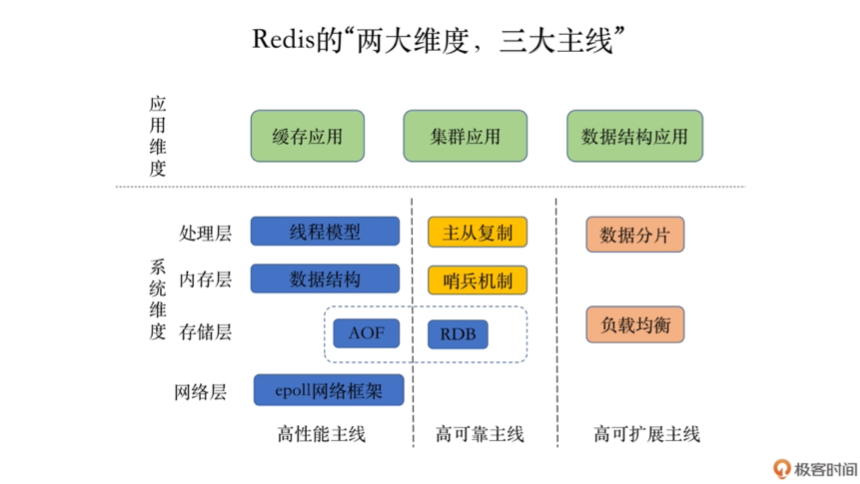
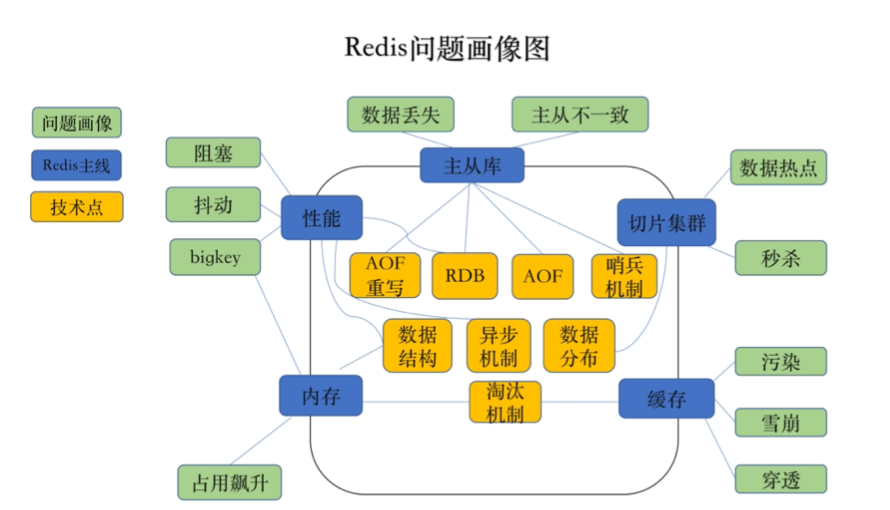
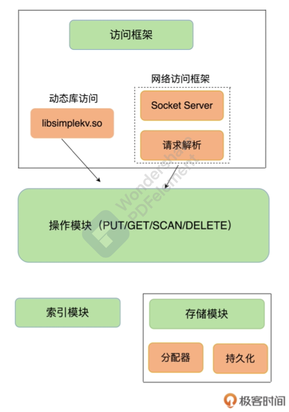
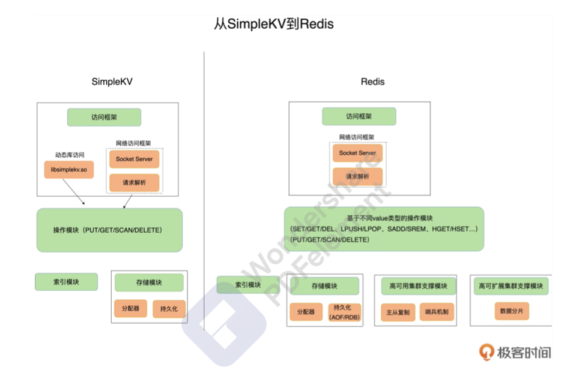

首先我们来谈谈Redis，Redis现在对于一个高并发的系统基本是必备的中间件，那么这个中间件有哪些东西值得我们学的呢？

我想先给你介绍一下Redis的“两大维度，三大主线”，这里维度是指应用维度和系统维度，三大主线是指高性能主线、高可用主线、高扩展主线。接着这里给出一个图，直观的感受一下开发者的设计思路。

- 应用维度
  - 缓存应用，处理层、内存层、存储层、网络层；
  - 集群应用主要是主从复制、哨兵机制；
  - 数据结构应用对应是数据分片、负载均衡。

- 系统应用
  - **高性能主线** ，包括线程模型、数据结构、AOF、网络框架；
  - **高可用主线**， 包括主从复制、哨兵机制、RDB；
  - **高扩展主线**， 包括数据分片、负载均衡。

我们这里给出一个Redis包含的常见问题的图：

## 01-基本架构:一个键值数据库包含什么?

一个键值数据库包括了那几部分呢？包含了访问框架、索引模块、操作模块和存储模块。这里也可以通过下面的图看的更加清晰。

先说一下索引模块，常见的索引方法有哈希表、B+树、字典树。而我们常见的Redis和Memcached是采用哈希表作为key-value的索引，而RocksDB则采用的是以跳跃表作为内存中的key-value的索引。

可以从下图中看到简单的键值数据库到Redis的变化。

只有了网络访问框架，增加了多种操作接口，重要的是提供了高可用集群支撑和高可扩展集群的支撑，这是Redis为什么这么受到开发人员的青睐的原因，因为不只是简单的键值数据库。

## 02-数据结构:快速的Redis有哪些慢操作?

简单来说，底层数据结构一共有6种，分别是简单动态字符串、双向链表、压缩列表、哈希表、跳表和整数数组。

这里你需要理清对应的Redis数据类型和底层实现的数据结构的关系？

**键和值用什么结构组织?**

哈希表的冲突是怎么解决的呢？也就是rehash的过程是怎么样的呢？

为了使rehash操作更高效，Redis默认使用了两个全局哈希表:哈希表1和哈希表2

1. 给哈希表2分配更大的空间，例如是当前哈希表1大小的两倍; 
2. 把哈希表1中的数据重新映射并拷⻉到哈希表2中;

3. 释放哈希表1的空间。

这的rehash会有什么样的问题呢？你能更加优化的办法么，其实办法是有的，就是渐进式rehash。

这里主要的思路是把一次拷贝的过程分摊到多次请求的处理过程。

那你接着说说跳表的实现吧？

跳表在链表的基础 上，**增加了多级索引，通过索引位置的几个跳转，实现数据的快速定位**。

## 03-高性能IO模型:为什么单线程Redis能那么快?

一方面，Redis的大部分操作在内存上完成，再加上它采用了高效的数据结构，例如哈希表和跳表，这是它 实现高性能的一个重要原因。另一方面，就是Redis采用了**多路复用机制**

回调机制是怎么工作的呢?其实，select/epoll一旦监测到FD上有请求到达时，就会触发相应的事 件。

这些事件会被放进一个事件队列，Redis单线程对该事件队列不断进行处理。这样一来，Redis无需一直轮询 是否有请求实际发生，这就可以避免造成CPU资源浪费。同时，Redis在对事件队列中的事件进行处理时， 会调用相应的处理函数，这就实现了基于事件的回调。

## 04-AOF日志:宕机了，Redis如何避免数据丢失?

AOF日志正好相反，它是写后日志，“写 后”的意思是Redis是先执行命令，把数据写入内存，然后才记录日志

这样做的目的是啥？

结合避免当前命令执行阻塞和正确性来思考，不难得出答案。

难道AOF就没有风险了么？

你接着可以说说写回策略是什么？

AOF文件在不断的写，这个时候变的太大了你该怎么办呢，磁盘装满了怎么处理。

接着可以问他，重写的时候会阻塞主线程么？

fork这个子进程的瞬间主线程会不会阻塞呢？

## 05-内存快照:宕机后，Redis如何实现快速恢复?

如果操作日志非常多，Redis就会恢复得很缓慢，会影响到正常使用。这当然不是理 想的结果。这样的情况你考虑到了么，那我们又该如何做呢？

你可以接着问：“这个会阻塞主线程么？”

写实复制的技术你平时有接触到么？在什么时候会用到？

既然你谈到快照，那你会多久拍一次呢，总不可能一直处于“连拍”模式吧！

很不错，你想到了增量快照，增量快照怎么做呢？

那你有更进一步的思考过，把两者的优点结合起来，混合使用AOF日志和内存快照呢？

## 06-数据同步:主从库如何实现数据一致?

1. 前面你谈到了如何减少数据丢失，万一我们的Redis实例宕机了，就不能正常提供对外服务了，这个时候你该怎么办？
2. 很棒，你提到了用从库做备份，那么问题来了，你怎么保证主库与从库之间的数据一致性的呢？
3. 读写分离具体怎么做？第一次主从同步如何建立和完成呢？
4. 那你有没有考虑过主库在做数据全量同步时候的压力，这个时候的压力该怎么减小？
5. “主-从-从”的模式，这个方法具体是怎么样的，能描述一下思路么？
6. 前面我们都是设想这些在网络正常的情况下，如果中间主从库之间网络阻塞或者是网络断开了，该怎么同步从库呢？
7. epl_backlog_buffer这个缓冲区可以用来你说到的把这个期间的增量命令记录下来，可是这个时候从库读取的速度比较慢，这个时候这个环形缓冲区被覆盖了，你有什么办法处理这样的情况，就是除了调大这个环形缓冲区的大小，还有其他办法么？
8. 还想问你一下，这里主从库同步的文件是选AOF日志合适还是RDB呢？

## 07-哨兵机制:主库挂了，如何不间断服务?

1. 如果主库突然宕机了，没法完成主从同步了，那这个时候你该怎么办？
2. 不知道你这时候会想什么，你可能会想主库真的挂了么还是只有一瞬间挂了，这个时候还有客户端在写数据怎么办？
3. 哨兵机制，那这个哨兵机制你能详细解释一下么？他主要负责干些什么？
4. 哨兵是怎么知道主库有没有挂呢，你是怎么判断的，会不会出现误判的情况，出现了误判咋办？
5. 哨兵们是怎么选出主库的呢？有没有选不出来的情况？
6. 那我还想问一下，在这个切换过 程中，客戶端能否正常地进行请求操作呢?如果想要应用程序不感知服务的中断，还需要哨兵或需要客戶端再做些什么吗?
7. 再多问一下，有没有可能哨兵集群中有实例挂了，怎么办，会影响主库状态判断和选主吗?
8. 最后想问，就算哨兵实例达成了共识，判断出来主库挂了，那又由哪个哨兵发起切换主库呢？

## 08-哨兵集群:哨兵挂了，主从库还能切换吗?

1. 前面说到了哨兵实例集群，这个是怎么组建的呢？
2. 哨兵是如何知道从库的IP地址和端口的呢？
3. 如果哨兵集群只有两个实例，当其中一个挂了还能选出领导者么？
4. 调大down-after-milliseconds值，对减少误判是不是有好处?
5. 问个简单问题，5个哨兵实例至少要拿到多少票才能当哨兵leader？

## 09-切片集群:数据增多了，是该加内存还是加实例?

1. 如果我们的数据特别多，你一般习惯怎么扩展呢，是加内存还是加实例，说说你的理由？
2. 如果千万级别的数据，横向扩展，你怎么将这些数据均匀切片的，还有怎么告诉客户端要访问的数据在哪个实例上？
3. 你提到了哈希槽(hash slot)，一个集群有多少个呢，为什么要CRC16对key进行计算呢？
4. 客户端是如何定位到实例的信息的呢？MOVED和ASK命令有听说过么？
5. 集群管理的主要问题是什么呢？
6. Redis Cluster是同步迁移还是异步的呢？

## 11-“万金油”的String，为什么不好用了?

1. 你觉得为啥Redis要有这么多的数据类型，而不想MemCached一样搞一个键值对就可以了，就比如Redis的String类型，如果都用String类型保存什么问题么？
2. 你知道用什么数据结构可以节省内存呢？
3. 压缩列表是如何节省空间的？
4. 你知道怎么测量一个键值对在不同数据类型中的内存消耗大小么？
5. 使用Hash和Sorted Set存储时，虽然节省了内存空间，但他有个什么问题你知道么？

## 12-有一亿个keys要统计，应该用哪种集合？

1. 你知道怎么统计每天的新增用戶么，用什么数据类型比较合适？
2. Set的计算会阻塞主线程么？
3. list和sorted set 都可以用于排序，为什么一般不用sorted set呢？
4. 签到用什么数据类型比较合适呢？为啥用这个数据类型？
5. 一个页面的uv统计用什么数据类型合适呢？会用到什么命令呀？
6. Set数据类型，使用SUNIONSTORE、SDIFFSTORE、SIN TERSTORE做并集、差集、交集时，选择一个从库进行聚合计算会生成新的key么？如果我不想生成新的key怎么做？

## 13-GEO是什么？还可以定义新的数据类型吗？

1. Redis还提供了3种扩展数据类型是什么呢？
2. 使⽤List当做队列，缺点是什么呢？支持多个消费者么？
3. Stream类型数据有了解过吗？

## 14-如何在Redis中保存时间序列数据？

1. 为什么保存时间序列数据，要同时使⽤这两种类型？
2. 如何对时间序列数据进⾏聚合计算？
3. RedisTimeSeries的底层数据结构知道么？

## 15-消息队列的考验：Redis有哪些解决方案？

1. 消息队列在存取消息时，必须满足三个要求，这个你能说一下么？
2. 基于list消息队列方案会遇到什么样的问题？
3. 消费者宕机之后，Streams还能处理消息么？

## 16-异步机制:如何避免单线程模型的阻塞?

1. bigkey删除操作会造成Redis阻塞么？
2. 你还知道哪些操作会造成Redis阻塞呢？

## 17-为什么CPU结构也会影响Redis的性能?

1. L3 Cache的命中率、内存利用率、避免使用到Swap这三个方面考虑的因素是为什么？

## 18-波动的响应延迟:如何应对变慢的Redis?(上)

1. 如何查看Redis的响应延迟？

2. 哪些会影响Redis变慢？你有遇到过么？

   1.  使⽤复杂度过⾼的命令或⼀次查询全量数据； 

   2. 操作bigkey；
   3. ⼤量key集中过期；
   4. 内存达到maxmemory； 
   5. 客⼾端使⽤短连接和Redis相连； 
   6. 当Redis实例的数据量⼤时，⽆论是⽣成RDB，还是AOF重写，都会导致fork耗时严重； 
   7. AOF的写回策略为always，导致每个操作都要同步刷回磁盘； 
   8. Redis实例运⾏机器的内存不⾜，导致swap发⽣，Redis需要到swap分区读取数据； 
   9. 进程绑定CPU不合理； 
   10. Redis实例运⾏机器上开启了透明内存⼤⻚机制； 
   11. 网卡压⼒过⼤。

3. ⼀个SET中的所有成员时，使⽤SMEMBERS命令好，还是要使⽤SSCAN命令好呢？

4. KEYS命令在线上环境上执行会怎么样？

5. 如何使⽤慢查询⽇志和latency monitor排查执⾏慢的操作？

6. ⼀旦业务应⽤中使⽤了bigkey，你该如何进⾏排查呢？

## 19-波动的响应延迟：如何应对变慢的Redis？（下）

1. 触发swap的原因主要是？
2. 如何查看在后台记录每个进程的swap使⽤情况？
3. 对于复杂度过⾼的命令，有什么建议？
4. 为啥建议使用长连接操作Redis？

## 20-删除数据后，为什么内存占⽤率还是很⾼？

1. 如何判断是否有内存碎⽚？
2. 如果 mem_fragmentation_ratio⼩于1了，Redis的内存使⽤是什么情况呢？

## 21-缓冲区：⼀个可能引发“惨案”的地⽅

1. MONITOR的输出结果占用输出缓冲区么？
2. 你如何避免复制缓冲区发⽣溢出呢？
3. repl_backlog_buffer缓冲区满了怎么处理？

## 23-旁路缓存：Redis是如何⼯作的？

1. Redis缓存具体是怎么⼯作的？

2. Redis缓存如果满了，该怎么办？

3. 为什么会有缓存一致性、缓存雪崩、缓存击穿、缓存穿透等异常，该如何应对？

4. Redis可以使用固态硬盘么？

5. 只读缓存是什么概念？

6. 同步直写是指什么呢，这个过程是怎么样？

7. 异步直写是什么样呢？

   等到这些增改的数据要 被从缓存中淘汰出来时，缓存将它们写回后端数据库。

   

   